# 🏗️ Real-Time Personalization Platform - Complete Architecture Documentation

## Table of Contents
1. [Executive Summary](#executive-summary)
2. [System Architecture Overview](#system-architecture-overview)
3. [Component Architecture](#component-architecture)
4. [Data Flow Architecture](#data-flow-architecture)
5. [Real-Time Processing Pipeline](#real-time-processing-pipeline)
6. [Session & State Management](#session--state-management)
7. [Feature Variable System](#feature-variable-system)
8. [WebSocket Communication Layer](#websocket-communication-layer)
9. [Integration Patterns](#integration-patterns)
10. [Extension Points](#extension-points)
11. [Mobile Integration Architecture](#mobile-integration-architecture)
12. [Security Architecture](#security-architecture)
13. [Performance & Scaling](#performance--scaling)
14. [Deployment Architecture](#deployment-architecture)
15. [Developer Guide](#developer-guide)

---

## Executive Summary

### What This Platform Does

The **Real-Time Personalization Platform** is a production-ready, edge-computing solution that enables instant user experience personalization based on real-time behavioral signals. Built on Cloudflare Workers, it processes user events at the edge, updates segments in milliseconds, and delivers personalized content through Optimizely Feature Experimentation.

### Key Capabilities

- **Sub-100ms Personalization**: Events trigger segment updates and content changes in real-time
- **Edge-Native Processing**: All logic runs at Cloudflare's edge, close to users
- **WebSocket Live Updates**: Changes broadcast instantly to connected clients
- **Session Persistence**: Sophisticated cookie and KV-based session management
- **Feature Variable Override**: Dynamic feature flag modifications per user
- **Multi-Channel Support**: Web, mobile, email, and API integrations

### Technology Stack

```yaml
Runtime:
  - Cloudflare Workers (V8 Isolates)
  - Node.js Compatible APIs
  
Languages:
  - TypeScript (Primary)
  - JavaScript (Client)
  
Frameworks:
  - Hono (Web Framework)
  - Optimizely Edge SDK
  
Storage:
  - KV (Session/Cache)
  - R2 (Object Storage)
  - Durable Objects (State/WebSocket)
  
Processing:
  - Queues (Async Events)
  - Analytics Engine (Metrics)
```

---

## System Architecture Overview

### High-Level Architecture

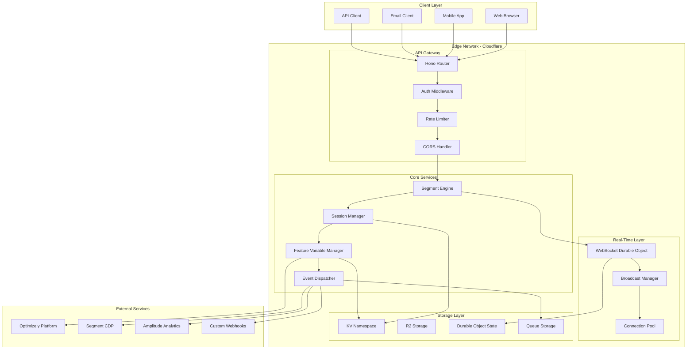

### Directory Structure

```
/cloudflare-edge-platform/
├── src/
│   ├── index.ts                    # Main entry point & export configuration
│   ├── routes/                     # API route handlers
│   │   ├── realtime.ts            # WebSocket & real-time endpoints
│   │   ├── tracking.ts            # Event tracking endpoints
│   │   ├── pixel.ts               # Email pixel tracking
│   │   ├── optimizely.ts          # Optimizely integration endpoints
│   │   ├── auth.ts                # Authentication endpoints
│   │   └── health.ts              # Health check endpoints
│   │
│   ├── services/                   # Core business logic
│   │   ├── RealtimeSegmentEngine.ts    # Segment evaluation & management
│   │   ├── SessionManager.ts           # Session & cookie management
│   │   ├── FeatureVariableManager.ts   # Feature flag management
│   │   ├── EventDispatcher.ts          # Event routing to external services
│   │   ├── OptimizelyService.ts        # Optimizely SDK wrapper
│   │   └── PixelDecoder.ts             # Pixel encoding/decoding
│   │
│   ├── durable-objects/            # Stateful edge components
│   │   ├── PersonalizationWebSocket.ts # WebSocket connection manager
│   │   ├── StateManager.ts            # Persistent state management
│   │   └── RateLimiter.ts            # Distributed rate limiting
│   │
│   ├── middleware/                 # Request/response processing
│   │   ├── auth.ts                # JWT authentication
│   │   ├── rate-limiter.ts        # Rate limiting logic
│   │   └── error.ts               # Error handling
│   │
│   └── types/                      # TypeScript definitions
│       ├── env.ts                 # Environment bindings
│       └── events.ts              # Event type definitions
│
├── public/                         # Demo client application
│   ├── index.html                 # Interactive demo UI
│   ├── demo.js                    # Demo JavaScript logic
│   └── scenarios.js               # User journey scenarios
│
├── wrangler.toml                   # Cloudflare Workers configuration
├── package.json                    # Node.js dependencies
└── tsconfig.json                   # TypeScript configuration
```

---

## Component Architecture

### Core Components Relationship Map

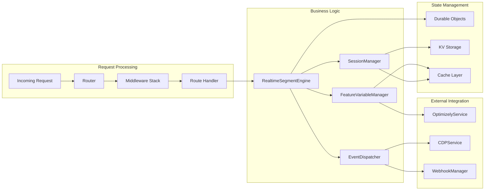

### Component Responsibilities

#### 1. RealtimeSegmentEngine (`src/services/RealtimeSegmentEngine.ts`)

**Purpose**: Core personalization engine that evaluates user actions and updates segments in real-time.

**Key Responsibilities**:
- Process incoming action events (email opens, form submits, page views)
- Evaluate segment rules based on user behavior
- Update user profiles and segments
- Trigger real-time personalization updates
- Manage segment progression logic

**Interfaces**:
```typescript
interface RealtimeSegmentEngine {
  processActionEvent(event: ActionEvent, sessionId?: string): Promise<PersonalizationUpdate>
  evaluateSegmentRules(event: ActionEvent, profile: UserProfile): Promise<string[]>
  getUserSegments(userId: string): Promise<string[]>
  assignSegment(userId: string, segment: string): Promise<void>
}
```

**Dependencies**:
- SessionManager (session persistence)
- FeatureVariableManager (feature flags)
- OptimizelyService (experimentation)
- PersonalizationWebSocket (real-time updates)

#### 2. SessionManager (`src/services/SessionManager.ts`)

**Purpose**: Manages user sessions, cookies, and persistent state across requests.

**Key Responsibilities**:
- Create and maintain user sessions
- Generate secure session cookies
- Persist session data in KV storage
- Track user preferences and consent
- Calculate engagement scores

**Data Model**:
```typescript
interface SessionData {
  userId: string
  anonymousId?: string
  segments: string[]
  attributes: Record<string, any>
  metadata: {
    firstSeen: number
    lastSeen: number
    sessionCount: number
    engagementScore: number
  }
  preferences: {
    trackingConsent: boolean
    personalizationEnabled: boolean
  }
}
```

#### 3. FeatureVariableManager (`src/services/FeatureVariableManager.ts`)

**Purpose**: Advanced feature flag and variable management with caching and overrides.

**Key Responsibilities**:
- Fetch feature variables from Optimizely
- Cache feature decisions for performance
- Support user-specific overrides
- Provide fallback configurations
- Track feature variable analytics

**Cache Strategy**:
```yaml
Cache Layers:
  L1: In-memory Map (5-minute TTL)
  L2: KV Storage (24-hour TTL)
  L3: Optimizely SDK (real-time)
  L4: Fallback defaults (hardcoded)
```

#### 4. PersonalizationWebSocket (`src/durable-objects/PersonalizationWebSocket.ts`)

**Purpose**: Manages WebSocket connections for real-time updates.

**Key Responsibilities**:
- Handle WebSocket upgrades
- Maintain connection pool per user
- Broadcast personalization updates
- Handle connection lifecycle
- Persist connection state

**Connection Management**:
```typescript
interface WebSocketState {
  connections: Map<string, WebSocket>      // connectionId -> WebSocket
  userConnections: Map<string, Set<string>> // userId -> Set<connectionId>
}
```

---

## Data Flow Architecture

### Event Processing Flow

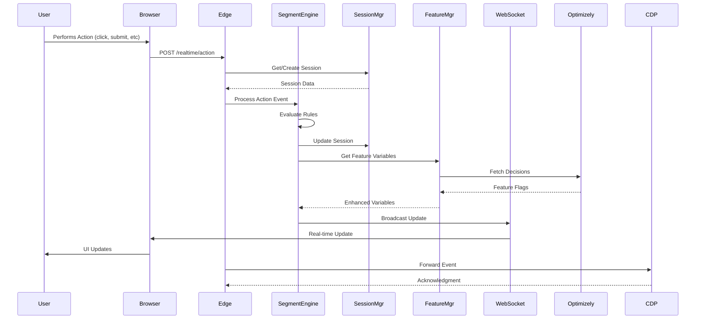

### Data Transformation Pipeline

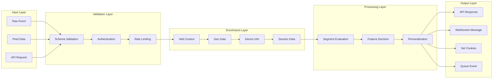

---

## Real-Time Processing Pipeline

### Event Types and Processing

```yaml
Event Types:
  email_open:
    triggers:
      - Add "email_engaged" segment
      - Increment engagement score
      - Update last_email_campaign attribute
    personalization:
      - Show email-specific content
      - Unlock email subscriber features
      
  form_submit:
    triggers:
      - Add "lead_qualified" segment
      - Calculate lead score
      - Update form_submissions count
    personalization:
      - Show premium content
      - Enable advanced features
      
  page_view:
    triggers:
      - Track page path
      - Update page_views count
      - Evaluate time-based rules
    personalization:
      - Adjust content based on browsing
      - Show relevant recommendations
      
  custom:
    triggers:
      - Process based on event_name
      - Update custom attributes
      - Evaluate custom rules
    personalization:
      - Apply custom logic
      - Trigger specific workflows
```

### Segment Rule Engine

```typescript
interface SegmentRule {
  id: string
  name: string
  condition: (event: ActionEvent, profile: UserProfile) => boolean
  segment: string
  priority: number
  cooldown?: number // Minutes before rule can fire again
}

// Example Rules Implementation
const rules: SegmentRule[] = [
  {
    id: 'email_opener',
    name: 'Email Engagement',
    condition: (event) => event.type === 'email_open',
    segment: 'email_engaged',
    priority: 100,
    cooldown: 60
  },
  {
    id: 'high_value',
    name: 'High Value Prospect',
    condition: (event, profile) => {
      const emails = profile?.metadata.emailOpens || 0
      const forms = profile?.metadata.formSubmissions || 0
      return emails >= 2 && forms >= 1
    },
    segment: 'high_value',
    priority: 300
  }
]
```

### Real-Time Update Mechanism

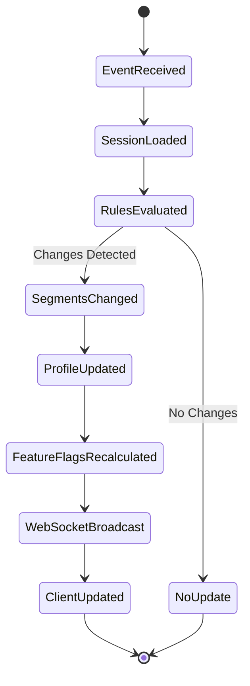

---

## Session & State Management

### Session Lifecycle

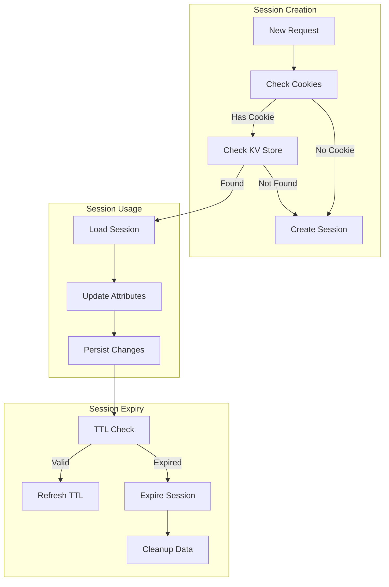

### Cookie Architecture

```yaml
Cookie Strategy:
  opt_session_id:
    type: HttpOnly
    purpose: Secure session identifier
    maxAge: 30 days
    sameSite: Lax
    
  opt_user_id:
    type: Regular
    purpose: User identification
    accessible: JavaScript
    
  opt_segments:
    type: Regular
    purpose: Current user segments
    format: Comma-separated list
    
  opt_engagement_score:
    type: Regular
    purpose: Engagement metric
    format: Integer (0-100)
    
  opt_tracking_consent:
    type: Regular
    purpose: GDPR compliance
    format: Boolean string
```

### State Persistence Layers

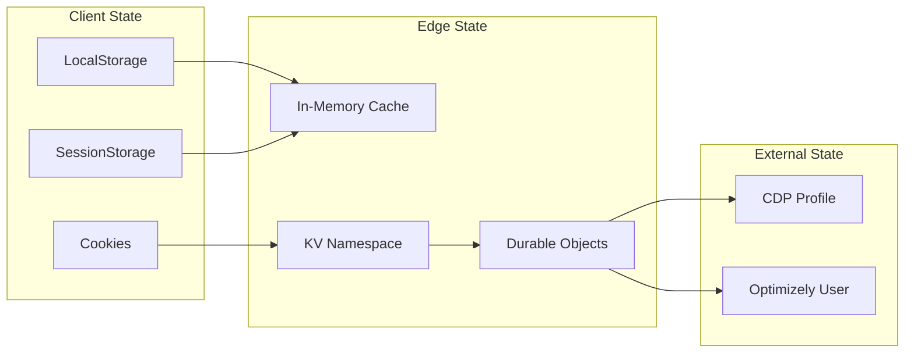

---

## Feature Variable System

### Feature Variable Architecture

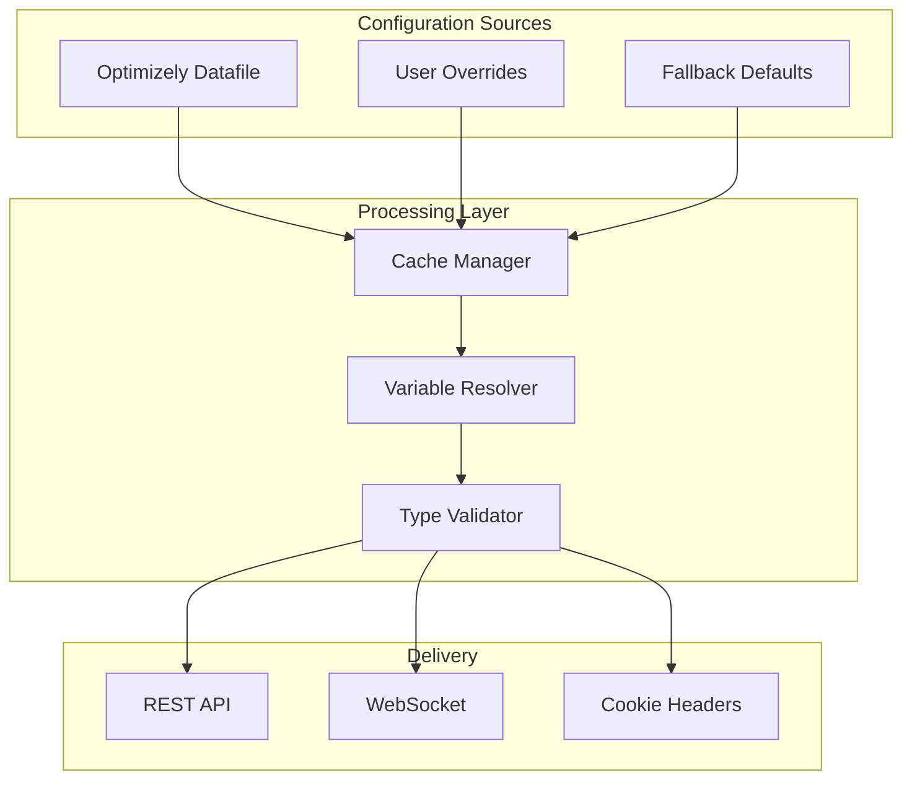

### Feature Variable Types

```typescript
// Feature Variable Configuration
interface FeatureVariableConfig {
  hero_content: {
    title: string           // Dynamic headline
    subtitle: string        // Supporting text
    cta_text: string       // Call-to-action button
    background_color: string // Theme color
    show_video: boolean    // Feature toggle
  }
  
  pricing_config: {
    show_enterprise: boolean  // Plan visibility
    discount_percentage: number // Dynamic pricing
    free_trial_days: number   // Trial length
    currency: string         // Localization
  }
  
  ui_theme: {
    primary_color: string    // Brand color
    dark_mode: boolean      // Theme toggle
    font_family: string     // Typography
    border_radius: string   // Design system
  }
}
```

### Override System

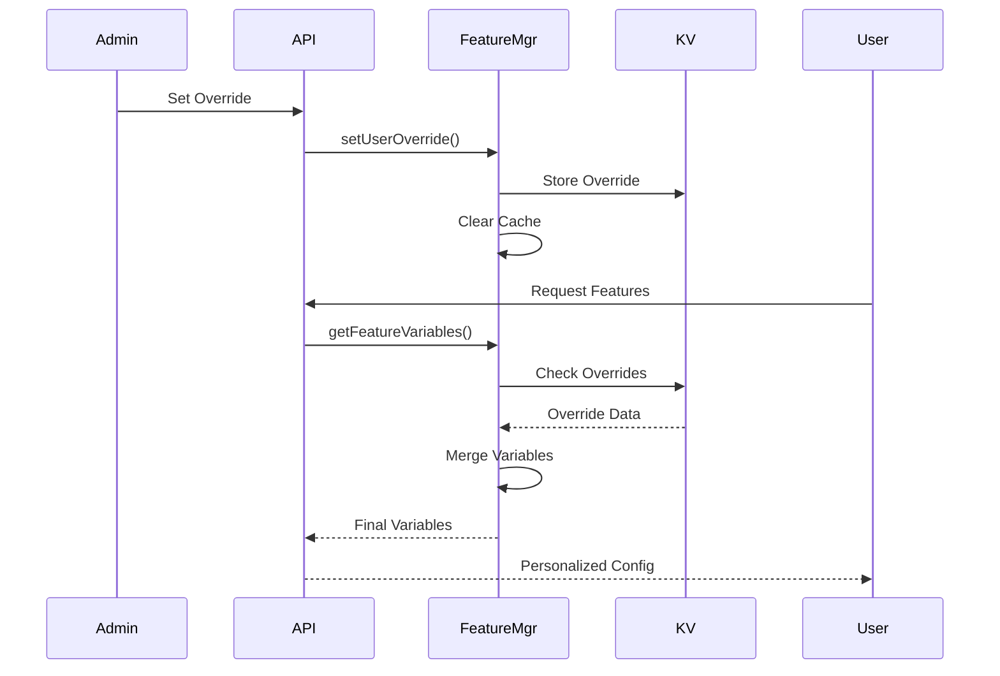

---

## WebSocket Communication Layer

### WebSocket Architecture

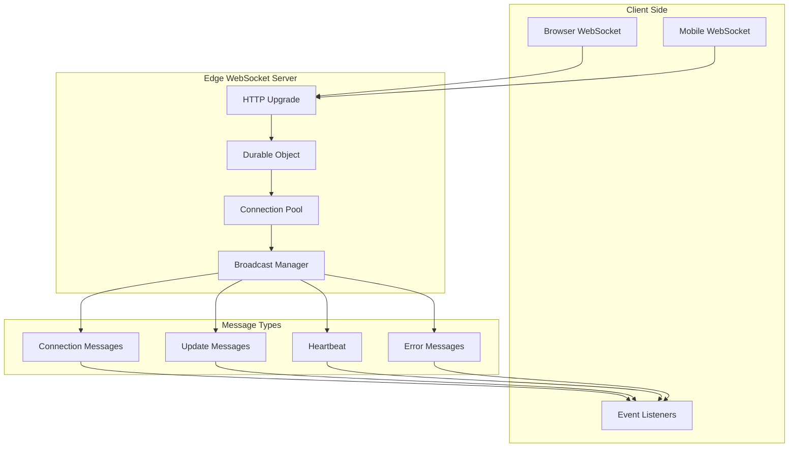

### Message Protocol

```typescript
// WebSocket Message Types
type WebSocketMessage = 
  | ConnectionMessage
  | PersonalizationUpdate
  | SegmentUpdate
  | HeartbeatMessage
  | ErrorMessage

interface ConnectionMessage {
  type: 'connected' | 'disconnected'
  connectionId: string
  userId: string
  timestamp: number
}

interface PersonalizationUpdate {
  type: 'personalization_update'
  userId: string
  data: {
    segments: string[]
    featureVariables: Record<string, any>
    cookies: Record<string, string>
    engagementScore: number
    timestamp: number
  }
}

interface SegmentUpdate {
  type: 'segment_update'
  userId: string
  data: {
    added: string[]
    removed: string[]
    current: string[]
    timestamp: number
  }
}
```

### Connection Management

```yaml
Connection Lifecycle:
  1. Handshake:
     - Client sends upgrade request
     - Server validates userId
     - WebSocket pair created
     
  2. Authentication:
     - Optional JWT validation
     - Session verification
     - Rate limit check
     
  3. Active Connection:
     - Bidirectional communication
     - Heartbeat every 30s
     - Auto-reconnect on failure
     
  4. Cleanup:
     - Remove from pool
     - Update connection state
     - Notify other services
```

---

## Integration Patterns

### Web Application Integration

```javascript
// Client-Side Integration Example
class PersonalizationClient {
  constructor(config) {
    this.baseUrl = config.baseUrl || 'https://edge.example.com'
    this.userId = config.userId
    this.websocket = null
  }
  
  async initialize() {
    // 1. Load initial personalization
    const response = await fetch(`${this.baseUrl}/realtime/personalization/${this.userId}`)
    const config = await response.json()
    
    // 2. Apply personalization
    this.applyPersonalization(config)
    
    // 3. Establish WebSocket for updates
    this.connectWebSocket()
  }
  
  connectWebSocket() {
    const wsUrl = `${this.baseUrl.replace('https', 'wss')}/realtime/ws?userId=${this.userId}`
    this.websocket = new WebSocket(wsUrl)
    
    this.websocket.onmessage = (event) => {
      const update = JSON.parse(event.data)
      if (update.type === 'personalization_update') {
        this.applyPersonalization(update.data)
      }
    }
  }
  
  applyPersonalization(config) {
    // Update UI based on segments
    if (config.segments.includes('high_value')) {
      document.querySelector('.premium-content').style.display = 'block'
    }
    
    // Apply feature variables
    if (config.featureVariables.hero_content) {
      document.querySelector('h1').textContent = config.featureVariables.hero_content.title
    }
  }
  
  trackEvent(eventType, eventData) {
    return fetch(`${this.baseUrl}/realtime/action`, {
      method: 'POST',
      headers: { 'Content-Type': 'application/json' },
      body: JSON.stringify({
        type: eventType,
        userId: this.userId,
        data: eventData,
        source: 'web',
        timestamp: Date.now()
      })
    })
  }
}
```

### Mobile Application Integration

```swift
// iOS Swift Integration Example
import Foundation

class PersonalizationSDK {
    private let baseURL: String
    private let userId: String
    private var webSocketTask: URLSessionWebSocketTask?
    private var sessionConfig: PersonalizationConfig?
    
    init(baseURL: String, userId: String) {
        self.baseURL = baseURL
        self.userId = userId
    }
    
    // Initialize SDK
    func initialize() async throws {
        // 1. Fetch initial configuration
        let config = try await fetchPersonalization()
        self.sessionConfig = config
        
        // 2. Connect WebSocket
        connectWebSocket()
        
        // 3. Apply initial personalization
        await applyPersonalization(config)
    }
    
    // Track user events
    func trackEvent(_ event: TrackingEvent) async throws {
        let url = URL(string: "\(baseURL)/realtime/action")!
        var request = URLRequest(url: url)
        request.httpMethod = "POST"
        request.setValue("application/json", forHTTPHeaderField: "Content-Type")
        
        let payload = [
            "type": event.type,
            "userId": userId,
            "data": event.data,
            "source": "ios",
            "timestamp": Date().timeIntervalSince1970
        ]
        
        request.httpBody = try JSONSerialization.data(withJSONObject: payload)
        
        let (_, response) = try await URLSession.shared.data(for: request)
        
        guard let httpResponse = response as? HTTPURLResponse,
              httpResponse.statusCode == 200 else {
            throw PersonalizationError.trackingFailed
        }
    }
    
    // WebSocket connection
    private func connectWebSocket() {
        let wsURL = URL(string: "\(baseURL.replacingOccurrences(of: "https", with: "wss"))/realtime/ws?userId=\(userId)")!
        webSocketTask = URLSession.shared.webSocketTask(with: wsURL)
        webSocketTask?.resume()
        receiveMessage()
    }
    
    private func receiveMessage() {
        webSocketTask?.receive { [weak self] result in
            switch result {
            case .success(let message):
                switch message {
                case .string(let text):
                    self?.handleWebSocketMessage(text)
                default:
                    break
                }
                self?.receiveMessage() // Continue receiving
            case .failure(let error):
                print("WebSocket error: \(error)")
                // Implement reconnection logic
            }
        }
    }
}
```

### Email Integration

```html
<!-- Email Template with Pixel Tracking -->
<!DOCTYPE html>
<html>
<head>
    <title>Personalized Email</title>
</head>
<body>
    <h1>Welcome Back!</h1>
    <p>We have special offers just for you.</p>
    
    <!-- Tracking Pixel -->
    
    
    <!-- Personalized CTA -->
    <a href="https://example.com/offer?utm_source=email&userId={{userId}}&segment={{segment}}">
        View Your Personalized Offers
    </a>
</body>
</html>
```

---

## Extension Points

### Adding New Event Types

```typescript
// 1. Define the new event type
interface CustomEventType extends ActionEvent {
  type: 'product_purchase'
  data: {
    productId: string
    amount: number
    currency: string
  }
}

// 2. Add processing logic
class CustomEventProcessor {
  async process(event: CustomEventType): Promise<SegmentUpdate> {
    // Evaluate business rules
    if (event.data.amount > 100) {
      return {
        addSegments: ['high_spender'],
        removeSegments: ['prospect']
      }
    }
    return { addSegments: ['customer'] }
  }
}

// 3. Register with segment engine
segmentEngine.registerEventProcessor('product_purchase', new CustomEventProcessor())
```

### Adding New Segment Rules

```typescript
// Define custom segment rule
const customRule: SegmentRule = {
  id: 'frequent_buyer',
  name: 'Frequent Buyer Detection',
  condition: (event, profile) => {
    const purchases = profile.events.filter(e => e.type === 'product_purchase')
    const lastMonth = Date.now() - (30 * 24 * 60 * 60 * 1000)
    const recentPurchases = purchases.filter(p => p.timestamp > lastMonth)
    return recentPurchases.length >= 3
  },
  segment: 'frequent_buyer',
  priority: 250,
  cooldown: 1440 // 24 hours
}

// Add to engine
segmentEngine.addSegmentRule(customRule)
```

### Adding External Integrations

```typescript
// Create custom destination
class CustomCRMDestination implements EventDestination {
  async send(event: Event): Promise<void> {
    const crmPayload = this.transformEvent(event)
    
    await fetch('https://crm.example.com/api/events', {
      method: 'POST',
      headers: {
        'Authorization': `Bearer ${this.apiKey}`,
        'Content-Type': 'application/json'
      },
      body: JSON.stringify(crmPayload)
    })
  }
  
  private transformEvent(event: Event): CRMEvent {
    return {
      contactId: event.userId,
      eventType: this.mapEventType(event.type),
      properties: event.properties,
      timestamp: event.timestamp
    }
  }
}

// Register destination
eventDispatcher.addDestination('custom_crm', new CustomCRMDestination())
```

---

## Mobile Integration Architecture

### Mobile SDK Architecture

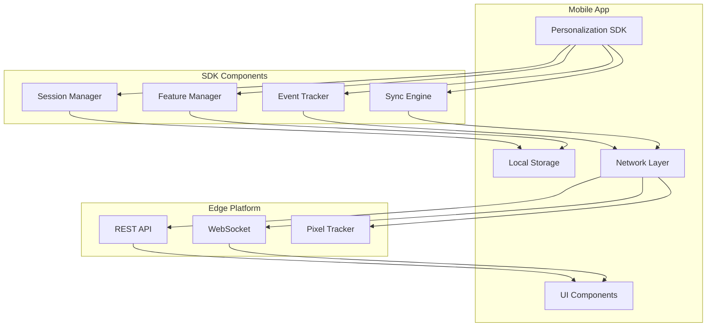

### Mobile Implementation Guide

```yaml
Integration Steps:
  1. SDK Initialization:
     - Configure base URL
     - Set user identification
     - Initialize local storage
     - Establish WebSocket connection
     
  2. Event Tracking:
     - Screen views
     - User actions
     - App lifecycle events
     - Custom events
     
  3. Personalization:
     - Fetch initial config
     - Apply feature flags
     - Update UI components
     - Cache decisions locally
     
  4. Offline Support:
     - Queue events locally
     - Sync when online
     - Use cached personalization
     - Handle conflicts
     
  5. Push Notifications:
     - Register device token
     - Subscribe to segments
     - Handle deep links
     - Track opens
```

### React Native Example

```typescript
// React Native Integration
import { NativeModules, NativeEventEmitter } from 'react-native'

class PersonalizationBridge {
  private eventEmitter: NativeEventEmitter
  private native: any
  
  constructor() {
    this.native = NativeModules.PersonalizationSDK
    this.eventEmitter = new NativeEventEmitter(this.native)
  }
  
  async initialize(userId: string): Promise<void> {
    await this.native.initialize({
      baseURL: 'https://edge.example.com',
      userId: userId,
      enableWebSocket: true
    })
    
    // Listen for updates
    this.eventEmitter.addListener('personalizationUpdate', (update) => {
      this.handleUpdate(update)
    })
  }
  
  async trackEvent(eventType: string, data: any): Promise<void> {
    return this.native.trackEvent({
      type: eventType,
      data: data,
      timestamp: Date.now()
    })
  }
  
  async getFeatureVariable(key: string): Promise<any> {
    return this.native.getFeatureVariable(key)
  }
  
  private handleUpdate(update: any): void {
    // Update React Native UI
    store.dispatch({
      type: 'PERSONALIZATION_UPDATE',
      payload: update
    })
  }
}
```

---

## Security Architecture

### Authentication & Authorization

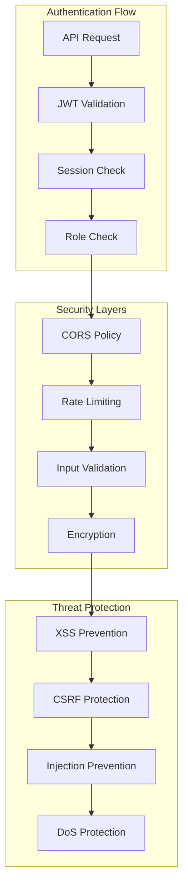

### Security Measures

```yaml
Security Implementation:
  Authentication:
    - JWT tokens with RS256 signing
    - Token expiration (1 hour default)
    - Refresh token rotation
    - Session invalidation
    
  Authorization:
    - Role-based access control (RBAC)
    - Resource-level permissions
    - API key management
    - IP whitelisting
    
  Data Protection:
    - TLS 1.3 encryption in transit
    - AES-256 encryption at rest
    - PII tokenization
    - Secure cookie flags
    
  Input Validation:
    - Zod schema validation
    - SQL injection prevention
    - XSS sanitization
    - File upload restrictions
    
  Rate Limiting:
    - Per-IP limits (100 req/min)
    - Per-user limits (1000 req/hour)
    - Distributed rate limiting
    - Exponential backoff
    
  Monitoring:
    - Security event logging
    - Anomaly detection
    - Failed auth tracking
    - Compliance auditing
```

---

## Performance & Scaling

### Performance Metrics

```yaml
Target Metrics:
  Response Times:
    - P50: < 50ms
    - P95: < 100ms
    - P99: < 200ms
    
  Throughput:
    - API requests: 10,000 RPS
    - WebSocket connections: 100,000 concurrent
    - Event processing: 50,000 events/second
    
  Availability:
    - Uptime: 99.99%
    - Error rate: < 0.1%
    - Recovery time: < 30 seconds
```

### Scaling Architecture

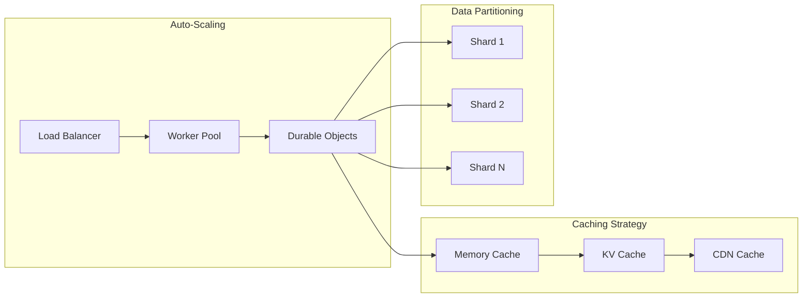

### Optimization Strategies

```typescript
// Performance Optimizations

// 1. Request Coalescing
class RequestCoalescer {
  private pending = new Map<string, Promise<any>>()
  
  async fetch(key: string, fetcher: () => Promise<any>): Promise<any> {
    if (this.pending.has(key)) {
      return this.pending.get(key)
    }
    
    const promise = fetcher()
    this.pending.set(key, promise)
    
    try {
      const result = await promise
      return result
    } finally {
      this.pending.delete(key)
    }
  }
}

// 2. Batch Processing
class BatchProcessor {
  private queue: Event[] = []
  private timer: NodeJS.Timeout
  
  add(event: Event): void {
    this.queue.push(event)
    
    if (this.queue.length >= 100) {
      this.flush()
    } else if (!this.timer) {
      this.timer = setTimeout(() => this.flush(), 1000)
    }
  }
  
  private async flush(): Promise<void> {
    const batch = this.queue.splice(0)
    clearTimeout(this.timer)
    this.timer = null
    
    await this.processBatch(batch)
  }
}

// 3. Smart Caching
class SmartCache {
  private cache = new Map<string, CacheEntry>()
  
  get(key: string): any {
    const entry = this.cache.get(key)
    
    if (!entry) return null
    
    // Adaptive TTL based on access patterns
    if (entry.accessCount > 10) {
      entry.ttl = Math.min(entry.ttl * 1.5, 3600000)
    }
    
    if (Date.now() > entry.expires) {
      this.cache.delete(key)
      return null
    }
    
    entry.accessCount++
    return entry.value
  }
}
```

---

## Deployment Architecture

### Multi-Environment Strategy

```yaml
Environments:
  Development:
    - Local Wrangler dev server
    - Mock external services
    - Debug logging enabled
    - Hot reload support
    
  Staging:
    - Cloudflare Workers preview
    - Integration with test services
    - Performance profiling
    - A/B testing
    
  Production:
    - Global Cloudflare network
    - Full service integration
    - Monitoring & alerting
    - Auto-scaling enabled
```

### CI/CD Pipeline

```mermaid
graph LR
    subgraph "Development"
        CODE[Code Changes]
        TEST[Unit Tests]
        LINT[Linting]
    end
    
    subgraph "Build"
        COMPILE[TypeScript Compile]
        BUNDLE[Webpack Bundle]
        OPTIMIZE[Optimization]
    end
    
    subgraph "Deploy"
        PREVIEW[Preview Deploy]
        STAGING[Staging Deploy]
        PROD[Production Deploy]
    end
    
    subgraph "Verify"
        SMOKE[Smoke Tests]
        PERF[Performance Tests]
        ROLLBACK[Rollback Ready]
    end
    
    CODE --> TEST
    TEST --> LINT
    LINT --> COMPILE
    COMPILE --> BUNDLE
    BUNDLE --> OPTIMIZE
    
    OPTIMIZE --> PREVIEW
    PREVIEW --> STAGING
    STAGING --> PROD
    
    PROD --> SMOKE
    SMOKE --> PERF
    PERF --> ROLLBACK
```

### Infrastructure as Code

```toml
# wrangler.toml - Production Configuration
name = "edge-personalization-prod"
main = "dist/index.js"
compatibility_date = "2024-01-01"

[env.production]
workers_dev = false
routes = [
  "api.example.com/*",
  "edge.example.com/*"
]

kv_namespaces = [
  { binding = "SESSIONS", id = "abc123" },
  { binding = "CACHE", id = "def456" }
]

durable_objects.bindings = [
  { name = "WEBSOCKET", class_name = "PersonalizationWebSocket" },
  { name = "RATE_LIMITER", class_name = "RateLimiter" }
]

[env.production.vars]
ENVIRONMENT = "production"
LOG_LEVEL = "info"
```

---

## Developer Guide

### Quick Start

```bash
# 1. Clone repository
git clone https://github.com/your-org/edge-personalization
cd edge-personalization

# 2. Install dependencies
npm install

# 3. Configure environment
cp wrangler.toml.example wrangler.toml
# Edit wrangler.toml with your settings

# 4. Start development server
npm run dev

# 5. Test the platform
curl http://localhost:9100/health

# 6. Deploy to Cloudflare
npm run deploy
```

### Common Development Tasks

#### Adding a New API Endpoint

```typescript
// 1. Create route handler in src/routes/custom.ts
import { Hono } from 'hono'
import type { Env } from '@/types/env'

const customRoutes = new Hono<{ Bindings: Env }>()

customRoutes.post('/process', async (c) => {
  const data = await c.req.json()
  
  // Your logic here
  const result = await processData(data)
  
  return c.json({ success: true, result })
})

export default customRoutes

// 2. Register in src/index.ts
import customRoutes from '@/routes/custom'
app.route('/custom', customRoutes)

// 3. Add types in src/types/
interface CustomData {
  // Define your types
}

// 4. Add tests
describe('Custom Routes', () => {
  it('should process data', async () => {
    // Test implementation
  })
})
```

#### Adding a New Segment Rule

```typescript
// 1. Define the rule
const newRule: SegmentRule = {
  id: 'loyal_customer',
  name: 'Loyal Customer',
  condition: (event, profile) => {
    const purchases = profile.metadata.purchases || 0
    const accountAge = Date.now() - profile.metadata.firstSeen
    const daysOld = accountAge / (24 * 60 * 60 * 1000)
    
    return purchases >= 5 && daysOld >= 30
  },
  segment: 'loyal',
  priority: 200
}

// 2. Add to RealtimeSegmentEngine
segmentEngine.addSegmentRule(newRule)

// 3. Test the rule
const testProfile = {
  metadata: {
    purchases: 6,
    firstSeen: Date.now() - (45 * 24 * 60 * 60 * 1000)
  }
}

const result = await segmentEngine.evaluateRules(event, testProfile)
expect(result).toContain('loyal')
```

#### Debugging WebSocket Connections

```javascript
// Client-side debugging
const ws = new WebSocket('wss://edge.example.com/realtime/ws?userId=test')

ws.onopen = () => console.log('Connected')
ws.onmessage = (e) => console.log('Message:', JSON.parse(e.data))
ws.onerror = (e) => console.error('Error:', e)
ws.onclose = (e) => console.log('Closed:', e.code, e.reason)

// Send test message
ws.send(JSON.stringify({
  type: 'heartbeat',
  timestamp: Date.now()
}))

// Server-side debugging
class PersonalizationWebSocket {
  async fetch(request: Request): Promise<Response> {
    console.log('WebSocket request:', request.url)
    console.log('Headers:', Object.fromEntries(request.headers))
    
    // Add debug logging
    this.debug = true
    
    return this.handleWebSocketUpgrade(request)
  }
}
```

### Testing Strategy

```yaml
Testing Layers:
  Unit Tests:
    - Service logic tests
    - Utility function tests
    - Type validation tests
    Coverage: > 80%
    
  Integration Tests:
    - API endpoint tests
    - Database interaction tests
    - External service mocks
    Coverage: > 70%
    
  E2E Tests:
    - User journey tests
    - WebSocket flow tests
    - Performance benchmarks
    Coverage: Critical paths
    
  Load Tests:
    - Concurrent user simulation
    - Event processing capacity
    - WebSocket connection limits
    Metrics: Response times, error rates
```

### Monitoring & Observability

```typescript
// Structured Logging
class Logger {
  log(level: string, message: string, context: any) {
    const entry = {
      timestamp: new Date().toISOString(),
      level,
      message,
      ...context,
      environment: this.env.ENVIRONMENT,
      requestId: this.requestId
    }
    
    console.log(JSON.stringify(entry))
    
    // Send to Analytics Engine
    this.env.ANALYTICS.writeDataPoint({
      blobs: [level, message],
      doubles: [Date.now()],
      indexes: [this.requestId]
    })
  }
}

// Performance Tracking
class PerformanceMonitor {
  private timers = new Map<string, number>()
  
  start(operation: string): void {
    this.timers.set(operation, Date.now())
  }
  
  end(operation: string): void {
    const start = this.timers.get(operation)
    if (!start) return
    
    const duration = Date.now() - start
    this.timers.delete(operation)
    
    // Log performance metric
    this.logger.log('performance', operation, {
      duration,
      operation
    })
  }
}
```

---

## Conclusion

This Real-Time Personalization Platform represents a complete, production-ready solution for edge-based personalization. The architecture is designed to be:

- **Scalable**: Handles millions of events and thousands of concurrent connections
- **Extensible**: Clear extension points for new features and integrations
- **Performant**: Sub-100ms response times with intelligent caching
- **Reliable**: Fault-tolerant with automatic recovery
- **Secure**: Enterprise-grade security at every layer

The platform can be extended for specific use cases like banking, e-commerce, media, or any industry requiring real-time personalization based on user behavior.

For questions or contributions, please refer to the repository documentation or contact the development team.