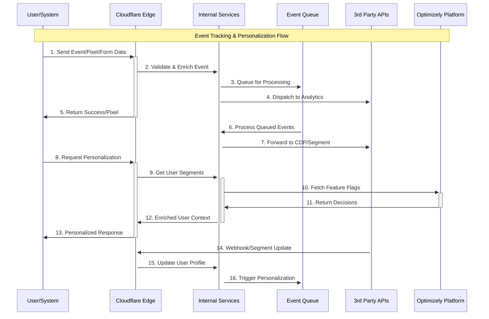
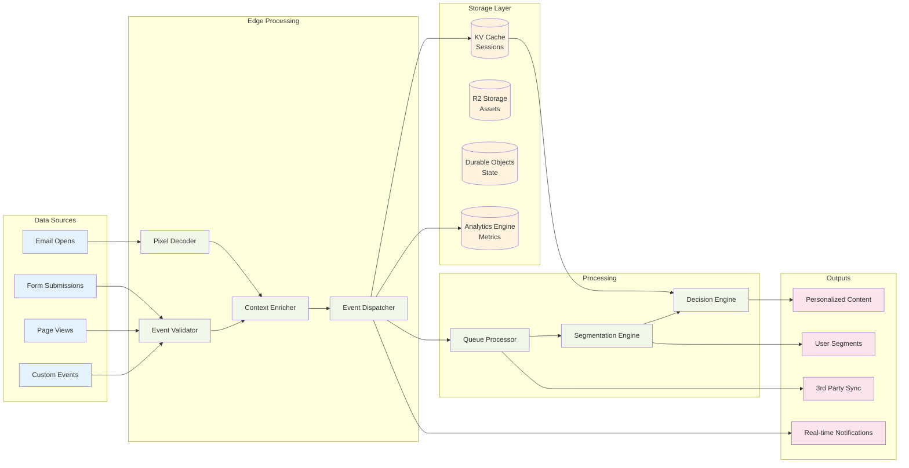

# 🚀 Cloudflare Edge Platform

A comprehensive Cloudflare Workers foundation that serves as a reusable scaffold for demos and production services with tracking, personalization, and experimentation capabilities.

## ✨ Features

- **Real-time Event Tracking**: Track user interactions, page views, and custom events
- **Email Pixel Tracking**: Generate and track email pixels with secure encoding
- **Optimizely Integration**: Feature flags, experiments, and user segmentation
- **Customer Data Platform**: User profiles, segments, and event forwarding
- **JWT Authentication**: Role-based access control for secure API access
- **Cloudflare Services**: Queues, Durable Objects, R2 storage, and Analytics Engine
- **Rate Limiting**: Built-in rate limiting with Durable Objects
- **Error Handling**: Comprehensive error handling and monitoring

## 🏗️ Architecture

### Platform Overview

```mermaid
graph TB
    subgraph "Client Layer"
        WEB[Web Applications]
        MOBILE[Mobile Apps]
        EMAIL[Email Systems]
        API_CLIENT[API Clients]
    end
    
    subgraph "Cloudflare Edge"
        subgraph "API Routes"
            TRACK["/track/*<br/>Event Tracking"]
            PIXEL["/pixel/*<br/>Email Pixels"]
            OPT["/optimizely/*<br/>Feature Flags"]
            CDP["/cdp/*<br/>Customer Data"]
            AUTH["/auth/*<br/>Authentication"]
            WEBHOOK["/webhook/*<br/>Integrations"]
            API["/api/*<br/>Infrastructure"]
            HEALTH["/health<br/>Monitoring"]
        end
        
        subgraph "Middleware"
            CORS[CORS Handler]
            RATE[Rate Limiting]
            JWT_MW[JWT Auth]
            LOGGER[Request Logger]
            ERROR[Error Handler]
        end
        
        subgraph "Services"
            EVENT_DISP[EventDispatcher<br/>3rd Party Routing]
            PIXEL_DEC[PixelDecoder<br/>Secure Encoding]
            OPT_SVC[OptimizelyService<br/>Edge Agent SDK]
            CDP_SVC[CDPService<br/>Profile Management]
        end
        
        subgraph "Cloudflare Infrastructure"
            WORKERS[Workers Runtime]
            KV[KV Storage<br/>Cache & Sessions]
            R2[R2 Storage<br/>File Management]
            QUEUES[Queues<br/>Event Processing]
            DO[Durable Objects<br/>State & Rate Limiting]
            ANALYTICS[Analytics Engine<br/>Metrics Collection]
            PAGES[Pages<br/>Static Hosting]
        end
    end
    
    subgraph "External Integrations"
        OPTIMIZELY[Optimizely<br/>Feature Experimentation]
        SEGMENT[Segment API]
        AMPLITUDE[Amplitude API]
        MIXPANEL[Mixpanel API]
        WEBHOOKS[Custom Webhooks]
    end
    
    %% Client connections
    WEB --> TRACK
    WEB --> PIXEL
    WEB --> OPT
    MOBILE --> OPT
    MOBILE --> TRACK
    EMAIL --> PIXEL
    API_CLIENT --> AUTH
    API_CLIENT --> API
    
    %% Route to middleware
    TRACK --> CORS
    PIXEL --> CORS
    OPT --> JWT_MW
    CDP --> JWT_MW
    AUTH --> CORS
    WEBHOOK --> CORS
    API --> JWT_MW
    HEALTH --> CORS
    
    %% Middleware to services
    CORS --> EVENT_DISP
    CORS --> PIXEL_DEC
    JWT_MW --> OPT_SVC
    JWT_MW --> CDP_SVC
    
    %% Services to infrastructure
    EVENT_DISP --> QUEUES
    EVENT_DISP --> ANALYTICS
    PIXEL_DEC --> KV
    OPT_SVC --> KV
    CDP_SVC --> KV
    RATE --> DO
    
    %% Infrastructure connections
    WORKERS --> KV
    WORKERS --> R2
    WORKERS --> QUEUES
    WORKERS --> DO
    WORKERS --> ANALYTICS
    
    %% External integrations
    OPT_SVC --> OPTIMIZELY
    EVENT_DISP --> SEGMENT
    EVENT_DISP --> AMPLITUDE
    EVENT_DISP --> MIXPANEL
    EVENT_DISP --> WEBHOOKS
    
    %% Styling
    classDef clientLayer fill:#e1f5fe
    classDef apiLayer fill:#f3e5f5
    classDef serviceLayer fill:#e8f5e8
    classDef infraLayer fill:#fff3e0
    classDef externalLayer fill:#fce4ec
    
    class WEB,MOBILE,EMAIL,API_CLIENT clientLayer
    class TRACK,PIXEL,OPT,CDP,AUTH,WEBHOOK,API,HEALTH apiLayer
    class EVENT_DISP,PIXEL_DEC,OPT_SVC,CDP_SVC serviceLayer
    class WORKERS,KV,R2,QUEUES,DO,ANALYTICS,PAGES infraLayer
    class OPTIMIZELY,SEGMENT,AMPLITUDE,MIXPANEL,WEBHOOKS externalLayer
```



### Event Flow Diagram



### Data Flow Architecture



## 🚀 Quick Start

### Prerequisites

- Node.js 18+
- Cloudflare account with Workers, KV, R2, and Queues enabled
- Optimizely account (optional)

### Installation

```bash
# Clone the repository
git clone <your-repo>
cd cloudflare-edge-platform

# Install dependencies
npm install

# Configure your environment
cp wrangler.toml.example wrangler.toml
# Edit wrangler.toml with your Cloudflare settings
```

### Development

```bash
# Start development server
npm run dev

# The server will be available at http://localhost:9100
```

### Deployment

```bash
# Deploy to Cloudflare
npm run deploy

# Deploy to staging
wrangler deploy --env staging

# Deploy to production
wrangler deploy --env production
```

## 🔧 Configuration

### Environment Variables

Set these secrets using `wrangler secret`:

```bash
wrangler secret put JWT_SECRET
wrangler secret put OPTIMIZELY_SDK_KEY
wrangler secret put API_KEYS
wrangler secret put WEBHOOK_ENDPOINTS
wrangler secret put CDP_ENDPOINTS
```

### wrangler.toml

Update the following in your `wrangler.toml`:

- KV namespace IDs
- R2 bucket names
- Queue configurations
- Durable Object bindings

## 📚 API Documentation

### Authentication

Most endpoints require JWT authentication. Get a token from `/auth/login`:

```bash
curl -X POST https://your-worker.workers.dev/auth/login \\
  -H "Content-Type: application/json" \\
  -d '{"email": "user@example.com", "password": "password"}'
```

### Event Tracking

Track custom events:

```bash
curl -X POST https://your-worker.workers.dev/track/event \\
  -H "Content-Type: application/json" \\
  -d '{
    "eventId": "uuid",
    "eventType": "track",
    "event": "button_click",
    "user": {"anonymousId": "user-123"},
    "properties": {"button": "signup"}
  }'
```

### Pixel Tracking

Generate email pixels:

```bash
curl -X POST https://your-worker.workers.dev/pixel/generate \\
  -H "Content-Type: application/json" \\
  -d '{
    "campaignId": "campaign-123",
    "emailId": "email-456",
    "recipientId": "user-789"
  }'
```

### Optimizely Integration

Get experiment decisions:

```bash
curl -X POST https://your-worker.workers.dev/optimizely/decisions \\
  -H "Content-Type: application/json" \\
  -d '{
    "userId": "user-123",
    "experiments": ["experiment-key"],
    "features": ["feature-key"]
  }'
```

### Customer Data Platform

Get user profile:

```bash
curl -X POST https://your-worker.workers.dev/cdp/profile \\
  -H "Content-Type: application/json" \\
  -d '{"userId": "user-123"}'
```

## 🛠️ Services

### EventDispatcher

Handles event forwarding to multiple destinations:

- Segment
- Amplitude
- Mixpanel
- Custom webhooks

### PixelDecoder

Secure encoding/decoding of email tracking pixels with:

- Base64 encoding
- Hash verification
- Timestamp validation
- Metadata support

### OptimizelyService

Feature experimentation integration:

- Feature flags
- A/B test variations
- User segmentation
- Event tracking

### CDPService

Customer data platform abstraction:

- User profiles
- Segment management
- Event forwarding
- Destination management

## 🔐 Security

- JWT authentication with configurable expiration
- Rate limiting with Durable Objects
- CORS protection
- Secure headers middleware
- Input validation with Zod schemas

## 📊 Monitoring

- Health check endpoints
- Analytics Engine integration
- Error tracking and logging
- Performance monitoring

## 🚦 Health Checks

- `GET /health` - Comprehensive health check
- `GET /health/ready` - Readiness probe
- `GET /health/live` - Liveness probe

## 🔄 Queue Processing

Events are processed asynchronously using Cloudflare Queues:

- Automatic retries
- Batch processing
- Dead letter queues
- Monitoring and alerting

## 💾 State Management

Durable Objects provide persistent state:

- Session management
- Rate limiting
- Cache invalidation
- Real-time collaboration

## 📈 Analytics

Built-in analytics with Cloudflare Analytics Engine:

- Event tracking
- Performance metrics
- Error monitoring
- Custom dashboards

## 🔧 Customization

This platform is designed to be extended:

1. **Add new routes**: Create files in `src/routes/`
2. **Add new services**: Create files in `src/services/`
3. **Add new middleware**: Create files in `src/middleware/`
4. **Add new destinations**: Configure in EventDispatcher

## 📋 Examples

### Email Campaign Tracking

```javascript
// Generate tracking pixel
const pixel = await fetch('/pixel/generate', {
  method: 'POST',
  headers: { 'Content-Type': 'application/json' },
  body: JSON.stringify({
    campaignId: 'summer-sale-2024',
    emailId: 'email-123',
    recipientId: 'user-456'
  })
});

// Add to email template
const { pixelHTML } = await pixel.json();
// Insert pixelHTML into email
```

### Feature Flag Personalization

```javascript
// Get user segments and feature flags
const decisions = await fetch('/optimizely/decisions', {
  method: 'POST',
  headers: { 'Content-Type': 'application/json' },
  body: JSON.stringify({
    userId: 'user-123',
    features: ['new-checkout', 'premium-features'],
    userAttributes: { plan: 'pro', country: 'US' }
  })
});

const { features } = await decisions.json();
// Use features to personalize experience
```

### Custom Event Tracking

```javascript
// Track conversion event
await fetch('/track/event', {
  method: 'POST',
  headers: { 'Content-Type': 'application/json' },
  body: JSON.stringify({
    eventId: crypto.randomUUID(),
    eventType: 'track',
    event: 'purchase_completed',
    user: { userId: 'user-123' },
    properties: {
      revenue: 99.99,
      currency: 'USD',
      products: ['product-1', 'product-2']
    }
  })
});
```

## 🤝 Contributing

1. Fork the repository
2. Create a feature branch
3. Make your changes
4. Add tests
5. Submit a pull request

## 📄 License

MIT License - see LICENSE file for details.

---

Built with ❤️ for the Cloudflare Workers ecosystem