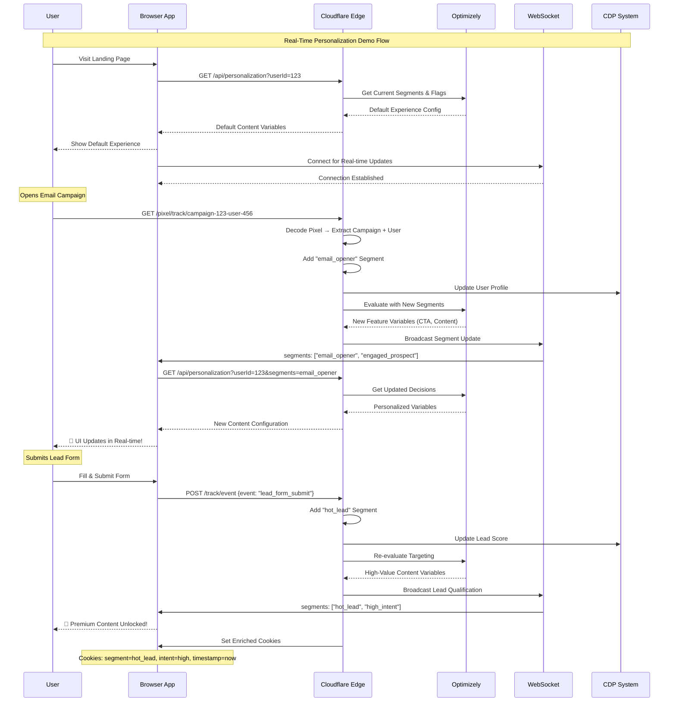

# 🚀 Real-Time Personalization Demo Architecture

## Overview

This architecture demonstrates how customer actions (email opens, form submissions, page views) can trigger immediate personalization changes using Optimizely Feature Experimentation and edge computing.

## Architecture Diagram

```mermaid
graph TB
    subgraph "Client Applications"
        BROWSER[Browser App<br/>React/Next.js]
        EMAIL_CLIENT[Email Client]
        MOBILE[Mobile App<br/>iOS/Android]
        FORM_EMBED[Embedded Forms]
    end
    
    subgraph "Real-Time Layer"
        WEBSOCKET[WebSocket Server<br/>Cloudflare Durable Objects]
        SSE[Server-Sent Events]
        REAL_TIME_API[Real-Time API<br/>/realtime/*]
    end
    
    subgraph "Edge Processing"
        EVENT_INGESTION[Event Ingestion<br/>/track/action]
        SEGMENT_ENGINE[Real-Time Segmentation]
        DECISION_ENGINE[Optimizely Decisions]
        COOKIE_MANAGER[Cookie/Session Manager]
    end
    
    subgraph "Optimizely Integration"
        FEATURE_FLAGS[Feature Flags<br/>Experimentation]
        VARIABLES[Feature Variables<br/>Content/Config]
        AUDIENCES[Audience Targeting]
        DATAFILE[Datafile Manager]
    end
    
    subgraph "Storage & State"
        PROFILE_CACHE[User Profiles<br/>KV Storage]
        SEGMENT_CACHE[Segment Cache<br/>Durable Objects]
        SESSION_STATE[Session State<br/>Real-time]
        ANALYTICS_STORE[Analytics Engine<br/>Event History]
    end
    
    subgraph "External Systems"
        CDP_SYSTEM[Customer Data Platform]
        EMAIL_PLATFORM[Email Platform<br/>SendGrid/Mailchimp]
        ANALYTICS[Analytics Systems<br/>GA4/Adobe]
    end
    
    %% User Actions
    EMAIL_CLIENT -->|Email Open/Click| EVENT_INGESTION
    BROWSER -->|Form Submit| EVENT_INGESTION
    BROWSER -->|Page View| EVENT_INGESTION
    MOBILE -->|App Action| EVENT_INGESTION
    FORM_EMBED -->|Lead Capture| EVENT_INGESTION
    
    %% Real-time Processing
    EVENT_INGESTION --> SEGMENT_ENGINE
    SEGMENT_ENGINE --> DECISION_ENGINE
    DECISION_ENGINE --> FEATURE_FLAGS
    FEATURE_FLAGS --> VARIABLES
    
    %% State Management
    SEGMENT_ENGINE --> PROFILE_CACHE
    SEGMENT_ENGINE --> SEGMENT_CACHE
    DECISION_ENGINE --> SESSION_STATE
    EVENT_INGESTION --> ANALYTICS_STORE
    
    %% Real-time Notifications
    SEGMENT_ENGINE --> WEBSOCKET
    DECISION_ENGINE --> SSE
    WEBSOCKET --> BROWSER
    SSE --> BROWSER
    
    %% Cookie/Session Updates
    DECISION_ENGINE --> COOKIE_MANAGER
    COOKIE_MANAGER --> BROWSER
    
    %% External Integrations
    SEGMENT_ENGINE --> CDP_SYSTEM
    EVENT_INGESTION --> EMAIL_PLATFORM
    ANALYTICS_STORE --> ANALYTICS
    
    %% Client Requests
    BROWSER --> REAL_TIME_API
    MOBILE --> REAL_TIME_API
    REAL_TIME_API --> DECISION_ENGINE
    
    classDef clientNode fill:#e3f2fd
    classDef realtimeNode fill:#e8f5e8
    classDef processNode fill:#f3e5f5
    classDef optimizelyNode fill:#fff3e0
    classDef storageNode fill:#fce4ec
    classDef externalNode fill:#f1f8e9
    
    class BROWSER,EMAIL_CLIENT,MOBILE,FORM_EMBED clientNode
    class WEBSOCKET,SSE,REAL_TIME_API realtimeNode
    class EVENT_INGESTION,SEGMENT_ENGINE,DECISION_ENGINE,COOKIE_MANAGER processNode
    class FEATURE_FLAGS,VARIABLES,AUDIENCES,DATAFILE optimizelyNode
    class PROFILE_CACHE,SEGMENT_CACHE,SESSION_STATE,ANALYTICS_STORE storageNode
    class CDP_SYSTEM,EMAIL_PLATFORM,ANALYTICS externalNode
```



## Demo Flow Sequence



## Implementation Strategy

### Phase 1: Foundation Extension (Week 1)
- Create WebSocket endpoint using Durable Objects
- Extend event tracking for real-time processing
- Build segment enrichment engine
- Add cookie/session management

### Phase 2: Optimizely Integration (Week 2)
- Implement real-time decision engine
- Create feature variable mapping system
- Build audience targeting logic
- Add decision caching with TTL

### Phase 3: Client Application (Week 3)
- Build React demo application
- Implement WebSocket client
- Create dynamic component system
- Add real-time UI updates

### Phase 4: Demo Scenarios (Week 4)
- Email campaign tracking flow
- Form submission personalization
- Page behavior adaptation
- Mobile app integration

## Key Technical Components

### 1. Real-Time Segment Engine
```typescript
interface SegmentEngine {
  evaluateAction(userId: string, action: ActionEvent): Promise<string[]>
  updateUserProfile(userId: string, segments: string[]): Promise<void>
  triggerPersonalization(userId: string): Promise<void>
}
```

### 2. WebSocket Manager (Durable Object)
```typescript
class PersonalizationWebSocket {
  handleConnection(request: Request): Response
  broadcastSegmentUpdate(userId: string, segments: string[]): void
  sendPersonalizationUpdate(userId: string, variables: FeatureVariables): void
}
```

### 3. Dynamic Decision Engine
```typescript
interface DecisionEngine {
  getPersonalizationConfig(userId: string, segments: string[]): Promise<PersonalizationConfig>
  evaluateFeatureFlags(context: UserContext): Promise<FeatureDecisions>
  getCookieUpdates(segments: string[]): CookieConfiguration
}
```

### 4. Event Action Handlers
```typescript
interface ActionHandler {
  handleEmailOpen(pixelData: PixelData): Promise<SegmentUpdate>
  handleFormSubmission(formData: FormSubmissionEvent): Promise<SegmentUpdate>
  handlePageInteraction(pageEvent: PageInteractionEvent): Promise<SegmentUpdate>
}
```

## Demo Use Cases

### Use Case 1: Email-Triggered Personalization
1. **Trigger**: User opens email campaign
2. **Processing**: Extract campaign context, add "engaged" segment
3. **Decision**: Optimizely evaluates new segments
4. **Action**: WebSocket pushes updated content variables
5. **Result**: Browser shows personalized CTA and content

### Use Case 2: Form-Submission Qualification
1. **Trigger**: User submits lead capture form
2. **Processing**: Extract form data, calculate lead score
3. **Decision**: Promote to "qualified_lead" segment
4. **Action**: Unlock premium content variables
5. **Result**: Real-time content upgrade without page reload

### Use Case 3: Behavioral Adaptation
1. **Trigger**: User spends 2+ minutes on pricing page
2. **Processing**: Add "price_interested" segment
3. **Decision**: Show discount offer feature flag
4. **Action**: Display time-limited offer
5. **Result**: Immediate conversion opportunity

### Use Case 4: Mobile App Integration
1. **Trigger**: Push notification click
2. **Processing**: Context from notification campaign
3. **Decision**: Mobile-specific feature variables
4. **Action**: Update app UI configuration
5. **Result**: Seamless cross-channel experience

## Technical Implementation

### WebSocket Endpoint
```typescript
// /src/routes/realtime.ts
export async function handleWebSocket(request: Request, env: Env): Promise<Response> {
  const upgradeHeader = request.headers.get('Upgrade');
  if (upgradeHeader !== 'websocket') {
    return new Response('Expected Upgrade: websocket', { status: 426 });
  }
  
  const userId = new URL(request.url).searchParams.get('userId');
  const id = env.PERSONALIZATION_WEBSOCKET.idFromName(userId);
  const durableObject = env.PERSONALIZATION_WEBSOCKET.get(id);
  
  return durableObject.fetch(request);
}
```

### Real-Time Segmentation
```typescript
// /src/services/RealtimeSegmentEngine.ts
export class RealtimeSegmentEngine {
  async processAction(userId: string, action: ActionEvent): Promise<PersonalizationUpdate> {
    // 1. Determine new segments based on action
    const newSegments = await this.calculateSegments(action);
    
    // 2. Update user profile
    await this.updateUserSegments(userId, newSegments);
    
    // 3. Get new Optimizely decisions
    const decisions = await this.getOptimizelyDecisions(userId, newSegments);
    
    // 4. Prepare real-time update
    return {
      userId,
      segments: newSegments,
      featureVariables: decisions.variables,
      cookieUpdates: this.generateCookieUpdates(newSegments),
      timestamp: Date.now()
    };
  }
}
```

This architecture enables the exact demo you're envisioning - showing customers how their actions can have immediate, measurable effects on the experiences they see, all powered by Optimizely Feature Experimentation at the edge.

Would you like me to start implementing this by creating the branch and building the WebSocket infrastructure?