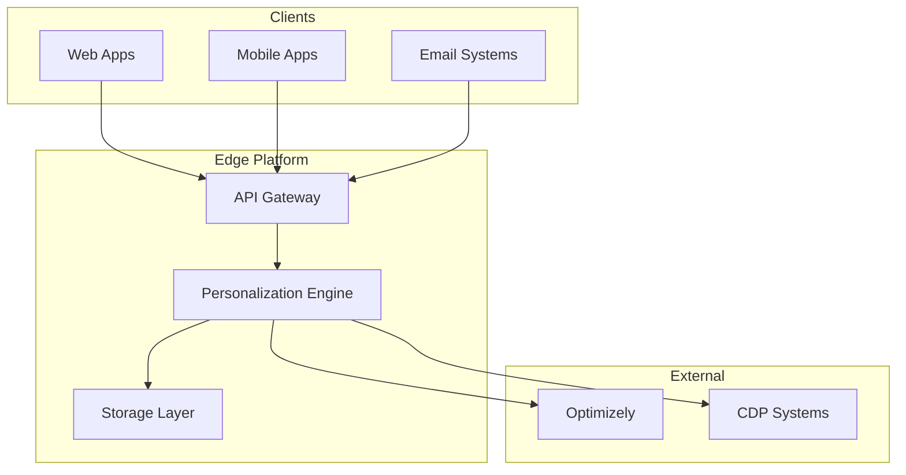

# System Overview

## Executive Summary

The Real-Time Personalization Platform is an edge-computing solution that enables instant user experience personalization based on real-time behavioral signals. Built on Cloudflare Workers, it processes events at the edge and delivers personalized content through Optimizely Feature Experimentation.

## Key Capabilities

- **Sub-100ms Personalization**: Events trigger segment updates in real-time
- **Edge-Native Processing**: All logic runs at Cloudflare's edge locations
- **WebSocket Live Updates**: Changes broadcast instantly to connected clients
- **Session Persistence**: Sophisticated cookie and KV-based session management
- **Feature Variable Override**: Dynamic feature flag modifications per user
- **Multi-Channel Support**: Web, mobile, email, and API integrations

## Technology Stack

| Layer | Technology | Purpose |
|-------|------------|---------|
| **Runtime** | Cloudflare Workers | Edge compute platform |
| **Language** | TypeScript | Type-safe development |
| **Framework** | Hono | Lightweight web framework |
| **Experimentation** | Optimizely Edge SDK | Feature flags and experiments |
| **Session Storage** | Cloudflare KV | Key-value storage |
| **Object Storage** | Cloudflare R2 | File and asset storage |
| **State Management** | Durable Objects | Stateful components |
| **Queue Processing** | Cloudflare Queues | Async event processing |
| **Analytics** | Analytics Engine | Metrics and monitoring |

## High-Level Architecture

## Core Concepts

### 1. Real-Time Segmentation
Users are dynamically assigned to segments based on their actions (email opens, form submissions, page views). These segments drive personalization decisions.

### 2. Edge Processing
All personalization logic runs at Cloudflare's edge locations, ensuring low latency regardless of user location.

### 3. Feature Variables
Content and features are controlled through Optimizely feature variables that can be overridden per user or segment.

### 4. Session Continuity
User sessions persist across requests using secure cookies and KV storage, maintaining personalization context.

## Use Cases

### E-Commerce
- Show personalized product recommendations
- Display targeted promotions based on browsing history
- Adjust pricing display for different segments

### Media & Publishing
- Personalize content recommendations
- Control paywall strategies
- Customize subscription offers

### B2B SaaS
- Tailor onboarding flows
- Show relevant feature highlights
- Customize pricing based on company size

### Financial Services
- Personalize product offerings
- Risk-based authentication flows
- Targeted financial advice

## System Components

| Component | Responsibility |
|-----------|---------------|
| **RealtimeSegmentEngine** | Evaluates user actions and updates segments |
| **SessionManager** | Manages user sessions and cookies |
| **FeatureVariableManager** | Handles feature flags and variables |
| **PersonalizationWebSocket** | Manages real-time connections |
| **EventDispatcher** | Routes events to external systems |

## Performance Targets

- **Response Time**: P95 < 100ms
- **Throughput**: 10,000 requests/second
- **WebSocket Connections**: 100,000 concurrent
- **Availability**: 99.99% uptime

---

🔗 **Next**: [Component Architecture](./02-components.md)  
🔗 **Related**: [Quick Start Guide](../guides/01-quick-start.md)