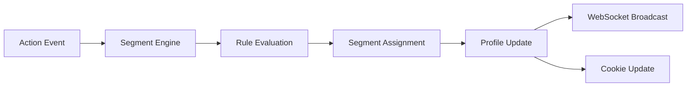
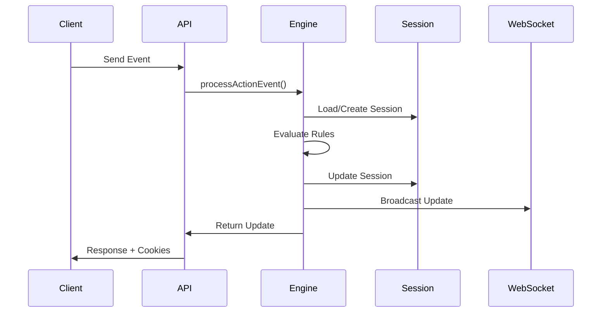

# Segment Engine Documentation

## Overview

The `RealtimeSegmentEngine` is the core component that evaluates user actions and dynamically assigns segments in real-time. It processes events, evaluates rules, and triggers personalization updates.

## Location

**File**: `src/services/RealtimeSegmentEngine.ts`

## Key Responsibilities

1. Process incoming action events
2. Evaluate segment rules based on user behavior
3. Update user profiles and segments
4. Trigger real-time personalization updates via WebSocket
5. Integrate with SessionManager and FeatureVariableManager

## Architecture



## Core Interfaces

### ActionEvent

```typescript
interface ActionEvent {
  type: 'email_open' | 'form_submit' | 'page_view' | 'button_click' | 'custom'
  userId: string
  anonymousId?: string
  data: Record<string, any>
  timestamp: number
  source: string
}
```

### SegmentRule

```typescript
interface SegmentRule {
  id: string
  name: string
  condition: (event: ActionEvent, profile: UserProfile) => boolean
  segment: string
  priority: number
  cooldown?: number // Minutes before rule can fire again
}
```

## Default Segment Rules

| Rule ID | Trigger | Segment | Priority | Cooldown |
|---------|---------|---------|----------|----------|
| `email_opener` | Email open event | `email_engaged` | 100 | 60 min |
| `form_submitter` | Form submission | `lead_qualified` | 200 | 24 hours |
| `multiple_email_opens` | 3+ email opens | `highly_engaged` | 150 | None |
| `pricing_page_visitor` | View pricing page | `price_interested` | 120 | None |
| `high_value_prospect` | 2+ emails & 1+ form | `high_value` | 300 | None |
| `demo_request` | Demo form submit | `sales_qualified` | 400 | None |

## Usage Examples

### Process an Action Event

```typescript
const segmentEngine = new RealtimeSegmentEngine(env)

const event: ActionEvent = {
  type: 'email_open',
  userId: 'user-123',
  data: {
    campaignId: 'summer-sale',
    emailId: 'email-456'
  },
  source: 'email',
  timestamp: Date.now()
}

const update = await segmentEngine.processActionEvent(event)
// Returns PersonalizationUpdate with new segments and feature variables
```

### Add Custom Segment Rule

```typescript
const customRule: SegmentRule = {
  id: 'vip_customer',
  name: 'VIP Customer',
  condition: (event, profile) => {
    const totalPurchases = profile.attributes.total_purchases || 0
    return totalPurchases > 10000
  },
  segment: 'vip',
  priority: 500,
  cooldown: 1440 // 24 hours
}

segmentEngine.addSegmentRule(customRule)
```

### Get User Segments

```typescript
const segments = await segmentEngine.getUserSegments('user-123')
// Returns: ['email_engaged', 'high_value', 'vip']
```

### Manual Segment Assignment

```typescript
await segmentEngine.assignSegment(
  'user-123',
  'beta_tester',
  'manual' // source
)
```

## Integration with Session Management

The Segment Engine integrates with SessionManager to maintain segment persistence:

```typescript
// Process event with session context
const result = await segmentEngine.processActionEventWithSession(
  event,
  request.headers.get('Cookie')
)

// Returns session ID and cookie headers for response
response.headers.set('Set-Cookie', result.cookieHeaders)
```

## Rule Evaluation Logic

### Priority System

Rules are evaluated in priority order (highest first):
1. Higher priority rules override lower priority ones
2. Multiple rules can add different segments
3. Cooldown periods prevent rule spam

### Cooldown Management

```typescript
// Rule with cooldown
{
  id: 'frequent_viewer',
  cooldown: 60, // 60 minutes
  condition: (event) => event.type === 'page_view'
}

// User can only get this segment once per hour
```

## Performance Considerations

### Caching Strategy

- User profiles cached in KV for 7 days
- Segment evaluations cached in memory for 5 minutes
- Feature variables cached per user/segment combination

### Optimization Tips

1. **Batch Events**: Process multiple events together when possible
2. **Use Cooldowns**: Prevent excessive rule evaluations
3. **Prioritize Rules**: Put most common rules at higher priority
4. **Cache Profiles**: Leverage KV caching for user profiles

## Event Processing Flow



## Error Handling

The engine handles various error scenarios:

```typescript
try {
  const update = await segmentEngine.processActionEvent(event)
} catch (error) {
  if (error.message.includes('User not found')) {
    // Create new user profile
  } else if (error.message.includes('Invalid event')) {
    // Return 400 Bad Request
  } else {
    // Log and return 500 Internal Error
  }
}
```

## Extending the Engine

### Adding New Event Types

1. Update the `ActionEvent` type union
2. Add processing logic in `processActionEvent`
3. Create corresponding segment rules
4. Update event validation schema

### Custom Rule Conditions

```typescript
// Complex multi-condition rule
const complexRule: SegmentRule = {
  id: 'power_user',
  name: 'Power User',
  condition: (event, profile) => {
    const recentEvents = profile.events.filter(
      e => e.timestamp > Date.now() - 7 * 24 * 60 * 60 * 1000
    )
    
    const hasEmail = recentEvents.some(e => e.type === 'email_open')
    const hasForm = recentEvents.some(e => e.type === 'form_submit')
    const hasPageViews = recentEvents.filter(e => e.type === 'page_view').length >= 10
    
    return hasEmail && hasForm && hasPageViews
  },
  segment: 'power_user',
  priority: 250
}
```

## Testing

```typescript
describe('RealtimeSegmentEngine', () => {
  it('should add segment on email open', async () => {
    const engine = new RealtimeSegmentEngine(mockEnv)
    
    const event: ActionEvent = {
      type: 'email_open',
      userId: 'test-user',
      data: {},
      source: 'test',
      timestamp: Date.now()
    }
    
    const result = await engine.processActionEvent(event)
    
    expect(result.data.segments).toContain('email_engaged')
  })
})
```

---

🔗 **Next**: [Session Manager](./02-session-manager.md)  
🔗 **Related**: [Data Flow](../architecture/03-data-flow.md) | [API Reference](../api/03-event-types.md)