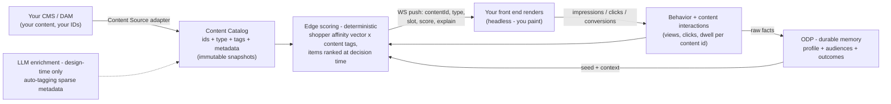

# Real-Time Behavioral Personalization at the Edge — Overview for ASOS

*What our edge personalization engine does today — live, verified — and the content-personalization capability we are building on top of it with design-partner retailers.*

---

## What exists today (live, not roadmap)

A real-time behavioral personalization engine running on the CDN edge, with **Optimizely ODP** as the durable first-party memory:

- **Live affinity scoring, per shopper, in milliseconds.** As a shopper browses, the engine maintains a per-dimension affinity vector (category, product line, silhouette, occasion, price band) — scores **rise with engagement and decay with time**, so shoppers flow *into and out of* affinity audiences purely by behavior. Deterministic math (recency/frequency-weighted decayed scoring — the same class of computation behind the affinity engines you may know, made transparent), no black box: every membership change carries an **explain record**.
- **Audiences generated from your catalog.** "Tote Affinity," "Evening Affinity" — the names come from the catalog's own taxonomy; audiences are auto-generated (population-filtered so noise values never become audiences), fully reviewable and tunable. Nobody hand-maintains lists.
- **ODP as the memory, the edge as the reflex.** Every behavioral fact streams into ODP in real time (event ingest with delivery receipts); the edge seeds from ODP's segments (an instant read measured at ~85–200 ms); the live affinity scores are written onto the ODP customer profile. Split by responsibility: ODP owns the facts, profile, and audiences; the edge owns decay and scoring.
- **Platform-native activation.** The affinity audiences are real ODP segments — available immediately for targeting, personalization campaigns, and **CMAB** (where the affinity *scores* feed the bandit as context attributes: memberships gate, scores teach).
- **Governed and tunable.** Per-dimension weights, decay rates, and thresholds are configuration (a tuning UI is in progress with design partners); audiences are legible rules; decisions are explainable end to end.
- **Headless-native delivery.** Server-side at the edge — no client-side snippet injection. Decisions push over a WebSocket to the front end; a snapshot endpoint covers first paint.

This foundation is deployable to a new environment in roughly **1–2 weeks**.

## What we're building on this foundation: content personalization

Working with design-partner retailers, we are extending the same engine from *products* to **content** — because the engine is catalog-agnostic by design, a content catalog is simply a second catalog:

**The idea in one line:** register your content (images, copy blocks, modules) in a **content catalog** — your IDs, your URLs, tagged metadata (an LLM enrichment pass fills sparse tagging, human-approved, design-time only) — and the engine recommends **content the way recommendation engines recommend products**: scored against each shopper's live affinity and context (entry channel, visit count, referrer), pushed to your front end as `{content ID, type, score, explain}`. Your front end paints; the runtime stays deterministic and fast — no model calls in the render path.

**How the intelligence grows (staged, each stage feeding the next):**
1. **Affinity-matched content** — content matching *this shopper's* live behavior wins. Per-individual, real-time, explainable; no hand-coded variation sets.
2. **Outcome-optimized content** — the system learns *what works*: content × context × conversion across all shoppers (aggregation + CMAB with content items as arms), so among matching content, the proven winner for shoppers-like-this is served.
3. **Discovery** — the system surfaces the patterns nobody predefined ("visitors from paid social who engage with reviews convert at 3×"), proposed through **Opal** with full explainability, human-approved.

Stage 1 rides the engine that exists today; stages 2–3 are in active development with design partners. A further tier — **experience/layout personalization** (the page's module composition itself personalized per shopper, every module addressed by ID) — is designed and sits on the same delivery contract.

## Why this architecture (the three properties that matter)

- **Instant *and* durable:** milliseconds in-session at the edge; a governed, cross-channel first-party memory in ODP. One event stream, two readers.
- **Glass, not black box:** every audience is a rule you can read; every decision explains itself; every weight is yours to tune.
- **Headless-native:** decisions by ID over a socket, your front end in control — no injection, no layout risk, CDN-grade performance.

## What partnering looks like

Design partners shape the co-design surfaces directly: the content-catalog contract (IDs, types, metadata), the SDK push-payload schema, the slot taxonomy, the tuning UI, and the Stage-2 success metrics. The foundation deploys in weeks; the content capability is being built now — partners get it first and shape it most.

*Next step: a working session with your engineering team — a live walkthrough of the running engine, then the content-catalog and SDK contracts against your stack.*
