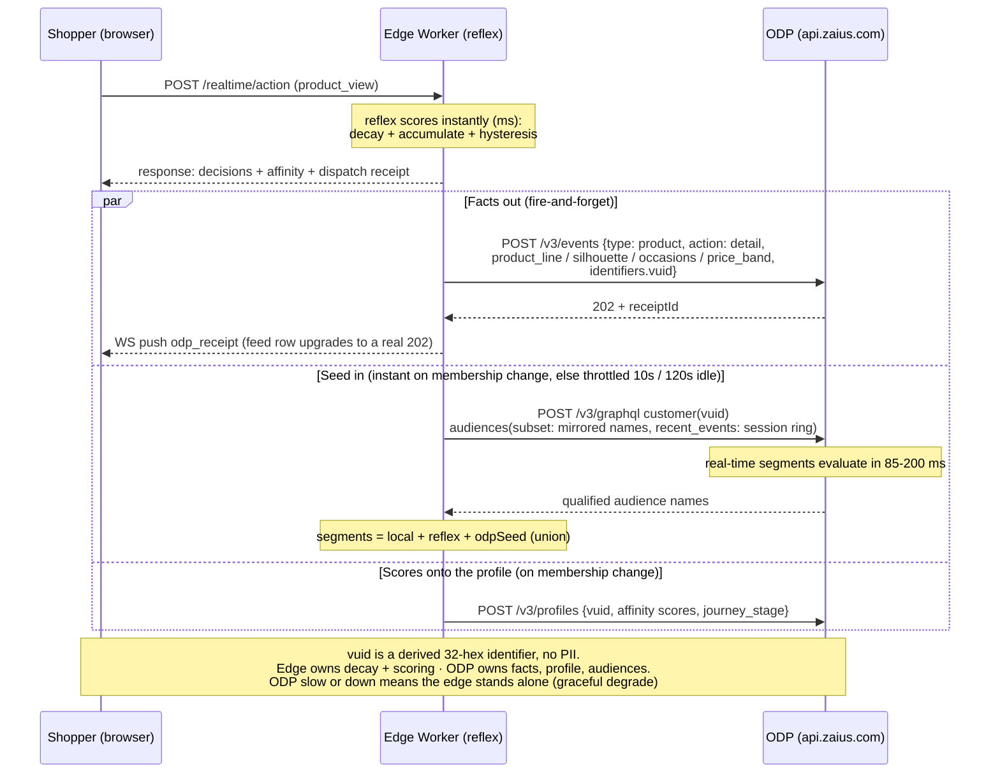
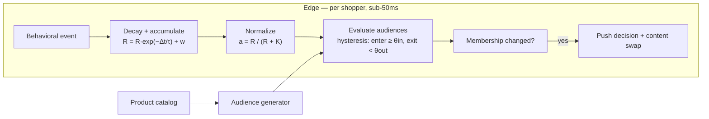
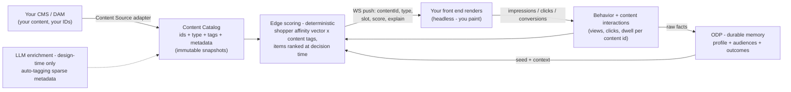

# Real-Time Behavioral Personalization at the Edge

### An architecture overview for ASOS — what the platform is, how it works, and where it's going

---

## 1. Executive summary

Every retailer wants the same thing from personalization: a store that adapts to each shopper **as they browse** — not on the next visit, not after tonight's batch job, but in the moment. Audiences that build themselves from behavior. Shoppers who flow into and out of those audiences naturally, as their interest shifts. Content and experiences that respond immediately. And all of it explainable, governed, and running on the retailer's **own first-party data**.

This document describes a platform Optimizely has built that does exactly that. It runs at the **CDN edge** — in the data center closest to the shopper — and computes a live, per-shopper behavioral profile in **milliseconds**, while **Optimizely Data Platform (ODP)** serves as the durable, cross-session memory underneath it. It is running today, verified end to end against a live ODP instance, and deployable to a new environment in roughly one to two weeks.

The document is in three parts: **what exists today and how it works** (§2–§7), **the architecture** (§8), and **the capability we are now building on top of it — content personalization** (§9–§10), which we are developing with design-partner retailers and where ASOS's interest is the reason for this write-up.

---

## 2. The problem this solves

Behavioral personalization has historically forced a choice between three bad options:

1. **Batch segmentation** — audiences recomputed nightly or hourly. By the time "interested in occasion wear" is true in the system, the shopper left twenty minutes ago.
2. **Hand-coded rules** — "if the visitor viewed 3 products in category X, show banner Y." Every audience is a rule someone wrote and must maintain; shoppers enter but never leave (nothing expires); the logic is guesswork frozen in configuration.
3. **Black-box vendors** — products that do build behavioral affinity automatically, but on opaque scoring you cannot inspect, tune, or explain — often computed on data infrastructure you don't own.

What retailers actually want is the fourth option: affinity that computes **automatically** and **instantly**, that **decays** so shoppers exit as naturally as they enter, that is **transparent** (every score inspectable, every threshold tunable, every decision explainable), and that runs on **first-party data in the retailer's own customer data platform**. That is what this platform is.

---

## 3. What the platform is, in one walk-through

Take an anonymous shopper — no login, no history. She lands on the storefront.

1. **She browses.** She opens three evening dresses over about a minute. Each view is a behavioral event, sent to the edge engine.
2. **The engine scores her, live.** For every dimension of the catalog — category, product line, silhouette, occasion, price band — the engine maintains a per-shopper **affinity score** between 0 and 1. Her *occasion: evening* score climbs with each view. This computation happens at the edge in milliseconds, in the same request.
3. **She crosses a threshold.** After the third view her evening affinity passes the entry threshold, and she becomes a member of the **"Evening Affinity"** audience. Nobody created a campaign or wrote a rule for her — the audience definition was **generated from the catalog's own taxonomy** (more on this in §5), and her behavior carried her into it.
4. **The experience responds immediately.** Membership change triggers a decision: the hero swaps to evening styling, sorting reorders, a relevant module surfaces — pushed to the page over a live connection, on the next paint.
5. **The memory persists it.** In parallel, every behavioral fact streams into **ODP** — her events land on a durable profile, ODP's own real-time segments evaluate her, and the edge's live scores are written onto her ODP customer record. When she returns tomorrow, the platform starts warm.
6. **She drifts, and the system lets go.** She wanders to accessories; her evening score **decays**. Below the exit threshold, she leaves the audience — automatically, at a mathematically exact moment — and the experience relaxes back. This is the part hand-coded rules can never do: membership that is as fluid as attention itself.

Everything in this walk-through is live functionality today, not roadmap.

---

## 4. How the scoring works (and why it's not a black box)

The engine's mathematics are deliberately simple, published, and inspectable — four classical techniques in a chain:

| Stage | Rule | What it does |
|---|---|---|
| **Accumulate** | `R ← R·e^(−Δt/τ) + w` | Each engagement adds evidence; time continuously subtracts it (exponential decay with a tunable time constant τ) |
| **Weight** | view = 1 · wishlist = 2 · cart = 3 · purchase = 5 | Stronger actions are stronger evidence — a continuous, per-dimension form of the RFM model marketers already trust |
| **Normalize** | `a = R / (R + K)` | Maps raw evidence to a 0–1 score with diminishing returns — the same saturation curve used in the BM25 ranking function |
| **Decide** | enter at `a ≥ θ_in`, exit at `a < θ_out` | Two thresholds (hysteresis) so shoppers don't flicker at the boundary |

A concrete trace, with the demo tuning (τ = 60 s, K = 1.8, thresholds 0.60 / 0.45) — three product views, five seconds apart, then the shopper goes idle:

| t | Event | Score `a` | Membership |
|---|---|---|---|
| 0 s | view #1 | 0.357 | — |
| 5 s | view #2 | 0.516 | — |
| 10 s | view #3 | **0.606** | **ENTERS** the affinity audience |
| ~48 s | *(no events — decay only)* | **0.450** | **EXITS** — at a moment computed in closed form, not polled |

Every number above is reproducible by hand from the formulas — and that is the point. Where black-box products say *trust us*, this engine hands you the equation, the parameters (all tunable configuration: weights, decay rates, thresholds — per dimension), and an **explain record on every membership change**: which event, which score movement, which threshold. *"Why is this shopper in this audience?"* always has an exact, replayable answer.

One important clarification: this layer is **deterministic by design** — no machine-learning model decides in the request path. (Predictive ML — order likelihood, churn — lives in ODP, where it belongs; and §10 describes where learning enters the picture for content.) Deterministic is what makes it fast, cheap at scale, and explainable to the standard a brand's engineering and legal teams require.

---

## 5. Audiences that create themselves — from the catalog

The second half of "automatic" is where audiences come from. Nobody invents them, and no model dreams them up: **the product catalog writes them**.

The catalog's own taxonomy — its lines, categories, silhouettes, occasions, price bands — is enumerated, and each meaningful value becomes an audience by template: the value **"tote"** becomes **"Tote Affinity"**, defined as *silhouette affinity ≥ 0.6*. A population filter keeps the set sensible (a value carried by only one product never becomes an audience). Against a demo-scale catalog this generates ~37 audiences across five dimensions in one pass; against a large catalog it generates what the taxonomy supports — and the generated set remains fully **editable**: rename, pin, prune, retune, with human edits protected from regeneration.

So "automatic affinity audiences" decomposes into two honest mechanisms: **the catalog supplies the names and definitions; the behavioral engine supplies the membership.** The same decomposition applies to any catalog — the engine is deliberately catalog-agnostic, configured by taxonomy rather than hard-coded to one retailer's data.

---

## 6. The ODP loop — instant experience, durable memory

The edge engine and ODP divide responsibility cleanly: **the edge owns decay and scoring** (the in-session experience); **ODP owns the facts, the profile, and the audiences** (the durable, governed, cross-channel memory). The event stream between them runs in real time:

Three things flow: **raw behavioral facts out** to ODP's event API (with delivery receipts surfaced back to the page — the integration proves itself on screen); **qualified segments in** as a seed (an instant GraphQL read, measured at 85–200 ms, that unions with the edge's own evaluation); and **the live affinity scores up** onto the ODP customer profile, so the edge's view is visible on the customer record. Because the edge forwards *facts, not scores*, nothing about the edge's tuning ever contaminates ODP's own models — two independent readers of one event stream. And because the audiences land in ODP as real segments, they are immediately available to the whole platform: targeting, personalization campaigns, and **CMAB** (contextual multi-armed bandit) experiments — where the affinity *scores* additionally serve as the contextual attributes the bandit learns on.

---

## 7. What exists today — summary

- Live per-shopper affinity scoring at the edge (sub-50 ms), with decay, hysteresis, per-dimension tuning, and explain records — verified in production.
- Catalog-generated affinity audiences — automatic to stand up, human-controlled after.
- The full ODP loop — events with receipts, the instant segment seed, profile score upserts — live-verified against a real ODP instance.
- Platform activation — the audiences drive personalization campaigns and CMAB natively.
- A live on-screen instrument (score bars, membership badges, ODP confirmations) that makes the whole mechanism visible — useful both as a demo and as an operator's window.
- Headless-native delivery: server-side at the edge, decisions pushed over a WebSocket, no client-side snippet injection, no layout risk.

Deployable to a new environment in **~1–2 weeks**. A live walkthrough takes thirty minutes and is the fastest way to evaluate all of the above.

---

## 8. Architecture at a glance

The runtime is a globally distributed edge worker holding each shopper's state in a per-shopper isolate, with the catalog and audience definitions cached locally — **no external calls on the hot path**, which is what makes the millisecond budget structural rather than aspirational. ODP connects asynchronously as shown in §6. All tuning (weights, decay constants, thresholds, dimensions) is versioned configuration, changed without deployment.

---

## 9. Where this is going: content personalization

Everything above personalizes **within a fixed experience** — which products, which sort, which pre-built variation. The next tier, which we are building now with design-partner retailers, applies the same engine to a different question: **which piece of content should each shopper see?**

The insight that makes this a natural extension rather than a new product: the engine is **catalog-agnostic**. It scores a shopper against whatever taxonomy it is configured with. Today that taxonomy comes from the product catalog. Register a **content catalog** — every image, copy block, and module from the retailer's CMS, each carrying the retailer's own ID, a URL, and descriptive tags — and the identical machinery scores each shopper's affinity against **content attributes**, and recommends **content the way recommendation engines recommend products**:

Concretely: a returning shopper with high *evening* affinity, arriving from paid social on her second visit, gets the model-worn evening image in the hero — not because someone wrote that rule, but because her behavioral vector selected it from the tagged content catalog. The decision arrives at the front end as a small message — `{content ID, type, slot, score, explain}` — over the same WebSocket the platform already uses. **The retailer's front end paints; the platform decides.** For a headless architecture this is the entire integration contract: your IDs in, your IDs out, your rendering untouched.

Two design choices worth naming because they distinguish this from everything else in the market:

- **The runtime stays deterministic.** No LLM, no model call in the render path — decisions stay at edge speed and full explainability. Where AI does enter: **design time**, where an LLM pass auto-tags sparse CMS metadata into the content catalog (human-approved — CMS tagging is never as rich as scoring wants), and **insight time**, where Optimizely's Opal agent explains and proposes on top of the data.
- **Context is first-class.** Entry channel (paid social vs. search vs. email), visit count (first visit vs. returning — backed by ODP's memory), and referrer join the scoring as weighted signals — the highest-value personalization signals retailers consistently report, treated as scored preferences rather than hand-coded branches.

---

## 10. How the intelligence grows — three stages

We stage the capability by what the system *learns*, because each stage produces the data the next one needs:

1. **Learns the shopper** *(the foundation — rides the engine that exists today)*: content is matched to each individual's live behavioral vector. Per-shopper, real-time, explainable — and already beyond rules, because the shopper→content mapping emerges from behavior rather than configuration.
2. **Learns what works** *(in development)*: the system correlates content, context, and **outcomes** across all shoppers — which image converts for paid-social visitors with evening affinity — and serves the proven winner among matching content. Mechanically: **per-item outcome statistics over the open content catalog**, folded into each item's ranking score as measured lift — the same machinery product recommenders use, item-level and catalog-wide, never pre-built variation buckets. Requires stage 1's interaction telemetry accumulating first.
3. **Learns what matters** *(the frontier, with design partners)*: the system surfaces patterns nobody predefined — *"shoppers who linger on reviews during a second visit convert at 3×"* — proposed through **Opal** with full explanation, approved by humans. The machine suggesting; the brand deciding.

Beyond content sits a further tier — **experience personalization**, where the page's module composition itself is assembled per shopper (every module addressed by ID, delivered as an ordered manifest under governed layout rules). It is architecturally designed and shares the same delivery contract; content personalization builds its exact data foundation.

---

## 11. Why this architecture — the three properties that matter

1. **Instant *and* durable.** Milliseconds in-session at the edge; a governed, cross-channel, first-party memory in ODP. One event stream, two readers — you never trade the profile for the reflex or vice versa.
2. **Glass, not black box.** Every audience is a rule you can read; every score is an equation you can check; every decision explains itself; every weight is yours to tune.
3. **Headless-native.** Decisions by ID over a socket; your front end in control; no snippet injection, no layout risk, CDN-grade performance.

## 12. What a partnership looks like

Design partners get the platform first and shape it most — specifically the co-design surfaces: the content-catalog contract (IDs, types, metadata), the SDK push-payload schema, the slot taxonomy, the tuning interface, and the stage-2 success metrics. The practical sequence: **(1)** a 30-minute live walkthrough of the running engine with your engineering team; **(2)** a working session mapping the content-catalog and SDK contracts onto the ASOS stack; **(3)** foundation deployment (~1–2 weeks) and the content-personalization build alongside it.

*Prepared by Optimizely. All capabilities marked "today" are live and verified; staged capabilities are dated by stage and dependency, not aspiration.*
