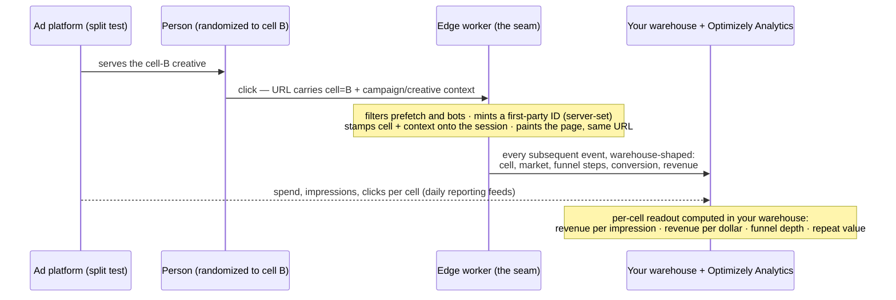
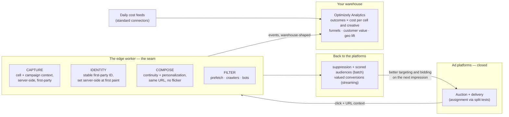
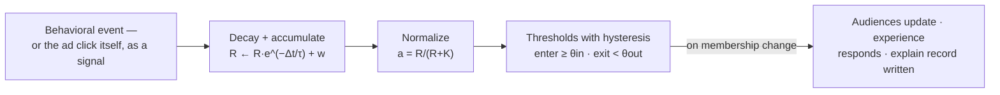

# The Click-Through Seam

### A perspective on paid-media experimentation — and what becomes possible when you own the moment after the click

**Simone Coelho — Managing Principal Enterprise Architect, Optimizely**

*Written for media, marketing, engineering, and data science readers together. The mechanics live in tables and diagrams; the argument lives in the prose. Sources for every load-bearing claim are collected at the end.*

---

## 1. Where this conversation starts

Most sophisticated media organizations bring us some version of the same four questions:

1. **Optimization strategy** — which in-platform optimization setup (which conversion events, which values, which platform features) actually performs best, given that the auctions are run by machine-learning systems we don't control.
2. **Audience targeting** — whether granular first-party audiences beat broader demographic targeting, and by how much.
3. **Creative** — which imagery and messaging works for which audience.
4. **Geo** — whether local media activation in specific markets actually moves outcomes.

All four are experimentation questions. And all four collide with the same wall: **paid media is a black box by design.** The platform's auction decides who sees which ad; the advertiser sees aggregate reports; and the person who clicks arrives on your property anonymous.

It helps to name precisely why this feels harder than the testing you already do. Email testing works because you hold three things: **assignment** (you choose who receives version A and version B), **identity** (you know every recipient), and **visibility** (your link, your landing page, your data tell you what happened next). Paid media takes away all three. You cannot choose who sees which ad — the auction does. You do not know who saw it. And the platform measures the outcome with its own pixel, on its own attribution window, and grades its own homework.

So this document follows one signal end to end — **the paid click** — because the click is the one moment where the ad world touches yours. I'll take the challenges in the order they actually arise: first *how do you split traffic at all*, then *how do you measure what you split*, and then the part I care most about — the engine we have been building that sits exactly at that seam, what it does for testing, and what it additionally makes possible in real-time personalization once it's there.

A note on posture before we start: some of what follows is us being direct about what **nobody** can do in this landscape, including us. In our experience that candor is the fastest way to find the work worth doing together.

---

## 2. Challenge one: splitting the traffic

Here is the part of the problem that is more solved than most teams assume: **every major platform can randomize people into non-overlapping test groups.** This is real, person-level (or cookie-level) random assignment, run before the auction:

| Platform | Native test product | Unit of assignment | Notable constraints |
|---|---|---|---|
| Google Ads | Custom experiments | Cookie-based (a person sees only one arm) or search-based (re-randomized per query) | Split locked at start; base-campaign edits don't sync to the test arm |
| Meta | A/B Test | Person — "random, non-overlapping groups," up to 5 variants | ≥7 days recommended, 30-day max; power estimate shown in UI |
| TikTok | Split Test | Person — two non-overlapping groups | 90% confidence bar; built-in power calculator; 7–30 days |
| LinkedIn | Campaign A/B | Member | Large minimum audiences per variant; multi-week, minimum-budget guidance |
| Microsoft | Experiments | Cookie-based or per-search | Mirrors Google's design |

Meta's own documentation makes the case for why these exist: informally comparing two live campaigns "isn't true experimentation," because audiences overlap and the delivery system contaminates the comparison. The platforms built proper randomization because their own delivery optimization makes naive comparisons unreadable.

So use them. When a clean creative or audience-strategy read matters, the platform's split-test machinery is the right assignment mechanism, and we would never propose rebuilding it.

Now the two pieces of fine print that the platforms will not put on the first slide — both well established in the research literature:

**First: even inside a randomized cell, delivery is not neutral.** The auction still chooses *which people within each cell* actually get exposed, and it chooses differently per creative. The research community calls this **divergent delivery**. A 2025 Journal of Marketing paper puts it plainly: the "winning" ad may have won because the algorithm showed it to people more prone to respond [1]. A 2025 large-scale study — co-authored by platform researchers, across 185,000 real tests — found that this imbalance is systematic in A/B products (and, notably, absent in the platforms' holdout-based lift studies), and that no campaign configuration fully eliminates it [2]. The academic objection dates back to 2018 [3]. The practical translation: a platform split test tells you which ad performs best **as delivered by that platform's targeting** — a genuinely useful answer for budget allocation — but it is not a clean read on which *message* resonates with which *audience*. That cleaner question is answerable only where allocation is actually controlled: on properties you own. We'll come back to that.

**Second — and this is the bigger one: the results are aggregate, platform-attributed, and unverifiable.** No platform exports who was assigned to which cell. The readout is the platform's own attributed conversions, on its chosen window, measured by its own pixel. You cannot join test cells to your CRM, your revenue, or your longer-term customer outcomes — and you cannot reproduce the analysis. The same is true of the platforms' lift studies: the randomization and holdout membership never leave the building.

Which sets up the real problem. **Splitting traffic is available. Measuring what you split — in your data, against revenue, on your terms — is not.** That's challenge two, and it's where the interesting engineering lives.

---

## 3. Challenge two: measuring what you split

There is exactly one place where information escapes the black box on every single paid visit: **the landing URL.** Every platform lets the ad's identity ride the click:

| What crosses the click | Examples |
|---|---|
| Structural IDs via URL macros | Google ValueTrack: campaign, ad group, creative/ad ID, keyword, match type, device, network, geo criterion; Meta: campaign/ad-set/ad IDs and names, placement, source app; TikTok: campaign/ad-group/creative IDs; LinkedIn: account/campaign/creative IDs; Microsoft: a near-clone of ValueTrack |
| Auto-appended click IDs | `gclid`/`wbraid` (Google), `fbclid` (Meta), `ttclid` (TikTok), `msclkid` (Microsoft), `li_fat_id` (LinkedIn), and equivalents — each one is also the match key for that platform's server-side conversion API, which matters later |
| Whatever you add | UTMs — including a **test-cell parameter** on each arm of a platform split test |

Before the mechanism, a piece of context the mechanism depends on — because the diagram below is not hypothetical infrastructure. For some time now I have been designing real-time systems that live at the **CDN edge**: the compute layer that answers a request in the data center closest to the person, in the few milliseconds before a page paints. An engine of this kind already runs in production for other enterprise customers — I introduce it properly in §4 and §5, because it is the heart of this document. What matters here is the *position* it occupies: an edge worker is the **first server-side touchpoint after the click**. It sees the campaign context that produced the visit and everything the visitor does next, while the click is still warm, on every request — before any tag or pixel gets the chance to fire, or be blocked. Much of what this document proposes is an extension of that engine — thinking I have been carrying for a while about what the same machinery makes possible when it is pointed at paid media. When this document says "the seam," that worker is what it means. Hold that image.

That last row of the table, landed in that position, is the key that turns the platforms' split tests into *your* experiments:

> **The platform randomizes. The URL declares the cell. The edge captures. Your warehouse judges.**

In email terms: the platform's split test is your send list, the URL parameter is your tracking pixel, the landing is your open, and the warehouse is where truth gets computed. Assignment stays with the machinery that does it well; measurement moves to the only place it can be honest.

Three disciplines make this statistically honest rather than merely clever:

- **Measure at the cell level.** Under person-level randomization, cell-level ratios are clean: revenue per impression, revenue per dollar, conversions per thousand impressions — the platform supplies the denominators (spend, impressions per cell, from its reporting APIs), your first-party stream supplies the numerators. Per-click conversion rates are still useful, but they are *diagnostics*, not causal claims — the creative influences who clicks, so post-click rates are conditioned on the click.
- **Run the integrity check the platforms can't.** The platform reports clicks per cell; your edge counts arrivals per cell. Those two numbers reconciling — after bot and prefetch filtering — is a built-in audit of the whole measurement chain. (Sample-ratio checking is standard practice in mature experimentation programs [4]; paid traffic is where it's most often skipped and most needed.)
- **Match the instrument to the question.** Not everything can be person-randomized by anyone — bid strategies, event-and-value schemes, and local media questions apply to whole campaigns or whole markets. Those go to **geo experiments**: matched-market designs with open-source, fully auditable statistics (Meta's GeoLift and Google's newly released Meridian GeoX are both open source [5]) — run over your warehouse data, so the analysis is reproducible by your own team. This is the industry's answer to incrementality for a reason, and for a brand with presence in every market it is an exceptionally natural fit.

Put together, testing lands in three tiers:

| Tier | Question it answers | Assignment | Measurement |
|---|---|---|---|
| **Split-test tier** | Which creative/audience strategy wins, as delivered | Platform split test; cell declared in URL | Cell-level, in your warehouse, against your revenue |
| **Always-on ledger** | Which ads buy engaged sessions and revenue vs clicks that bounce | None — every ad is macro-tagged anyway | Standing per-creative post-click scoreboard; catches high-CTR/low-value creative that platform metrics structurally reward. Directional, not causal — labeled as such |
| **Geo tier** | Strategy questions: bid/value schemes, granular vs broad, local media | Market-level randomization | Open-source lift statistics over warehouse outcomes, run jointly with your data science team |

**Where the measurement runs.** This is what our warehouse-native analytics product (**Optimizely Analytics**) was built for: it computes directly against Snowflake, Databricks, BigQuery, or Redshift — funnels, journeys, retention, and experiment statistics **in situ, with no data leaving your warehouse**. Ad-platform cost and creative aggregates arrive daily through standard connectors (this is a well-trodden pattern — open-source models exist that normalize cost data across all the major platforms into one schema). Your conversions arrive first-party from the edge. The join is straightforward SQL on your side of the fence — which means the analysis is inspectable, repeatable, and yours.

One more property matters for a subscription business: because conversions are captured server-side with their click context, the warehouse can later join **acquisition creative to realized customer value** — plan tier, upgrades, churn — months after the click. "Which ad bought customers who stayed" is a question no pixel-and-platform stack can answer, and for subscription economics it's the question that matters most.

---

## 4. The engine at the edge

Now the engine I promised in §3, plainly. I design personalization and experimentation systems for large enterprises, and over the past year I have been building exactly this class of system — real-time, edge-resident, measurement-first — for other enterprise customers, as custom solutions inside specific engagements. The same requirements kept arriving from different industries, often in almost the same words. That repetition is why we now treat this as a capability we are investing in properly rather than rebuilding per engagement — and why this document proposes extending it into the media seam: the organizations asking these questions are the ones who should shape what it becomes.

The system runs at the **CDN edge** — in the data center closest to the visitor, on the first server-side touchpoint that sees both sides of the click: the campaign context that produced it, and everything the visitor does after it. That position, held in single-digit milliseconds on every request, is what makes the following capabilities structural rather than aspirational:

**Capture, without the losses you've learned to accept.** Every event is recorded server-side at the edge: no ad-blocker attrition, no tag latency, exact request-level geography on every row, landing in your warehouse already shaped for analysis. The click IDs and campaign context are stamped onto the session at arrival — including the test-cell parameter from §3.

**Identity that survives the modern browser.** A detail with outsized consequences: Safari caps *JavaScript-set* cookies at **24 hours** on exactly this traffic — navigations arriving from ad platforms with tracking parameters attached [6]. Every purely client-side tool loses those visitors' identity overnight, which quietly corrupts both testing (the same person re-enters as a new visitor) and personalization (memory resets daily). Cookies set **server-side at the edge, at first paint,** don't carry that cap. This is not an exotic trick; it is simply only available to an architecture that owns the response.

**A data-quality firewall in front of your experiments.** Paid traffic is polluted in ways platform decks don't mention: Meta pre-downloads landing pages before anyone taps, TikTok documents that server requests will exceed real clicks for the same reason, and platform crawlers visit ad landing URLs routinely [7]. The edge sees the request headers and filters this traffic **before** it contaminates assignment counts or outcome data. Client-side tags fire after the damage is done. (This class of pollution is a leading cause of the sample-ratio failures that invalidate paid-landing tests [4].)

**Continuity at first paint — the click you paid for, landed.** The edge reads the click context — campaign, creative story, market — and composes the landing experience to continue the ad's promise, at the **same URL**, with no redirect and no flicker. Three independent reasons this is the right mechanic, beyond taste:

- *The economics are in the auction.* Google's Ad Rank documentation explicitly scores whether your landing page meets "the expectations users have based on the clicked ad creative," and higher-quality ads routinely pay **less per click** [8]. Message match isn't just a conversion lever; it lowers acquisition cost at the source.
- *Redirect-based routing fights both policy and physics.* Cross-domain redirects from final URLs violate Google's destination policies, and every redirect hop costs real time — and a tenth of a second of speed is measurably worth several percent of conversion [9].
- *Composition is the only thing that scales.* A generation of post-click tools attacks this by pre-building pages — one page per ad, mapped by hand or stamped out by templates. That works until campaigns × creatives × audiences × markets does what combinatorics does. Composing the experience at request time from your content, keyed on the click context plus what the engine knows about the visitor, is how the matrix gets covered without anyone pre-building it. It's worth noting the direction of travel here: Google now defaults to *replacing* advertisers' chosen landing URLs with pages its AI predicts will convert better [10]. Advertisers who can't match message to click at parity are already ceding that decision.

Everything above serves the testing story from §3. But the most interesting property of this engine is that once it sits in the seam, testing is only half of what it does.

---

## 5. Beyond testing: personalization in real time

The engine's core is a **behavioral affinity model** computed live, per visitor, at the edge — and it is deliberately *not* machine learning in the serving path, and *not* the counters most personalization tools use. It's worth being precise about how it works, because the mechanics are the credibility:

| Step | Rule | What it means in plain language |
|---|---|---|
| **Accumulate** | `R ← R·e^(−Δt/τ) + w` | Every action adds evidence of interest; time continuously subtracts it (exponential decay, tunable per dimension) |
| **Weight** | e.g. view = 1 · engage = 2 · configure = 3 · order = 5 | Stronger actions are stronger evidence — and the weights are visible configuration, not buried model coefficients |
| **Normalize** | `a = R / (R + K)` | Raw evidence becomes a 0-to-1 score with diminishing returns — repetition can't game it |
| **Decide** | enter at `a ≥ 0.6`, exit at `a < 0.45` | Two thresholds (hysteresis), so membership doesn't flicker at the boundary |

Why this beats a counter: **counters only go up.** A visitor who browsed home-internet plans three weeks ago and one checking address availability right now look identical to a counter. In this model, interest is a living quantity — it builds with engagement, **decays with silence**, and crosses in and out of audiences at mathematically exact moments. A concrete trace: someone clicks a home-internet ad, reads coverage details, opens pricing, runs an availability check — their *home-internet* score climbs with each weighted action and crosses the entry threshold; an audience membership fires; the experience responds on the next paint. They drift to browsing phones; the score decays; at a precomputed instant they exit the audience and the experience relaxes. Nobody wrote a rule for any of it.

Five properties of this design matter for a media conversation specifically:

**The ad click is a signal, not just a referrer.** The creative someone clicked is a *declaration of interest* — a device-upgrade story, a family-plan story, a home-internet story. The engine treats entry channel and campaign context as first-class scored dimensions, so the visitor's profile starts warm **at first paint of the very first visit**, from the click alone — no history required. This is the same mechanism that later personalizes for returning visitors; the click is simply its coldest, most valuable input.

**Audiences build themselves from your taxonomy.** The engine is taxonomy-agnostic: point it at a product catalog and it generates product-affinity audiences; point it at your campaign/offer structure and it generates audiences like "Home Internet Intent" or "Trade-In Shoppers" — each one a legible threshold rule over named dimensions, automatically created, automatically population-filtered, human-editable afterward. No workshop where someone invents segments; the taxonomy is the dictionary and behavior fills the membership.

**Everything explains itself.** Every score is reproducible arithmetic; every audience entry and exit carries an explain record — which events, which weights, which threshold. When a test reads out, "what was the granular audience, exactly?" has an exact, replayable answer. When legal or a data-science team asks why a visitor saw what they saw, the answer is arithmetic, not a model's shrug. (Where we do use AI — generating creative variants, enriching content metadata, narrating results — it is never the thing deciding what a visitor sees in the moment. Decisions stay deterministic, millisecond-fast, and auditable.)

**Two keys over one event stream.** For measurement, each **click** is a unit, carrying its ad identity. For personalization, each **visitor** is a subject, carrying the stable first-party identity from §4. The same event stream serves both: analyses can run at click grain and cluster by visitor — a dual view that neither platform reporting nor pixel analytics can reconstruct.

**Bandits sit one layer up, where the question is open.** Where the answer is known — the ad promised an offer, the landing continues it — a deterministic rule fires; spending traffic to "learn" what the click already told you is waste. Where the question is genuinely open — *which* message or offer works best for a given audience — experimentation takes over: A/B with revenue-grade metrics, multi-armed bandits, and contextual bandits (early access) whose context attributes are precisely the numeric affinity scores this engine computes. Rules where the answer is known; bandits where it's genuinely open; and the onsite environment is exactly the controlled-allocation setting that §2's divergent-delivery problem cannot touch — so message-per-audience learnings earned here travel back into creative briefs for the ads themselves.

---

## 6. Closing the loop with the platforms

Owning the seam also changes what you can *send back* — and this is where the black box, while never opening, starts working harder for you.

- **Suppression first.** The cheapest win in paid media: stop paying to acquire people who already converted. Scored audiences sync from the profile store to the ad platforms as exclusion lists; industry analyses put the waste this removes at a meaningful share of acquisition budgets [11].
- **Scored retargeting audiences, honestly clocked.** Affinity-derived audiences ("high home-internet intent, didn't convert") export to the platforms' audience systems. One honesty note we volunteer before anyone asks: platform audience ingestion is **batch — hours to a day or two, everywhere, with per-platform minimum sizes.** True real-time audience membership does not exist on any ad platform. The session that generated the signal already benefited **onsite**, in milliseconds; the platforms receive it as fresh as their intake allows.
- **Valued conversions — the near-real-time rail.** What *does* flow back continuously is the conversion stream, through each platform's server-side intake (keyed on the click IDs captured at the seam), built on the platforms' current go-forward APIs. And because the engine scores every session, conversions can carry **values, not just pings** — engagement- and affinity-informed at first, and, as the warehouse accumulates joined outcomes, **predicted-lifetime-value** for a subscription business. The platforms' own guidance endorses exactly this (proxy and scored values are explicitly supported for value-based bidding), and their published evidence says richer conversion signals materially improve delivered performance [12]. The bidder starts hunting for the customers who *stay*, not the ones who merely click.
- **Consent as architecture, not afterthought.** Exporting audiences and conversion values is squarely regulated territory — state privacy law generally, and carrier-class obligations (CPNI-shaped) specifically. The egress module is designed with the consent gate as its first component: per-purpose consent checks before any record leaves, full audit of what left and why. For an organization with a serious privacy posture, that gate is a requirement; we consider it a feature.

One structural observation that frames all of this: the browser ecosystem has spent five years dismantling third-party measurement — and the proposed aggregate replacements are now being dismantled too [13]. First-party, server-side capture feeding advertiser-owned measurement isn't a vendor preference; it's where the entire landscape has been converging. The architecture in this document is that conclusion, built.

---

## 7. A note on the CDP question

You may already have a CDP strategy — most organizations at this scale do. Two things are worth knowing about how this architecture relates to it.

**The engine does not require any particular CDP.** Its memory layer is a pluggable connector: the edge owns in-session scoring and decisions; the durable profile store — whichever it is — owns cross-session memory. Your systems remain systems of record. The design principle is *split by responsibility, never by dependency*: the engine runs whole even with the connector absent.

**What ODP adds, if you choose to use it — even in a supporting role.** Optimizely Data Platform can serve as the engine's operational memory without displacing a system-of-record CDP, and it brings four specific things to this use case:

1. **Real-time segment evaluation** measured in the low hundreds of milliseconds, with an instant seed of the visitor's durable profile at session start — the engine starts warm on visit two without waiting on batch windows.
2. **Turnkey audience egress**: productized audience sync into Google, Meta, and TikTok ad platforms (plus others) already exists in ODP's integration directory — the retargeting and suppression rail from §6 as configuration rather than an integration project.
3. **A unified profile the rest of the stack can see**: the engine's live affinity scores are written onto the customer record, where marketing tools, experimentation audiences, and contextual-bandit context can all use them — one view, not an edge-only silo.
4. **Native wiring into the rest of this architecture** — experimentation, analytics, and the AI assistance layer connect to it without custom glue.

If those four arrive some other way in your stack, the architecture doesn't object. The honest summary: ODP is additive here, not required — but for this specific loop, several weeks of integration work already exists as product.

---

## 8. What's real, what we'd build, and what we won't claim

I hold perspectives like this to a strict standard: every capability labeled by its actual state, and the impossible conceded before anyone asks.

| Capability | State |
|---|---|
| Warehouse-native analytics: funnels, journeys, experiment statistics computed in your warehouse (Snowflake, Databricks, BigQuery, Redshift) | Product, available today |
| Feature experimentation: A/B with revenue metrics, sticky assignment for anonymous visitors, multi-armed bandits | Product, available today |
| Contextual bandits with numeric context attributes | Early access |
| ODP audience sync to Google / Meta / TikTok (and others) | Product, available today |
| The edge engine: server-side capture, first-party identity, affinity scoring, taxonomy-generated audiences, real-time composition | Running today in engineered deployments; being productized |
| Ad-context ingress: macros + click IDs parsed and stamped at the edge | Configuration on the engine — days |
| Continuity composition mapped to your campaign taxonomy | Built with you — roughly weeks to a working demonstration |
| Valued-conversion egress rail with the consent gate | Built with you — the one genuinely new module in this document |
| Geo-lift statistics (matched markets, synthetic control) | Joint data-science motion using open-source, auditable methods over your warehouse — deliberately not a black-box product button |

And the concessions, plainly — these hold for every vendor in the room, which is exactly why we lead with them:

- We will never access, influence, or test the **auction and bidding internals**. We feed them better and audit them independently; the box stays closed.
- **Impressions and view-through exposure** stay invisible to everyone but the platform. Geo experiments are the honest instrument for full-funnel effects.
- **In-platform creative measurement stays confounded** — divergent delivery is structural [1][2]. We measure "as delivered" honestly and answer message-resonance questions where allocation is controlled.
- **Real-time audience activation on the platforms does not exist** — their intake is batch. Our milliseconds are onsite; we say so.

If it would be useful, the fastest way to evaluate any of this is not a slide: it's the working system. A demonstration takes a mock ad click end to end — cell-stamped, market-aware first paint; affinity building live on screen; an audience lighting up; an export receipt; a per-cell readout — on infrastructure that already runs. Standing that up against your scenario is measured in days.

---

### Selected sources

1. Braun & Schwartz, *Where A/B Testing Goes Wrong* — Journal of Marketing (2025): divergent delivery in platform split tests. https://journals.sagepub.com/doi/10.1177/00222429241275886
2. Burtch, Moakler, Gordon, Zhang, Hill — analysis of 3,204 lift studies and 181,890 A/B tests (2025, with Meta co-authors): delivery imbalance is systematic in A/B products and not fully removable by configuration. https://arxiv.org/abs/2508.21251
3. Eckles, Gordon & Johnson — PNAS (2018): the foundational objection to naive ad "experiments." https://www.pnas.org/doi/10.1073/pnas.1805363115
4. Fabijan et al. — *Diagnosing Sample Ratio Mismatch* (KDD 2019): the standard taxonomy of experiment-integrity failures. https://exp-platform.com/Documents/2019_KDDFabijanGupchupFuptaOmhoverVermeerDmitriev.pdf
5. Meta GeoLift (open source): https://github.com/facebookincubator/GeoLift · Google Meridian GeoX announcement: https://business.google.com/us/accelerate/announcements/meridian-geox-googles-new-open-source-geo-incrementality-solution/
6. WebKit — Intelligent Tracking Prevention: link-decorated navigations cap script-set cookies at 24 hours. https://webkit.org/blog/9521/intelligent-tracking-prevention-2-3/ · https://webkit.org/tracking-prevention/
7. TikTok — landing-page prefetch ("server request access volume will be higher than clicks"): https://ads.tiktok.com/help/article/about-prefetch-landing-page · Meta landing-page pre-loading (2016 advertiser notice): https://www.marketingdive.com/news/facebook-will-pre-load-mobile-content-warns-advertisers-to-optimize-their/425655/
8. Google Ads — Ad Rank and ad/landing quality ("the expectations users have about your landing page based on the clicked ad creative"; higher quality → lower CPC): https://support.google.com/google-ads/answer/1722122
9. Google/Deloitte — *Milliseconds Make Millions*: +0.1s of mobile speed → +8.4% retail conversions. https://web.dev/case-studies/milliseconds-make-millions · Google Ads destination policy on redirects: https://support.google.com/adspolicy/answer/6368661
10. Google Ads — AI Max Final URL expansion (default-on): https://support.google.com/google-ads/answer/16230205
11. Hightouch — suppression audiences ("often 10–20% of acquisition budget" reaches already-converted customers): https://hightouch.com/blog/start-with-suppression
12. Google — value-based bidding accepts proxy/scored values; tCPA→tROAS median +14% conversion value: https://support.google.com/google-ads/answer/15099424 · https://business.google.com/uk/resources/articles/increase-your-roi-with-value-based-bidding/ · Google Data Manager API (go-forward conversion intake): https://developers.google.com/data-manager/api
13. Chrome Privacy Sandbox status (third-party cookies retained; aggregate replacement APIs deprecated): https://privacysandbox.google.com/blog/privacy-sandbox-next-steps

*All product capabilities described are labeled by state in §8; nothing in this document assumes access to ad-platform internals beyond publicly documented interfaces.*
