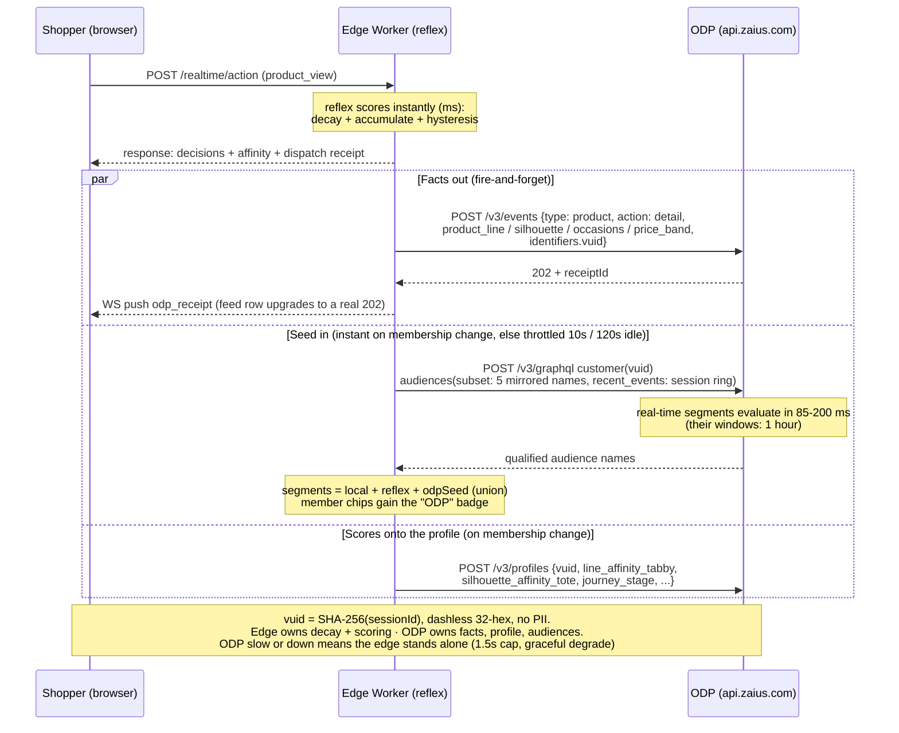

# Coach Demo — ODP Wiring Spec (for the ODP team)

**Purpose:** everything the ODP team needs to create in the ODP demo account so the Monday demo shows the **full live loop**: the edge storefront forwards behavioral events into ODP in real time → ODP's profile updates and its real-time segments qualify (~within a minute) → on a fresh session the edge **seeds** from those ODP segments. One system, two speeds, on screen.

**Fallback stays free:** the edge engine runs standalone (mock mode) if any of this slips — nothing below is a dependency, all of it is upside.

---

## 0. The loop at a glance (as built, live-verified)



## 1. What we need from you (the handoff)

| # | Item | Notes |
|---|---|---|
| 1 | **API host** for the demo account | e.g. `https://api.zaius.com` (or the account-specific host) |
| 2 | **API key for event ingestion** (REST `POST /v3/events`) | typically the **private** API key — please confirm |
| 3 | **API key for the GraphQL real-time segment read** (`POST /v3/graphql`) | our connector sends it as `x-api-key`; confirm public vs private for your account |
| 4 | The **exact segment identifiers** ODP will return for the segments in §5 | so our mapping table (§6) is exact |
| 5 | **30 minutes together** to fire test events and verify the loop | before EOD Friday |

## 2. Identity contract

- We derive the **`vuid`** deterministically from the session — `SHA-256(sessionId)`, first 16 bytes, as a **dashless 32-hex string** (ODP hard-validates `char(32)`). Every event carries it in `identifiers`; the GraphQL read queries by the same `vuid`. *(As built and live-verified.)*
- No PII is sent. (If you want a "known shopper" beat, we can additionally send a demo `email` identifier on one scripted profile — optional.)

## 3. Events we forward (edge → ODP `POST /v3/events`)

| Storefront action | ODP event | Standard fields | Custom event fields (see §4) |
|---|---|---|---|
| Product view (PDP) | `product` / `action: detail` | `product_id` | `product_line`, `product_silhouette`, `product_subcategory`, `product_occasions`, `product_price_band` |
| Add to cart | `product` / `action: add_to_cart` | `product_id` | same |
| Wishlist add | `product` / `action: save_for_later` (or your preferred action) | `product_id` | same |
| Page view (PLP/nav) | `pageview` | `page` | — |
| Purchase (demo checkout) | `order` / `action: purchase` *(planned — not yet forwarded)* | order summary | — |

We **flatten the product's catalog attributes onto each event** (the custom fields above) so your segment builder can qualify on line/silhouette/occasion **without a catalog join**. If you'd rather do it properly with ODP product objects, we'll also hand you the **71-SKU Coach demo catalog as CSV** (id, name, line, category, subcategory, silhouette, occasions, price_usd, price_band) — your call; the events work either way.

## 4. Schema to create in ODP (one-time)

**Custom event fields** (on the `product` event): `product_line` (string) · `product_silhouette` (string) · `product_subcategory` (string) · `product_occasions` (string, comma-joined) · `product_price_band` (string: entry/core/elevated).

**Optional customer attributes** (nice profile-page visual — the edge's live scores ON the ODP profile): `line_affinity_tabby` (number 0–1) · `silhouette_affinity_tote` (number) · `occasion_affinity_evening` (number) · `dominant_line` (string) · `journey_stage` (string). We'll upsert these on membership changes if you create them; skip if schema time is tight — the segments in §5 don't depend on them.

## 5. Real-time segments to create (the demo headliners)

Create these **5** as **real-time** segments (they must be eligible for the GraphQL `audiences(subset:["realtime"])` read). Use **exactly these display names** — both screens must say the same words. Logic below is intent; implement in your builder's nearest terms:

| ODP segment name | Qualification intent |
|---|---|
| **Tabby Affinity** | ≥ 3 `product detail` events where `product_line = Tabby` within the last hour |
| **Tote Affinity** | ≥ 2 `product detail` events where `product_silhouette = tote` within the last hour |
| **Evening Affinity** | ≥ 3 `product detail` events where `product_occasions` contains `evening` within the last hour |
| **Luxe Affinity** | ≥ 2 `product detail` events where `product_price_band = elevated` within the last hour |
| **High Purchase Intent** | ≥ 1 `add_to_cart` and 0 `order` events within the last hour |

*(Thresholds are demo-tuned to fire from a ~60-second browse; adjust to your builder's units as needed — what matters is that a short live browse in the room qualifies within your refresh cycle.)*

## 6. Name mapping (ODP segment ⇄ edge audience key)

Our seed/union code maps by these keys — if your returned identifiers differ, give us the exact strings (item 4 in §1):

| ODP segment | Edge audience key |
|---|---|
| Tabby Affinity | `line_tabby_affinity` |
| Tote Affinity | `silhouette_tote_affinity` |
| Evening Affinity | `occasion_evening_affinity` |
| Luxe Affinity | `luxe_affinity` *(seeded)* |
| High Purchase Intent | `late_journey_ready_to_buy` *(seeded)* |

## 7. Context — the full edge audience set (FYI, no ODP action needed)

The edge engine **generates its audiences from the catalog** (population-filtered, threshold `affinity ≥ 0.6`, live-updating with time-decay). The current generated set is **37 audiences** — you only mirror the 5 headliners above; the rest exist at the edge and every event feeding them also lands in your ODP:

- **Line (11):** Tabby · Pillow Tabby · Brooklyn · Essential · Kira · Kisslock · Lana · Mollie · Novelty · Rogue · Signature
- **Silhouette (6):** Shoulder · Crossbody · Tote · Hobo · Bag Charm · Card Case
- **Subcategory (6):** Shoulder Bags · Crossbody Bags · Totes & Carryalls · Wallets · Card Cases · Bag Charms
- **Occasion (8):** Everyday · Evening · Work · Festival · Date-Night · Travel · Special-Occasion · Gift
- **Price band (3):** Entry · Core · Elevated
- **Category (3):** Handbags · Small Leather Goods · Accessories

(Plus the seeded intent/journey audiences: high-intent browser, ready-to-buy, cart-abandoner, etc.)

## 8. What we read back (ODP → edge)

The edge reads the shopper's qualified segments over GraphQL and **unions** them with its own live evaluation (additive — ODP being slow or unreachable never blocks the storefront; the read is capped at 1.5 s and degrades to edge-only). **As built and live-verified**, the query enumerates the mirrored audience **names** (unknown names risk validation errors) and can inject the session's **`recent_events` inline** — the instant-seed path (~85–200 ms), so a membership badge can land on the very action that caused it:

```graphql
query { customer(vuid: "<32-hex vuid>") {
  audiences(subset: ["line_tabby_affinity","silhouette_tote_affinity","occasion_evening_affinity","luxe_affinity","late_journey_ready_to_buy"],
            recent_events: [ { idempotence_id: "…", type: "product", action: "detail", ts: 1751900000, product_id: "COA-CH857", product_line: "Tabby", … } ])
  { edges { node { name state } } } } }
```

Notes: `recent_events` entries are **flat** (fields at the event's top level, not under `data`), `ts` is **epoch seconds**, and each carries an `idempotence_id` so replays dedupe. We keep qualified names where `state = "qualified"`. Beyond the in-session seed, we also **upsert the live affinity scores onto the ODP profile** (`POST /v3/profiles`: `line_affinity_tabby`, `silhouette_affinity_tote`, `occasion_affinity_evening`, `dominant_line`, `journey_stage`) so the edge's view is visible on the ODP customer record. This is the "shopper starts warm from the ODP profile" beat.

## 9. The 30-minute wiring test (together, before Friday EOD)

1. We fire a scripted browse (3 Tabby views + 1 add-to-cart) at the deployed storefront with a test `vuid`.
2. You watch the events land on the ODP profile (event stream + custom fields populated).
3. Within your refresh cycle, **Tabby Affinity** and **High Purchase Intent** qualify on the ODP side.
4. We run the GraphQL read for that `vuid` and show the seed coming back into the edge.
5. Lock the run-of-show: ODP act first (memory), edge act second (reflex), same audience names on both screens.

---

*Companion docs: [Field Brief](./Coach-Affinity-Demo-Field-Brief.md) · [Customer-facing architecture](./Coach-Realtime-Behavioral-Personalization-Architecture.md) · engineering design `docs/architecture/16-edge-affinity-reflex.md`.*
