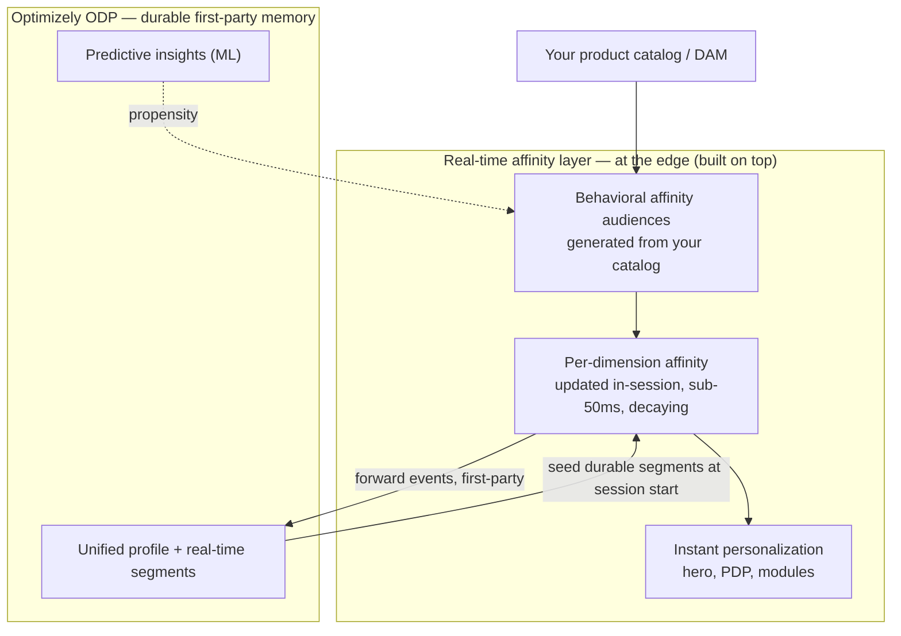

# Real-Time Behavioral Personalization on Optimizely — Architecture Overview

*Prepared for Mandeep. Building on what we presented to your team — this lays out what our platform does today, where ODP fits, and the real-time layer we designed on top of it to deliver exactly the behavioral-affinity capability you're benchmarking, and more.*

---

## The short version

What we showed your team is a real-time personalization platform running **at the edge**, with **Optimizely ODP** as its first-party behavioral backbone and **Feature Experimentation** driving the decisions. ODP already does the hard part — a unified, first-party profile and real-time segments, on your own data.

The one thing a Dynamic Yield–style experience adds on top of that is an **instant, in-session reflex**: affinity that updates the *moment* a shopper acts, so audiences form and shift live. That reflex is a layer we **designed on top of ODP, at the edge** — it's the design I originally proposed, and it's what we're building. It gives you the behavioral-affinity capability you're comparing to DY, and because it runs on your own first-party data in milliseconds, it goes further.

Nothing here is invented from scratch. It's our existing edge platform + ODP, with a real-time affinity layer bridging the two.

---

## 1. What you already have today

The foundation is in place and is what we walked your team through:

- **An edge personalization runtime** — decisions computed in the data center nearest the shopper, in milliseconds, with no origin round-trip.
- **Optimizely ODP** — your first-party customer data platform: a unified profile stitched across sessions and channels, real-time behavioral segments, and predictive insights.
- **Optimizely Feature Experimentation** — audiences, flags, and A/B · MAB · CMAB experiments that decide what each shopper sees.

That's a complete, real-time personalization stack. The question you raised — matching DY's automatic behavioral affinity audiences — sits on top of it.

---

## 2. What ODP gives you — and the one layer on top

ODP is the **durable, first-party memory**:

- A unified profile on **your** data (not a third-party/Mastercard-owned graph).
- **Real-time behavioral segments** that a shopper moves in and out of as their behavior changes.
- **Predictive insights** (order likelihood, churn, engagement rank) — the genuine ML layer.

This is exactly the system of record you want your audiences to live in. Its cadence is measured in seconds — right for a durable, cross-channel profile.

A Dynamic Yield–style *in-session* experience needs one more thing on top: a **reflex** that reacts the instant a shopper views a product — sub-second, in the current session — so the store visibly adapts as they browse. That's not a gap in ODP; it's a different cadence doing a different job. **ODP is the memory; the reflex is the layer we add on top of it, at the edge.**

---

## 3. The layer we designed — a real-time affinity reflex at the edge

Building **on top of ODP**, not replacing it. This is the design I originally proposed, and it's what we're building:

- **Per-dimension affinity, in-session, sub-50 ms.** As a shopper engages, we score their affinity to each dimension your catalog is organized by — line, silhouette, occasion, category, price — and update it live.
- **Shoppers move in *and out* of audiences by behavior.** Scores **decay over time**, so a shopper who shifts interest naturally exits one affinity audience and enters another — live, not on a batch cycle.
- **Deterministic — no black box.** This is recency/frequency-weighted, time-decayed scoring (which is exactly how affinity engines like DY's work under the hood). The real ML — propensity, churn — stays where it belongs: ODP's predictive insights.
- **Audiences generated from your catalog.** The names come straight from your catalog — "Tote Affinity" is your catalog's *Tote* value + *Affinity*. Nothing is invented; the catalog writes the audiences and the reflex fills them.

---

## 4. How it works

**The loop, in plain terms:** on session start, ODP **seeds** the edge with the shopper's durable affinity (their history). As they browse, the edge reflex **updates affinity live** and moves them in and out of the catalog-generated audiences **instantly** — personalizing the hero, PDP, and modules on the next paint. Every event is **forwarded back into ODP**, so your durable, first-party memory stays current and your audiences remain governed in one place.

**The edge is the reflex; ODP is the memory.** Together they give you an experience that reacts in milliseconds *and* a governed, cross-channel profile that's entirely yours.

---

## 5. Exactly what you're benchmarking — and more

| What you're comparing to Dynamic Yield | On Optimizely |
|---|---|
| Automatic behavioral affinity audiences (Backpack, Tote, High Intent…) | **Yes** — generated from your catalog, filled by real-time affinity |
| Shoppers move in and out based on behavior | **Yes** — including moving *out* via time-decay, live |
| Instant, in-session personalization | **Yes** — reacting in milliseconds, at the edge |
| Personalize content from those audiences | **Yes** — hero, PDP, modules |
| **…and past DY, on the axes your team cares about:** | |
| First-party data | **Your ODP, your data** — not a third-party / Mastercard-owned graph |
| Transparent & governed | Every audience is a **legible rule** you review, rename, or tune — not a black box |
| Architecture fit | **Server-side, at the edge** — headless-native, no client-side snippet injection |
| Extensibility | The same edge layer can **compose approved page modules** per shopper (a natural next step) |

You get exactly what you're asking for — and the axes we add — **data ownership, governance, and headless-native architecture** — are precisely the ones your engineering team cares about.

---

## 6. Building on ODP — integration & governance

- **What runs where:** ODP holds the durable, governed profile and segments; the edge holds the in-session reflex and the instant render. The edge consumes ODP's outputs and feeds events back — it never replaces ODP.
- **Your side is light:** point the reflex at your catalog and content source (your CMS/DAM, or Optimizely CMS — your choice), and the affinity layer does the rest. No re-platforming.
- **Governed and legible:** the affinity audiences are generated but not opaque — a human reviews, renames, prunes, or retunes them, and they live in ODP as real segments. Glass, not a black box.
- **First-party throughout:** every signal is your own data, flowing through your ODP — a genuine advantage over a third-party data model.

---

## 7. Where we'd shape it with you

This is an advanced design we're already building — the intent here is to **refine it against your context**, not to start a conversation from zero. The specifics we'd tune together:

- Your **catalog taxonomy** and which dimensions become affinity audiences.
- The **affinity tuning** (how fast interest builds and fades) to match your shoppers.
- Where the personalization is **rendered** (your edge/SSR, or ours in front).
- Your **governance** preferences — who reviews and approves the audience set.

The plan exists and is in motion. We'd love an hour with your team to shape the details.
