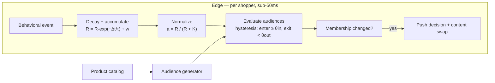
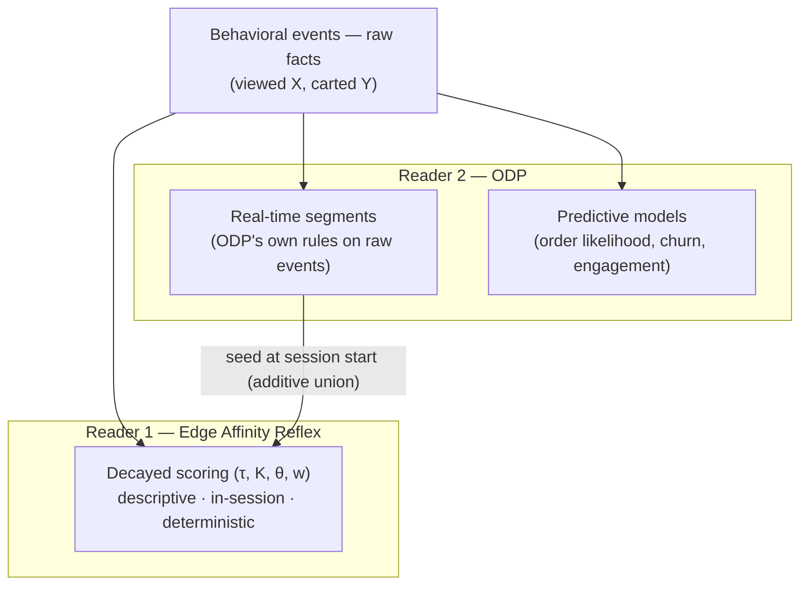

# Edge Affinity Reflex — Technical Design

**Audience:** technical readers (engineering, architecture).
**Scope:** how real-time behavioral affinity is computed at the edge — the algorithm, the state model, the audience generation, the runtime, and the data boundaries. Everything here is deterministic and replayable; there is no machine learning in this layer, by design.

---

## 1. What it is

The Edge Affinity Reflex is a **real-time behavioral affinity engine** that runs at the CDN edge, next to the shopper. As a shopper browses, it maintains a **per-shopper, per-dimension affinity vector** — a set of scores in `[0,1]` expressing her current interest in each value of each catalog dimension (product line, silhouette, occasion, category, price band). Scores **rise with engagement and decay with time**, so shoppers flow **into and out of** affinity audiences purely by behavior. Audience membership changes drive content decisions immediately, in-session.



Design constraints the engine is built to satisfy:

- **Deterministic.** Same events, same clock, same config → same scores and same membership transitions, everywhere. No model, no randomness.
- **Explainable.** Every membership change carries a record of the event, the score movement, and the threshold that caused it.
- **Fast.** The full event→decision path runs in one process at the edge with no external calls; the target budget is sub-50 ms.
- **Additive to the data platform.** The engine emits raw behavioral facts downstream (e.g., to a CDP such as ODP) and consumes its segments as seeds — it never alters what the platform's own models receive (§8).

---

## 2. The algorithm

The engine is a chain of four classical techniques. Each stage is a small, well-understood function; the composition is the engine.

| Stage | Rule | Technique | Why this construction |
|---|---|---|---|
| **1 · Accumulate** | `R ← R·e^(−Δt/τ) + w` | Exponentially time-decayed counter (continuous-time EWMA / "exponential forgetting") | Recency-weighted frequency in one number: engagement adds, time subtracts. The standard construction in user-interest profiling and stream processing |
| **2 · Weight** | `w = weight(action)` | Action-weighted engagement scoring | A cart-add is stronger evidence of interest than a view. Continuous, per-dimension **RFM** (recency · frequency · monetary-analog) |
| **3 · Normalize** | `a = R / (R + K)` | Saturating (hyperbolic) normalization | Maps unbounded `R` to `[0,1)` with diminishing returns — the same saturation curve as BM25's term-frequency component. `a = 0.5` exactly when `R = K` |
| **4 · Decide** | enter when `a ≥ θ_in`; exit when `a < θ_out` (θ_out < θ_in) | Hysteresis (Schmitt-trigger thresholds) | A shopper hovering at the boundary doesn't flap in and out; entering and leaving require distinct evidence |

### 2.1 State and lazy decay

For each shopper, for each `(dimension, value)` pair she has touched, the engine stores exactly two numbers:

```
R      raw accumulated score (never pre-decayed)
tLast  timestamp of the last touch
```

**Decay is computed at read time**, never by a background mutation:

```
R_eff(now) = R · e^(−(now − tLast) / τ)
a(now)     = R_eff(now) / (R_eff(now) + K)
```

This is the property that makes the engine defensible: stored state is raw facts plus timestamps; every score anyone ever sees is a **pure function of (state, clock, config)**. Nothing mutates on timers, replays are exact, and the same state yields the same answer on any host.

Entries whose effective score falls below a small ε are pruned, so per-shopper state stays tiny (bounded by the catalog taxonomy, in practice a few dozen `(R, tLast)` pairs).

### 2.2 Event → dimension mapping

An event references a product; the product's catalog attributes determine which `(dimension, value)` accumulators it touches. One PDP view of a *Tabby quilted shoulder bag, $575, occasions [evening, date-night]* touches:

```
line=tabby · category=handbags · subcategory=shoulder_bags · silhouette=shoulder
occasion=evening · occasion=date_night · priceBand=elevated
```

Multi-valued attributes (like `occasion[]`) touch each value with the full action weight by default (configurable to split). Price bands are derived from the numeric price by configured cuts.

### 2.3 The clock is authoritative

Events are timestamped **on arrival at the engine**; client-supplied timestamps are advisory only. A skewed or forged client clock cannot inflate affinity. Combined with catalog validation (unknown product IDs are dropped) and per-shopper rate limiting, a client can only influence its own vector, and only by behaving like a shopper.

---

## 3. Worked example (demo configuration)

Config: `τ = 60 s`, `K = 1.8`, `w(view) = 1`, `θ_in = 0.60`, `θ_out = 0.45`.
(Note: τ is the *time constant*; the half-life is `τ·ln 2 ≈ 41.6 s`.)

A shopper views three Tabby products, five seconds apart, then goes idle:

| t | Event | Decay factor `e^(−Δt/τ)` | `R` after | `a = R/(R+1.8)` | Membership |
|---|---|---|---|---|---|
| 0 s | view Tabby #1 | — | 1.000 | **0.357** | — |
| 5 s | view Tabby #2 | 0.920 | 1.920 | **0.516** | — |
| 10 s | view Tabby #3 | 0.920 | 2.767 | **0.606** | **ENTER** "Tabby Affinity" (≥ 0.60) |
| 10 s → | *(idle — score decays continuously at read)* | | | | |
| ≈ 47.8 s | *(no event)* | | 1.473 | **0.450** | **EXIT** (< 0.45) |

Three brisk views cross the threshold; ~38 seconds of neglect exits it. If she'd wandered to totes instead of idling, her `silhouette=tote` accumulator would rise on the same math while `line=tabby` decayed — she'd *exit* Tabby Affinity and *enter* Tote Affinity. That in-and-out flow is entirely emergent from decay + hysteresis; no one maintains a list.

**Tuning intuition:** `K` sets how much evidence "interested" requires (`a = 0.5` at `R = K`; with view-weight 1, `K = 1.8` ≈ two fresh views). `τ` sets how fast interest fades. `θ_in/θ_out` set the entry bar and the exit stickiness. Demo values compress the timeline for a live room; production uses the same math with τ in minutes–hours.

---

## 4. Exit timing — closed-form, not polled

Because decay is exponential, the engine never polls to discover that an idle shopper has faded out. For any current membership, the exact future instant its score will cross `θ_out` (absent new events) is solved directly:

```
R at exit:  R* = K·θ_out / (1 − θ_out)
exit time:  t* = tLast + τ · ln( R · (1 − θ_out) / (K · θ_out) )
```

The engine schedules a single wake-up at `min(t*)` over the shopper's current memberships, re-evaluates (lazily, per §2.1), emits the exit, and schedules the next crossing. Exact-time exits, zero wasted compute. (In the worked example above: `t* = 10 + 60·ln(2.767·0.55/0.81) ≈ 47.8 s` — the exit shown in the table.)

---

## 5. Audience generation — the catalog writes the audiences

Affinity audiences are **generated from the catalog taxonomy**, not hand-authored, and not invented by a model:

- **Names come from catalog values.** "Tote Affinity" is the catalog's `tote` value + "Affinity". The catalog is the dictionary; the audiences are its words in audience form.
- **A population filter keeps them meaningful.** A dimension value becomes an audience only if enough products carry it (and, optionally, enough traffic touches it) — deterministic counting, so a single winter SKU never spawns a noise audience.
- **Each audience is a legible predicate:**

```json
{
  "key": "silhouette_tote_affinity",
  "name": "Tote Affinity",
  "condition": { "attribute": "silhouette_affinity.tote", "operator": "gte", "value": 0.6 },
  "evaluation": "realtime",
  "source": "catalog-generated"
}
```

- **Keys are dimension-namespaced** (`silhouette_tote_affinity`), so identical values on different axes can never collide.
- **Regeneration is a diff, not a clobber.** On catalog change the generator adds audiences for new values and archives audiences whose values left the catalog — and never touches a pinned or human-edited audience (ownership is detected by a content hash). Human curation survives every regeneration.

Against the current 71-product demo catalog, the generator emits **37 audiences** across six dimensions (11 line, 6 silhouette, 6 subcategory, 8 occasion, 3 price-band, 3 category), alongside a small set of authored intent/journey audiences (high purchase intent, cart abandoner, …) built on behavioral counters.

---

## 6. Runtime at the edge

The core is a **pure module** — `apply(state, event, now, config) → (state′, changes)` — with no I/O, hosted at the edge in one of two modes (same core, different hosting):

- **Request-path mode:** affinity state rides the shopper's session; each behavioral action decays+accumulates, re-evaluates memberships, and the response (plus a WebSocket push) carries any changes. This is the simplest deployment and is running today.
- **Stateful per-shopper mode (target):** a per-shopper stateful edge object (Cloudflare Durable Object) owns the WebSocket and the vector — events arrive over the socket, evaluation happens in-memory in the same process, membership changes push instantly, and the closed-form alarm (§4) delivers exact-time exits even while the object hibernates. State persists in the object's embedded SQLite storage; the object is keyed by a stable visitor id.

In both modes the hot path makes **no external network calls** — the catalog index, the audience definitions, and the shopper's vector are all local reads. That is what makes the sub-50 ms budget realistic rather than aspirational.

**Delivery:** on a membership change the engine resolves the content decision (which hero, which sort, which module) and the client applies it on the next paint. A snapshot endpoint returns the current vector + memberships for first-paint hydration, so returning views render personalized without a flash.

**Config:** all parameters (dimensions, τ, K, θ, action weights, generator thresholds) live in a versioned config object; tuning is a config change, not a deployment.

### Configuration reference

| Parameter | Meaning | Demo value | Production guidance |
|---|---|---|---|
| `dimensions[]` | catalog axes scored (source field, multi-value, derived bands) | line, category, subcategory, silhouette, occasion, priceBand | any catalog taxonomy — config only |
| `w(action)` | evidence per action | view 1 · wishlist 2 · cart 3 · purchase 5 | tune to funnel semantics |
| `τ` | decay time constant (half-life = τ·ln 2) | 60 s | minutes–hours by vertical |
| `K` | saturation midpoint (`a = 0.5` at `R = K`) | 1.8 | ≈ "views that mean interested" |
| `θ_in / θ_out` | enter / exit thresholds (hysteresis) | 0.60 / 0.45 | widen the gap for stickier membership |
| `minProducts / minTraffic` | audience population filter | 3 / — | per catalog size |
| `ε` | prune floor for stale entries | 1e-4 | — |

---

## 7. Data contracts

```json
// Inbound behavioral event (timestamp advisory — the engine stamps arrival)
{ "type": "product_view", "productId": "COA-CH857", "action": "view", "ts": 1750000000000 }

// Affinity snapshot (drives UI / instrumentation)
{ "dims": { "line": { "tabby": 0.61, "brooklyn": 0.20 }, "silhouette": { "tote": 0.10 } },
  "audiences": ["line_tabby_affinity"],
  "changed": [ { "key": "line_tabby_affinity", "enter": true } ] }

// Membership-change explain record (emitted on every transition)
{ "audience": "line_tabby_affinity", "transition": "enter",
  "cause": { "event": "product_view", "productId": "COA-CH857" },
  "score": { "before": 0.516, "after": 0.606, "threshold": 0.60 },
  "configVersion": "reflex-demo-v1" }
```

The explain record is first-class: *"why is this shopper in this audience"* always has an exact, replayable answer — the property that distinguishes a glass-box affinity engine from a black-box one.

---

## 8. Boundary with the data platform (ODP) — strict separation

The engine is designed to **coexist with, and feed, a customer data platform** (Optimizely ODP in our deployments) without ever influencing the platform's own modeling:



The separation is **structural**, not procedural:

1. **The engine forwards facts, not opinions.** What flows downstream is the raw event stream — *product viewed, added to cart* — unscored and unweighted. The engine's parameters (τ, K, θ, weights) are applied at read time at the edge and **never travel**. Retune the engine hourly and the bytes the platform receives are identical.
2. **Two independent readers of one stream.** ODP's predictive ML and ODP's segment rules compute from ODP's own event data with ODP's own logic; the edge computes from the same facts with its own logic. There is no shared derived state and no channel through which edge parameters could reach the platform's models.
3. **Different questions, different horizons.** The edge answers a *descriptive, in-session* question ("what is she interested in right now"); the platform's ML answers *predictive, longitudinal* ones ("will she order in 30 days"). Same evidence, different mathematics.
4. **The seed direction is additive.** At session start the edge reads the platform's qualified real-time segments and **unions** them with its own evaluation — the durable profile warms the reflex. If the platform is slow or unreachable, the edge evaluation stands alone; the storefront never blocks on the platform.

A useful corollary for validation: because both systems derive membership independently from the same evidence, showing them **agree** — each under its own evaluation — is a genuine cross-check, not a mirror.

---

## 9. Properties & invariants (tested)

- **Determinism / replayability:** `(state, event, now, config)` → identical transitions on every host; a recorded event stream reproduces the exact membership timeline.
- **Monotone decay:** between events, every score is non-increasing.
- **Hysteresis safety:** membership is never entered below `θ_in`, never exited at or above `θ_out`.
- **Bounded state:** per-shopper state ≤ (touched values) × 2 numbers; ε-pruned.
- **Privacy:** the vector holds catalog values and timestamps — no PII. Per-shopper state carries a retention lifecycle (idle expiry) and a deletion path for erasure requests.
- **Verified live** (demo tuning): three brisk product views enter an affinity audience at `a = 0.606`; ~38 s of idle exits it at `a = 0.450` — matching the closed-form prediction in §4.

---

*Companion: [ODP Wiring Spec](./Coach-ODP-Wiring-Spec.md) — the concrete event fields, segment definitions, and identity contract for a live ODP integration.*
