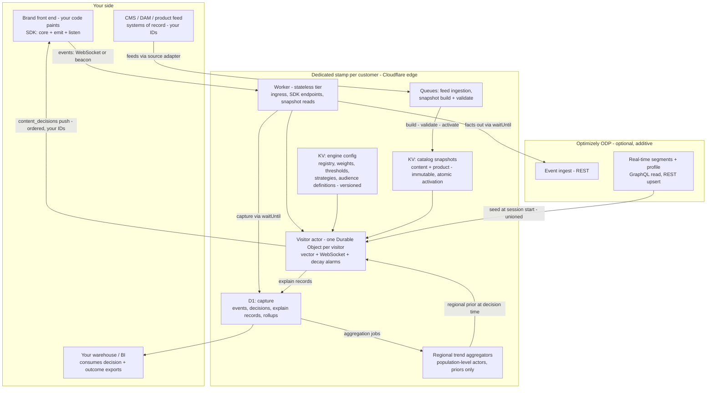
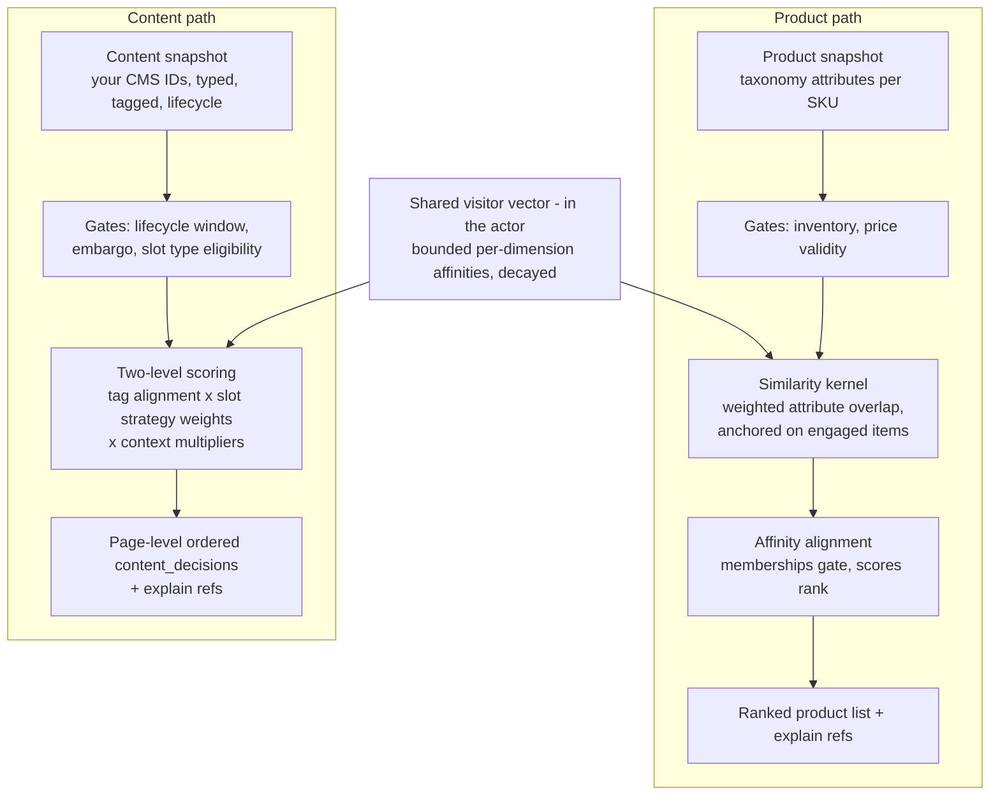
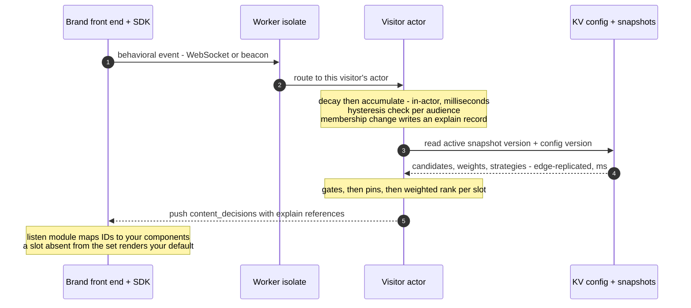
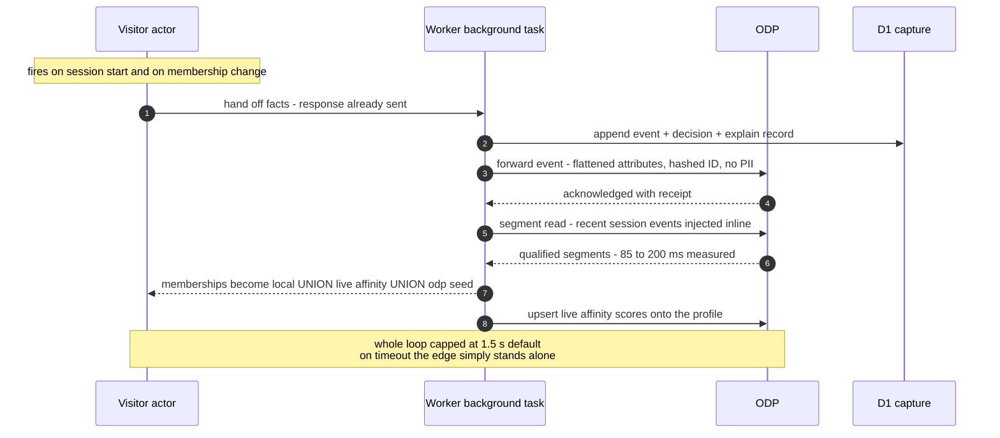

# Behavioral Targeting and Intelligence — System Architecture

**Audience:** engineering, architecture, and data science. Companion to the *Solution & Algorithm* document (which fixes the mathematics and the dimension registry); this document fixes the machine that executes it.
**Convention used throughout:** every numeric value marked *(default)* is versioned configuration, tunable per deployment without redeployment. The mechanisms are fixed; the constants are yours.

---

## 1. Executive summary

A real-time personalization engine for anonymous-first traffic, deployed as a **dedicated, isolated stack per customer** on Cloudflare's edge network. Three cooperating systems:

- **The edge engine** — a deterministic, per-visitor behavioral affinity engine: per-dimension scores with exponential time decay, threshold hysteresis, catalog-generated audiences, and per-slot decision composition. Runs in the data center nearest the visitor; scores update in milliseconds, in-session, from the first click of a first visit.
- **Optimizely ODP** — the durable, first-party **memory** (optional, strictly additive): every behavioral fact is forwarded to ODP in real time, the edge seeds each session from ODP's segments, and the engine's live scores are written onto the ODP profile. No decision ever waits on it.
- **The delivery contract** — headless push-by-ID: the engine emits page-level ordered decision sets referencing **your content and product IDs**; your front end paints everything. Nothing is injected into your pages.

Two invariants to test every section against:

1. **Nothing on the decision path calls a model.** The serving path is deterministic arithmetic over versioned configuration. AI appears exactly once in the lifecycle — optional design-time catalog tag enrichment, human-approved, before content enters a snapshot.
2. **Per-visitor state is O(dimensions), never O(catalog).** The visitor actor holds a bounded vector over the agreed dimension registry — not per-item state. This is the load-bearing scale decision; §7 and §9 show what it buys.

## 2. Technology stack

| Layer | Technology | Role |
|---|---|---|
| Runtime | Cloudflare Workers — V8 isolates, TypeScript, every Cloudflare data center | Stateless tier: ingress, routing, snapshot reads, SDK endpoints. Isolate start in single-digit milliseconds; no origin round-trip exists in the serving path |
| Stateful edge | Cloudflare Durable Objects, SQLite-backed — **one actor per visitor** | Owns the affinity vector, the WebSocket, and the decay alarms, co-located in one single-threaded object. WebSocket **hibernation** holds idle connections at near-zero compute cost |
| Config & catalogs | Workers KV, two namespaces | (1) engine configuration: dimension registry, weights, decay constants, thresholds, slot strategies, audience definitions — versioned, hot; (2) catalog snapshots: content + product, immutable, atomically activated |
| Capture | D1 (serverless SQL) | Every event, decision, and explain record; rollup views; outcome aggregation; customer-facing exports |
| Async | Cloudflare Queues | Feed ingestion, snapshot builds, any work that is not the visitor's next paint |
| Assets | R2 object storage | Static and generated assets, no egress toll |
| Observability | Analytics Engine + per-deployment health and event-flow monitoring | "No events for N minutes" pages a human |
| Request context | `request.cf` | Country/region/city and network context on every request, server-side — exact, zero client work, ad-blocker-proof. This is what makes the location dimension viable for anonymous first-time visitors |
| Egress mechanism | `ctx.waitUntil` | ODP forwarding, profile upserts, and capture writes complete **after** the response is sent. The visitor never pays for an integration |
| CDP | Optimizely ODP — REST event ingest, REST profile upsert, GraphQL segment read with inline recent events | The durable memory loop (§11), 85–200 ms measured round trips, 1.5 s hard cap *(default)* |

## 3. Deployment & isolation topology

- **Customer = dedicated deployment ("stamp"), hard isolation.** Separate Worker, Durable Object namespaces, KV namespaces, D1 database, queues, R2 bucket, secrets, and domain per customer. No shared compute, storage, or credentials with any other customer — the one-sentence answer for a security review.
- **Brand = tenant inside the stamp, logical isolation.** Per-brand catalogs, configuration, audiences, and CDP credentials, namespaced throughout. One multi-brand customer runs one stamp.
- **Environment = separate stamp** (staging, production), independently version-pinned — your code-freeze calendar is honored by pinning, not by negotiation.
- **Releases:** version pinned per stamp; upgrade and rollback are a pin change.

## 4. Architecture at a glance



Responsibility split, stated once and held everywhere: **the Worker is stateless and horizontal; the actor is the only writer of a visitor's state; KV is the read-optimized distribution plane for everything shared; D1 is the system's memory of what it did and why; ODP owns the durable profile.** Split by responsibility, not by speed — the event stream between edge and ODP is real time in both directions.

## 5. Identity & session model

| Element | Mechanism |
|---|---|
| Visitor ID | First-party, minted by the SDK core (localStorage + cookie). No fingerprinting, no third-party identifiers |
| Session boundary | 30 minutes of inactivity *(default)* — the same boundary the metering and analytics use, so the meter and the machine cannot disagree |
| CDP identifier | One-way hash of the session identity (SHA-256, dashless 32-hex) — events and profile writes to ODP carry no PII |
| Known-visitor join | When your systems identify a visitor (login, email click-through), your identifier is attached via the SDK's explicit API; the edge state itself never requires it |
| Erasure | One call deletes the visitor's actor, its state, and its capture rows. Idle actors self-expire after N days *(default)* |

## 6. The state model — the visitor actor, precisely

Per visitor, per dimension *d*, per value *v* (e.g. dimension `line`, value `tabby`), the actor stores two numbers: **raw magnitude** `R` and **last-update time** `t_last`. Everything else is derived:

- **Decay is lazy arithmetic, not a job.** Effective magnitude at read time: `R(t) = R · e^(−(t − t_last)/τ_d)`. Nothing mutates state on a timer; reading applies the decay implicitly.
- **Events accumulate onto the decayed value:** on an interaction of type *e*: `R ← R·e^(−Δt/τ_d) + w_e`, `t_last ← now`.
- **Interaction weights** `w_e` *(defaults)*: view = 1 · wishlist/save = 2 · add-to-cart = 3 · purchase closes the loop in capture. Content interactions carry their own weight table (impression, click, dwell-qualified view, video completion) — see §9.
- **Score is a saturating map to [0,1):** `a = R / (R + K_d)`. `K_d` is the half-saturation constant — the magnitude at which affinity reads 0.5. *(Illustrative defaults: K = 1.8 with the weights above means three brisk views cross 0.6.)*
- **Membership uses hysteresis:** enter an audience at `a ≥ θ_in`, exit at `a < θ_out`, with `θ_out < θ_in` *(illustrative defaults: 0.60 / 0.45)* — no flapping at the boundary.
- **Exits fire at the exact crossing, with zero polling.** Because decay is closed-form, the exit time is too: `t* = t_last + τ_d · ln( R(1 − θ_out) / (K_d · θ_out) )`. The actor sets one Durable Object alarm at `t*`; any new event reschedules it.
- **Per-dimension time constants are first-class:** product interest decays fast; price posture is a slower-moving trait *(default ratio ≈ 2.5× slower)*; visit-number and entry-channel context are session-scoped facts, not decayed scores. All `τ_d` are configuration.
- **Every membership change writes an explain record:** `{visitor, audience, direction: enter|exit, dimension, value, R, a, threshold, contributing events, config version, timestamp}` — written to capture, referenced by ID from every decision that used it.
- **Journey stage** (`early / mid / late`) derives from interaction counts and cart state, and gates message/module choices as a coarse context dimension.

## 7. Audience generation — the catalog writes the audiences

Audiences are **generated from your catalog taxonomy**, not hand-authored:

1. The generator walks each registered dimension's values in the active catalog snapshot.
2. Each value with sufficient support — minimum item count *(default: 3)* and a traffic floor — emits a governed audience: `"{Value} Affinity" = affinity[d][v] ≥ θ_in`, key `{dimension}_{value}_affinity`.
3. **Diff-regeneration with ownership hashes:** on catalog change, generated audiences are re-derived; **pinned or human-edited audiences are never overwritten**; audiences whose backing value disappeared are archived, not deleted.
4. Every audience is a legible rule a merchandiser can read, rename, pin, or retune — glass, not black box.

The same mechanism is catalog-agnostic: hand it the product taxonomy and it manufactures product-affinity audiences; hand it the content-type taxonomy and it manufactures content-behavior audiences (e.g. video-affinity). One generator, any registry.

## 8. Product recommendations — the pipeline

Stage by stage, at decision time, against the active product snapshot:

1. **Candidate set:** the product snapshot, filtered by **eligibility gates** — inventory, availability, price validity. Gates are item properties, never visitor properties: a sold-out SKU drops out; the visitor's affinity persists.
2. **Anchoring:** the visitor's engaged items (viewed, saved, carted) anchor similarity.
3. **Similarity kernel:** item-to-item scoring by weighted attribute overlap across the catalog's attribute classes (line, category, subcategory, silhouette, occasion, price band, material — seven classes *(default)*, weights in configuration).
4. **Affinity alignment:** *memberships gate, scores rank* — audience membership selects the strategy (which weight profile applies); the visitor's per-dimension scores order the candidates within it.
5. **Output:** a ranked product list into a widget, carousel, or sort order — with each item's explain reference.

## 9. Content recommendations — the pipeline, and why it is a different discipline

**The content catalog** registers each asset under **your CMS ID** with: type (from the agreed content-type taxonomy — on-model, silo, zoom, detail, video, editorial, review module), render URL, **tags projected into the same dimension space the products define** (an asset about a line carries that line's tag), per-slot eligibility, and a lifecycle window (publish/expire/embargo). The tag layer is the join between the two worlds: content participates in product-dimension affinity without pretending to be a product.

**Signals are dense and weak, and the math must respect that.** Product signals are sparse and strong (a cart add is intent). Content signals arrive with every page: an impression is nearly intent-free. The content path therefore **normalizes engagement against exposure** — click-through and qualified dwell are measured against impressions; video completion is the strong signal *(interaction weight table in configuration, exposure-normalized)*. Skipping this normalization is how content engines degenerate into "recommend whatever we showed most"; the normalization is the architectural defense.

**Two-level scoring — the O(dimensions) invariant doing its job:**

- **Level 1 (continuous, in the actor):** the visitor's bounded tag/dimension affinities update per event, exactly as §6 — including content-native dimensions: content-type affinity, entry channel, visit number.
- **Level 2 (at decision time, per slot):** every eligible candidate is scored against the vector:

  `s(item | visitor, slot) = Σ_d ω_d(slot) · a_d(visitor) · m_d(item) × c_visit × c_channel × c_type`

  where `ω_d(slot)` is the slot strategy's dimension weight, `a_d` the visitor's affinity, `m_d(item)` the item's tag alignment in dimension *d*, and the `c` terms are the context multipliers (visit number, entry channel, content-type affinity). All `ω` and `c` are versioned configuration — a *strategy* is exactly this weight profile, applied to a slot, configured or engine-autonomous.

- **No per-item state per visitor exists at either level** — which is why the identical actor scales from a 100-asset content set to a six-figure product catalog with no change to its state model.

**Outcome learning differs too:** products attribute directly (recommended → carted → purchased, per item). Content earns its keep indirectly, so the content path learns by **aggregation** — content × context × outcome statistics accumulated in capture sharpen slot strategies and defaults session over session, as batch reads of D1, never as serving-path computation.

**Delivery differs in kind:** the product path fills a widget with a ranked list; the content path emits the **page-level ordered decision set** — it decides the page's presentation layer slot by slot in one push, so the experience is coherent rather than N independently-optimized fragments.

| Axis | Product recommendations | Content recommendations |
|---|---|---|
| Candidate space | Uniform SKU taxonomy, slow-moving | Heterogeneous typed assets, your CMS IDs, fast-moving lifecycle |
| Signals | Sparse, strong, directly mapped | Dense, weak, **exposure-normalized** |
| Ranking | Item-to-item similarity kernel + affinity alignment | **Two-level scoring**: actor-held tag affinities → decision-time candidate scoring × context multipliers |
| Context terms | Secondary | First-class: visit number, entry channel, content-type affinity |
| Outcome learning | Direct per-item attribution | Aggregated content × context × outcome statistics |
| Eligibility | Inventory, price validity | Lifecycle windows, embargo, **per-slot type eligibility** |
| Delivery | Ranked list into a widget/sort | Page-level ordered `content_decisions`, one push per page |
| Per-visitor state | O(dimensions) | O(dimensions) — identical, by design |

The sentence that keeps them straight: **products are ranked things; content is the ranked presentation of things.** One engine, one vector, two disciplines.



## 10. Decision composition & governance

Declared precedence, evaluated at decision time, where all claims and the actual visitor are simultaneously present:

1. **Eligibility gates** (item properties — inventory, lifecycle, slot type) filter the candidate set before anything scores.
2. **Pins** (merchandiser authority — "this campaign owns the hero for launch week") outrank the engine, full stop; pinned entries survive regeneration; a pin pointing at a gated item **loses to the gate and logs the conflict** rather than shipping a dead placement.
3. **Weighted ranking** (§8/§9) fills whatever space the rules leave open.

Boosts compose rather than conflict (two categories boosting 1.2× still resolve by the visitor's affinity); business guarantees are explicit constraints — boost caps per scope, exposure quotas per slot region — applied as a deterministic re-rank pass. Every layer lives in the same versioned policy store as the weights; every parameter is hot-editable; every change is attributed.

## 11. How data moves

**The interaction loop** — one event, end to end, on the serving path:



**The memory loop** — everything that leaves the edge, all off the response path via `waitUntil`:



Three facts about this loop worth an architect's attention:

1. **The union is explicit:** `memberships = local evaluation ∪ live affinity ∪ ODP seed`. ODP enriches; it never gates. A visitor's in-session behavior always counts, even with the memory layer dark.
2. **The seed is instant when it matters:** the segment read injects the session's recent events inline, so ODP's real-time segments evaluate against behavior from *seconds ago* — 85–200 ms measured round trips — rather than waiting for its ingest pipeline.
3. **Scores travel both ways:** the engine's live affinity numbers are upserted onto the ODP profile, so what the edge believes is visible on the customer record your other channels read.

**Latency & failure budget:**

| Path | Budget | On breach |
|---|---|---|
| First paint | Snapshot hydration in the initial response — no flicker, no round trip | Defaults render; personalization joins on the socket |
| Event → score update | Milliseconds, in-actor, in-request | Not applicable — local arithmetic |
| Score → decision push | Same actor, same socket — one hop | Next interaction carries the updated state |
| Config / catalog read | Edge-replicated KV, milliseconds | Last replicated version serves |
| ODP loop | 85–200 ms measured | 1.5 s hard cap *(default)*; decisions never waited on it |
| Snapshot activation | Atomic version flip | A failed build never activates; the previous snapshot keeps serving |
| Audience exit | Exact-time alarm at the computed crossing | Any new event reschedules; a missed alarm self-corrects at next read (decay is lazy) |

**Consistency model, explicitly:** per-visitor state is strongly consistent — one single-threaded actor serializes all writes for that visitor. Shared artifacts (catalogs, configuration, audience definitions) are eventually consistent across the edge with **atomic activation**: a version marker flips only after validation, so no request ever observes a partial catalog, and staleness is bounded to replication lag on an immutable object. Cross-visitor aggregates (regional trending, outcome statistics) are asynchronous by definition and consumed as **priors** — blended at decision time, never written into any personal vector. The system never claims global strong consistency, and no decision requires it: every decision is a function of one visitor's state plus versioned shared artifacts.

## 12. The boundary contract — SDK, protocol, payloads

**The SDK** — one package, three parts:

- **Core (mandatory):** first-party identity, session boundaries, transport (WebSocket + snapshot), key auth. Non-negotiable because events and decisions must share one visitor ID and one socket.
- **Emit — four capture paths, used together:** (1) *automatic*: impressions and qualified dwell for content the platform itself pushed — free, the SDK knows what it rendered; (2) *declarative*: `data-*` attributes on slots and elements; (3) *adapter*: dataLayer/tag-manager mapping — the cheap path wherever a tag layer exists; (4) *explicit API*: commerce events — add-to-cart, and the conversion event, which is non-negotiable for outcome learning.
- **Listen:** subscribe to decision sets, per-slot callbacks, first-paint hydration from the snapshot (no flash of defaults), **guaranteed graceful absence** — no decision means your default renders; the page never waits and never shows a hole.

**Protocol summary (WebSocket, JSON messages):** client→server: event envelopes, subscription/resume. Server→client: `content_decisions` (the decision set), state updates (affinity/audience changes, for any surface you choose to build on them), and delivery receipts (capture and CDP acknowledgments). Beacon fallback covers events when the socket is absent; snapshot covers decisions at first paint. The contract is transport-level JSON — nothing browser-specific; native clients are a port, not a redesign.

**The customer-visible interface, as a surface inventory:** event ingest (socket + beacon) · realtime channel upgrade · first-paint snapshot · visitor erasure · decision & outcome exports · health. Concrete paths and schemas ship with the SDK package and API reference.

**The decision payload** (field semantics per the agreed contract — your ID, type, metadata, score, page-level order):

```json
{
  "type": "content_decisions",
  "page": "home",
  "config_version": "cfg-2041",
  "decisions": [
    {
      "slot": "hero",
      "order": 1,
      "contentId": "CMS-88213",
      "contentType": "on_model_image",
      "score": 0.74,
      "explain": "xr-9f21c",
      "metadata": { "renderUrl": "https://...", "tags": ["line:x", "occasion:evening"] }
    },
    {
      "slot": "story_1",
      "order": 2,
      "contentId": "CMS-90112",
      "contentType": "video",
      "score": 0.61,
      "explain": "xr-9f22a",
      "metadata": { "renderUrl": "https://..." }
    }
  ]
}
```

A slot absent from the set means: render your default. The `order` field echoes the template today and makes future re-sequencing a data change on your side, not a re-integration.

## 13. Catalogs in — the snapshot pipeline

Per brand, per catalog (content and product follow the identical pattern):

1. **Source adapter:** your CMS/DAM/feed via API pull, webhook, or file export (JSON/CSV) — normalized to the registry schema: your ID, type, render URL, tags/attributes, slot eligibility, lifecycle window.
2. **Enrichment (optional, design-time only):** where metadata is sparse, the enrichment pipeline proposes tags for **human approval** — calibrated on an initial sample batch; approved output only then enters the build. No enrichment ever executes at serving time.
3. **Build → validate → activate:** snapshots are immutable; validation gates activation; activation is a version-marker flip; rollback is re-pointing the marker. A request never sees a half-loaded catalog.

## 14. Capture, learning, exports

- **Capture rows** (D1): events — timestamp, visitor, session, type, item ID, flattened catalog attributes (line/category/subcategory/silhouette/occasions/price band), context (page, slot, entry channel, coarse geo); decisions — slot, chosen ID, score, strategy, config version; explain records — §6's schema. Everything keyed to **your IDs**.
- **Rollups:** session and cohort views over capture, feeding outcome aggregation (content × context × outcome) and the regional trend aggregators.
- **Regional trending** (the location dimension's substance): per-region population-level aggregate actors over event counts — consumed as a **prior** at decision time, never written into a personal vector. Priors open cold sessions; behavior replaces them within the session.
- **Exports:** decision and outcome extracts on your IDs, consumable by your warehouse — your data science team can verify, from your side of the boundary, everything the explain records claim.

## 15. Parameter catalog — the tunable surface, in one table

| Parameter | Scope | Type | Notes |
|---|---|---|---|
| Dimension registry | Deployment | list | The agreed 6–8 dimensions; documented, no hidden members |
| Dimension weight `ω_d` | Per slot strategy | number | The heart of a *strategy* |
| Decay constant `τ_d` | Per dimension | duration | Interest fast, price posture slow *(≈2.5× default ratio)* |
| Half-saturation `K_d` | Per dimension | number | Sets how much evidence 0.5 affinity requires |
| Entry / exit thresholds `θ_in / θ_out` | Per audience | pair | Hysteresis; generated audiences inherit defaults |
| Interaction weights `w_e` | Per event type | number | View / save / cart; content weights exposure-normalized |
| Context multipliers `c_visit, c_channel, c_type` | Per slot strategy | number | Content path's first-class context |
| Audience population filter | Deployment | number | Minimum items *(default 3)* + traffic floor |
| Slot strategies | Per slot | profile | Configured weights or engine-autonomous |
| Pins / exclusions / windows | Per slot or scope | rule | Merchandiser authority; survives regeneration |
| Boost caps / exposure quotas | Per scope / slot region | constraint | The anti-arms-race guarantees |
| CDP loop | Per brand | on/off + credentials | Strictly additive |
| Session boundary, actor idle expiry, ODP cap | Deployment | durations | Operational envelope |

Every row is versioned configuration applied hot — **tuning never means a deployment**, and every historical decision names the config version that produced it.

## 16. Security, privacy, isolation

- **Isolation:** §3's stamp model — dedicated everything per customer; brand tenants namespaced within; version pinning per stamp.
- **Privacy:** first-party ID only; hashed CDP identifier; no PII in vectors or CDP events; geography coarse on the request and population-level in aggregates; idle self-expiry; single-call erasure across actor + capture.
- **Security:** per-stamp secrets; scoped CORS; authenticated operational routes; exportable audit trail (decisions + explains, on your IDs) so verification never requires trusting our console.

## 17. What we shape together

1. The dimension registry — the agreed set, documented; location as regional trending from day one.
2. Content-type taxonomy and both feed specifications, per brand; environments and the release calendar.
3. The slot map and defaults — which pages, which slots, what renders when we say nothing.
4. Event coverage — your dataLayer today, the conversion event, what the adapter maps automatically.
5. Weights governance and the analysis loop — who tunes, how explain records and exports meet your data science team, and where your team injects its own math at the surfaces the algorithm document defines.

*Read together with the Solution & Algorithm document: that one fixes the mathematics; this one fixes the machine that executes it.*
