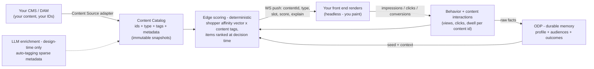

# Content Personalization on the Edge Affinity Engine

### Design proposal for Tapestry — prepared for Mandeep Bhatia & Seth Gabriel

*This is the write-up promised on our last call: the complete design for content personalization, the path to experience personalization, the roadmap with dates, and the specific points we want to shape together. Per our agreement — nothing here is written in stone. This is where our design is converging; read it, mark it up, and we build it together.*

---

## 1. Where this document starts

On our last call you watched the foundation running live: per-shopper affinity scoring at the edge — the Affinity tab with weights building as you browsed the Tabby, the audiences appearing and **decaying on their own** as attention drifted, the "· ODP" tags confirming each audience registered in ODP, and the memory-sync feed showing every event landing on the ODP profile in real time. You also confirmed the architecture division we proposed: **ODP is the memory** — the durable, first-party record that persists behavior across visits — and **the edge is the reflex** — where scoring, weighting, and decay happen live, in milliseconds. (And to close the loop on a point from that call: the old ~90-second latency concern no longer applies — the integration runs on ODP's immediate event streaming, which you saw confirming receipts on screen.)

That foundation is live, verified, and deployable to you in **7–14 days**. This document is about the two tiers above it.

## 2. Your framing, played back

You gave us a three-tier hierarchy, and we're using it as the spine of the roadmap:

1. **Product personalization / recommendations** — solved industry-wide; explicitly *not* where we innovate together.
2. **Content personalization** — the prize, and the subject of this proposal. Same layout, different **content** per visitor, chosen *algorithmically, not by hand-coded variations*. Your model, which we're adopting wholesale: a **content catalog** — "just like a product catalog" — where every image, text block, and module is registered with **your ID, our ID, a URL, and metadata**; shopper behavior is scored against content interactions (your Twitter analogy: like = 1, retweet = 2, reply = 3); and the system recommends **content the way recs engines recommend products**, with explainability ("why did you recommend this image to this person?"). The context signals you called out: **entry channel** ("paid-social visitors pay attention to these four or five things"), **visit count** (60% of purchases on visit two or three — romance image on first visit, silo shot and reviews on return), and converter-vs-non-converter behavior patterns.
3. **Experience personalization** — the layout itself reorders by context; every module has an ID (`CMP1234`). Roughly six months out, by your own framing; designed for now, built later (§8).

**And the delivery contract we agreed, which everything below honors:** you are headless. Everything has an ID. We push decisions — content ID, type, metadata, score — over a WebSocket through a small SDK, and **your front end paints**. In your words: *"whether you paint the screen or we paint the screen doesn't matter."*

## 3. Why this is an extension, not a new build

Two facts make this proposal credible rather than aspirational:

**First — the scoring engine you watched is already catalog-agnostic.** It doesn't know it's scoring *products*; it scores a shopper against whatever taxonomy it's configured with — today, the product catalog's lines, silhouettes, occasions, and price bands. A content catalog is, to the engine, simply a second catalog. Content tagged `evening`, `model-worn`, `ugc`, `reviews` participates in scoring exactly the way products tagged `Tabby` or `elevated` do today. Your Twitter weighting model is *literally the engine's existing action-weight table* (view = 1, wishlist = 2, cart = 3) — you described our mechanism back to us on the call without knowing it.

**Second — we have already shipped the governed content-by-ID contract for another enterprise customer:** a content registry with reference codes and metadata, deterministic resolution, explicit fallbacks, and explain metadata, served to a headless front end that paints. Your content-catalog concept is that proven pattern, fused with the live affinity engine you saw. Fusion, not invention — which is why the dates in §7 are short.

## 4. The design



### 4.1 The content catalog

Every piece of content registered once, in a shape deliberately parallel to a product catalog:

```json
{
  "yourId": "CMP1234",                       // your CMS id — the id we echo back to you
  "systemId": "cnt_8f3a…",                   // ours (stable across your renames)
  "type": "image | text | module | layout",
  "url": "https://…",                         // render reference — we never host your assets
  "tags": ["evening", "model-worn", "reviews", "ugc"],
  "metadata": { "slotTypes": ["pdp-hero"], "constraints": { } },
  "lifecycle": { "status": "active", "publishAt": "…", "expireAt": "…" }
}
```

It ingests from your CMS/DAM through a **source adapter** built against your actual stack (one of the co-design items in §9), into immutable, atomically-activated snapshots — a request never sees a half-loaded catalog. And because CMS tagging is never as rich as scoring wants, a **design-time LLM enrichment pass** proposes tags per item (image and copy in, taxonomy out) for **human approval**. That's where AI lives in this design: enriching the catalog offline and powering insight (§6) — **never in the render path**. The runtime stays deterministic, millisecond-fast, and fully explainable, which is the property that makes this trustworthy at your scale and your brand standard.

### 4.2 Interaction telemetry

Three new event types flow through the same pipeline your product events use today: `content_impression`, `content_click`, `content_dwell` — each keyed by content ID and carrying the content's tags. They feed three consumers at once: the live scoring (§4.3), the outcome-learning layer (§7, stage 2), and ODP, where they land as durable facts on the profile. The SDK emits them automatically for content it delivered.

### 4.3 Scoring and selection — including the answer to your performance question

You asked the right question on the call: *if I define 100 affinities, doesn't runtime scoring become a problem?* The design answers it structurally, with **two levels**:

- **The shopper's vector scores *tags*, never individual content items.** The per-shopper state is a small, bounded set of dimension scores (occasion, tone, format, line, price posture…) that **decays** — affinity is in-the-moment, so the active set stays tiny regardless of how many audiences or content items exist. Adding your thousandth piece of content adds zero per-shopper scoring cost.
- **Content items are ranked only at decision time**, for the slot being decided: each candidate's tags are scored against the shopper's current vector, lifecycle and constraints filter, and the top item is pushed — with its explain record. This is exactly how the engine ranks products for recommendations today; it scales the same way.

**Context joins the vector as first-class signals** — entry channel, visit count (backed by ODP's cross-visit memory and the stable visitor identity), referrer. So your two flagship scenarios fall out of scoring, not rules: the **first-visit** shopper gets the romance/non-model image because "first visit" weights toward inspiration-tagged content; the **returning** shopper gets the detail silo shot with reviews surfaced because return-visit context weights toward confidence-tagged content. Seeded with sensible defaults, then reweighted by observed behavior — different shopper, different vector, different content, automatically. No if-then anywhere.

### 4.4 Delivery — the SDK and the push contract

A thin embeddable client: **connect** (WebSocket, stable visitor identity) · **emit** (behavioral + content events) · **listen** (your event handler receives decisions). The payload — version 1 sketch, and deliberately the first thing we want to co-design with Seth's team:

```json
{
  "kind": "content_decision",
  "slot": "pdp-hero",
  "content": { "yourId": "CMP1234", "systemId": "cnt_8f3a…", "type": "image", "url": "…" },
  "score": 0.78,
  "explain": {
    "drivers": [ { "dim": "occasion", "tag": "evening", "a": 0.72 } ],
    "context": { "channel": "paid_social", "visit": 2 }
  },
  "ts": 1752000000000
}
```

Your front end subscribes once (a wrapper at the application skeleton, as we discussed) and paints whatever arrives, wherever its slot maps. A snapshot endpoint covers first paint (no flash); absence of a decision means your default renders — the system never blocks your page and never fills a slot arbitrarily.

## 5. The tuning surface — your anti-black-box control

The one UI gap we flagged transparently on the call, committed at **days, not weeks**: the surface where you control the behavior→affinity map that competitors hide. Per-dimension **weight**, **decay rate**, and **entry/exit thresholds** (all live configuration — tuning never requires a deployment); review of the generated audience set (rename, pin, prune — your edits survive regeneration); and per-audience **content association** — the "next best action" mapping from an affinity to its candidate content. The first cut goes in front of you this week; your feedback shapes the layout, because you'll operate it.

## 6. Explainability and Opal — the condition for trusting autonomy

Seth's point on the call stands as a design requirement: the brand will not hand keys to an autonomous system it cannot see into. So transparency is built in at three levels: every decision carries its **explain record** (the drivers, the scores, the context — as in the payload above); every audience is a **legible rule**; and **Opal** sits on top as the reporting and insight surface — which content is being chosen, for whom, at what performance, and *why* — in plain language, on demand. The same surface that explains is the one that will eventually *propose* (§7, stage 3), which is exactly the order trust has to be earned in.

## 7. How the intelligence grows — three stages, honestly dated

You warned us — rightly — not to say yes just because we're in a cycle. So the "algorithmic" in this proposal is staged by **what the system learns**, with the mechanism and the date named for each stage. The stages are sequential by necessity: each produces the data the next one requires.

**Stage 1 — it learns *the shopper*.** *(Weeks — rides the engine you watched.)* Content matched to each individual's live behavioral vector, per §4.3. This already ends the hand-coded-variations era: nobody writes "IF evening-affinity THEN image 7" — the mapping emerges from behavior, per shopper, and every choice explains itself. What stage 1 cannot yet do: if three images all match her, it can't know which one *converts* — it has never seen an outcome.

**Stage 2 — it learns *what works*.** *(Your ~2-month target.)* The system correlates content × context × **outcome** across all shoppers: paid-social visitors with high evening affinity convert twice as often on the model-worn shot than the flat-lay — so among content matching her, the proven winner for shoppers-like-her is served. Mechanically this is outcome aggregation feeding the ranker, plus **CMAB with content items as the arms and affinity scores as the context** — your existing experimentation machinery, pointed at the content catalog, deciding one-to-one instead of across a handful of hand-built variations. This is your "same algo as product recs, for content" — named, bounded, explainable. It requires stage 1's telemetry accumulating on real traffic first, which is why it cannot honestly ship sooner.

**Stage 3 — it learns *what matters*.** *(The co-innovation lane.)* Discovery: offline analysis over the ODP + event history surfacing the patterns nobody predefined — *"shoppers who linger on reviews during a second visit convert at 3×"; "here are the four things paid-social visitors actually respond to"* — proposed through **Opal**, with full explanation, approved by your team. Your words on the call: *"ideally, the machine would tell us which affinities are most meaningful."* This is that, built on stages 1–2's data.

## 8. Experience personalization — the six-month lane, designed now

The tier above content — the layout itself assembled per shopper — extends the same contract from *content in slots* to **the slots themselves**: a per-shopper **manifest** of module IDs and order (`CMP1234` and friends), resolved at the edge under your governed layout rules (required modules always present; brand constraints fail closed), delivered over the same socket, rendered by your front end. We have this architecture designed in full — it's the module-ID conversation we had when we first met, formalized — and content personalization builds its exact foundation: the catalog discipline, the telemetry, the outcome learning, and the delivery contract are shared. When stages 1–2 are live, the step to layout is configuration and learning surface, not new machinery. Timeline per your framing: ~6 months, revisited together once stage 2 is producing data.

## 9. Commitments, and what we need from you

**Our commitments:**

| What | When |
|---|---|
| Affinity tuning UI (first cut, §5) | **This week** — then iterated on your feedback |
| This design document + roadmap | Delivered (this document) |
| Today's foundation deployed to your environment | **7–14 days** from go |
| Stage 1 — affinity-matched content live | **Weeks** |
| Stage 2 — outcome-optimized content | **~2 months** (your stated target) |
| Experience personalization | **~6 months**, designed now, built on stages 1–2 |

**What we need from you (the co-design inputs):**

1. A **content inventory sample** — 20–30 real pieces with your IDs, URLs, and whatever metadata exists today (sparse is fine; that's what the enrichment pass is for).
2. **CMS/DAM API access** so the source adapter is built against your real stack, not an assumption of it.
3. A **working session with Seth's team** on the push-payload schema (§4.4) and the slot taxonomy — we'd suggest starting with the PDP hero plus one carousel, and expanding from proof.
4. The **success metric stage 2 optimizes** — conversion, add-to-cart, engagement depth — your call, and it shapes the learning design.
5. **Thirty minutes of tuning-UI feedback** once the first cut is in front of you this week.

---

*Next step: your markup of this document, then the working session. As agreed on the call — we build it together, and the learnings flow both ways.*
