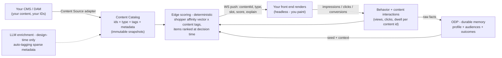

# Content Personalization on the Edge Affinity Engine — Proposal for Tapestry

*Prepared for Mandeep Bhatia & Seth Gabriel. This is the write-up promised on our last call: our design for content personalization and experience personalization, the roadmap, and exactly what we'd shape together. Nothing here is written in stone — this is where our design is converging; read it and push back.*

---

## Where this starts: what you already saw, live

On the call you watched the foundation running — not slides: live per-shopper affinity scoring at the edge (the Affinity tab: weights building and decaying in real time), affinity audiences generated automatically and registered in **ODP** (the "· ODP" tags), the event stream flowing immediately (the old ~90-second latency is gone — ODP is the durable **memory**; the edge is the **reflex** doing real-time scoring), and those audiences available to CMAB and personalization campaigns in the platform today. Deployable to you in **7–14 days**.

This proposal is the next two tiers of your hierarchy, built **on that same engine** — not from scratch.

## Your framing, played back (so we're building the right thing)

1. **Product recs** — solved industry-wide; not where we innovate together.
2. **Content personalization** — same layout, different content per visitor, chosen **algorithmically, not by hand-coded variations**. Your model: a **content catalog** ("just like a product catalog") — every image/text/module carrying your ID, our ID, a URL, and metadata — behavior scored against content interactions (your Twitter analogy: like = 1, retweet = 2, reply = 3), and we recommend **content the way recs engines recommend products**, with explainability. Key signals you named: **entry channel** ("paid social visitors pay attention to these 4–5 things"), **visit count** (60% of purchases on visit 2–3 → romance image first, silo shot + reviews on return), converter vs. non-converter patterns.
3. **Experience/layout personalization** — the layout itself reorders by context; every module has an ID (`CMP1234`). ~6 months; we design for it now, build it later.

**The contract we agreed:** you're headless. Everything has an ID. We push decisions — `{content ID, type, metadata, score}` — over a WebSocket via a small SDK; **your front end paints**. "Whether you paint the screen or we paint the screen doesn't matter."

## The design



- **Content Catalog:** your content registered with your ID + our ID + URL + metadata/tags; ingested from your CMS through an adapter; versioned in immutable snapshots. Where your tagging is sparse, an **LLM enrichment pass proposes tags for human approval** — AI at design time, **never in the render path** (the runtime stays deterministic, fast, and explainable — the same principle you've heard from us throughout).
- **Scoring at scale (your 100-affinities question):** the shopper's vector scores **tags/dimensions** (a small, bounded, decaying set — affinities are in-the-moment and fade, so the active set stays tiny), and **content items** are ranked against the vector only at decision time. Adding content never adds per-shopper scoring cost.
- **Context first-class:** entry channel, visit count (backed by ODP's durable memory), and referrer join the scoring as weighted signals — seeded with sensible defaults, then reweighted by observed behavior. Not if-then rules: different shopper, different vector, different content, automatically.
- **Delivery:** the thin SDK — connect, emit, listen. Push payload (v1 sketch, to be co-designed with Seth's team):

```json
{ "kind": "content_decision", "slot": "pdp-hero",
  "content": { "yourId": "CMP1234", "systemId": "cnt_8f3a", "type": "image", "url": "…" },
  "score": 0.78,
  "explain": { "drivers": [{ "dim": "occasion", "tag": "evening", "a": 0.72 }], "context": { "channel": "paid_social", "visit": 2 } } }
```

Every decision carries its **explain record** — "why this image, this person" is always answerable, and **Opal sits on top** as the transparency and insight surface (Seth's point about the brand needing to *see* the decisioning before trusting autonomy — we agree, and it's designed in, not bolted on).

## How the intelligence grows — three stages, honestly dated

| Stage | What it learns | What it means for you | When |
|---|---|---|---|
| **1 — Affinity-matched content** | *the shopper* — per-session behavior builds the vector; content matching her wins | Kills hand-coded variation guessing: the shopper→content mapping emerges from behavior, per individual, explainable | **Weeks** — the engine exists; the catalog, telemetry, and SDK are the build |
| **2 — Outcome-optimized content** | *what works* — content × context × conversion, learned across all shoppers | "The same algo as product recs, for content": among content matching her, serve the proven winner for shoppers like her (aggregation + CMAB with content as the arms, affinity as the context) | **~2 months** — your stated target; requires Stage 1's telemetry accumulating first |
| **3 — Discovery** | *what matters* — patterns nobody predefined ("review-lingerers on visit 2 convert 3×"), proposed through Opal, human-approved | Your "the machine tells us which affinities are most meaningful, per channel" — with full explainability and reporting | Co-innovation lane, alongside the experience-personalization design |

Each stage feeds the next (Stage 2 learns from Stage 1's data exhaust) — which is why the ladder is the honest sequence, not a hedge.

**Experience/layout personalization (~6 months):** the same delivery contract extended from *content in slots* to *the slots themselves* — a per-shopper manifest of module IDs and order, governed by your slot rules. We have this designed (it's the architecture we discussed when we first talked about module IDs); Stage 1–2 of content personalization builds the exact data and delivery foundation it needs.

## Commitments and what we need from you

**Ours:**
- The **affinity tuning UI** — per-attribute weight / decay / delay control (the anti-black-box you asked for) — first version **this week**, shaped by your feedback.
- This document + roadmap — delivered.
- Today's foundation deployed to you in **7–14 days** of a go.
- Stage 1 in weeks; Stage 2 targeted at ~2 months; experience personalization ~6 months.

**Yours (the co-design inputs):**
1. A **content inventory sample** — 20–30 pieces with your IDs, URLs, and whatever metadata exists (sparse is fine — that's what enrichment is for).
2. **CMS/DAM API access** so we build the Content Source adapter against your real stack.
3. A **working session with Seth's team** on the SDK push payload + slot taxonomy (which slots accept pushed content first — we'd suggest starting with the PDP hero + one carousel).
4. The **success metric** Stage 2 optimizes (conversion? engagement? add-to-cart?).
5. 30 minutes of **tuning-UI feedback** once the first cut is in front of you.

*Next step: your read on this, then the working session. We build it together — your words, and ours.*
