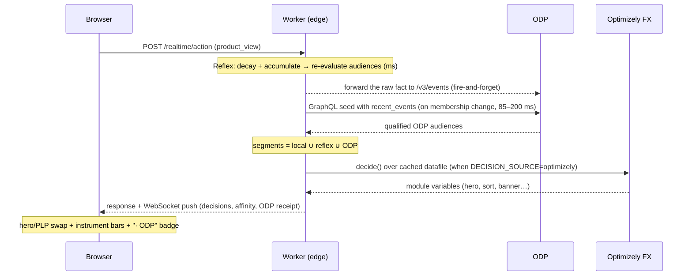

# Architect Walkthrough — Coach Real-Time Personalization

**Status:** as-built, verified 2026-07-08. The 2025 platform-era walkthrough (banking demo) is preserved at [legacy/00-architect-walkthrough-2025-platform.md](./legacy/00-architect-walkthrough-2025-platform.md).
**Use this doc to:** walk an engineer or partner through the system in ten minutes, in the order the system actually runs.

---

## The pitch, one sentence

An anonymous shopper's behavior is scored **at the edge in milliseconds** (the *reflex*), every behavioral fact lands in **ODP in real time** (the *memory*), **Optimizely Feature Experimentation** decides and experiments (the *brain*), and a **Gemini AI layer** powers search, concierge, generated imagery, and the operator's natural-language agent.

## What you're looking at (demo surfaces)

| URL | Surface |
|---|---|
| `/storefront.html` | the Coach storefront — hero/PLP/PDP, the Demo Director (15 beats + encore), the **Affinity Instrument** (live score bars, audience flips, ODP badges), the ODP memory-sync feed |
| `/operator-console.html` | the merchandiser console — audience suggest → publish |
| Opal tab (in the storefront sidebar) | the natural-language agent — query data, create audiences/flags, launch experiments |
| `/visual-demo.html`, `/` | **a different demo** (the banking-era platform demo) — not part of the Coach walkthrough |

## One request, end to end

The reflex's scores are also **upserted onto the ODP profile** (`/v3/profiles`), so the edge's live view is visible on the ODP customer record.

## The three talking points

1. **Reflex vs. memory — split by responsibility, never by speed.** The edge owns decay + scoring (milliseconds, in-session). ODP owns the facts, the profile, and the audiences — and the event stream between them is real time (the instant `recent_events` seed runs ~85–200 ms). Retune the edge hourly; ODP receives identical bytes.
2. **Deterministic, glass-box affinity.** Audiences are *generated from the catalog* ("Tote Affinity" = catalog value + threshold), scores are published math (decay `R·e^(−Δt/τ)`, saturation `R/(R+K)`, hysteresis), and every membership change explains itself. No black box — the anti-Dynamic-Yield argument.
3. **Language to live.** The Opal agent turns a sentence into real Optimizely objects — audiences, flags, A/B · MAB · CMAB experiments — through the gated FX REST path, previewed live on the storefront.

## The switches (what's live vs. gated)

| Switch | Default | Turns on |
|---|---|---|
| ODP creds (`ODP_API_HOST` + `ODP_PUBLIC_KEY`) | set | the **live ODP loop** — additive, independent of all other modes |
| `DECISION_SOURCE=optimizely` | `mock` | real SDK `decide()` over the datafile |
| `OPTIMIZELY_WRITE_ENABLED=true` (+ token) | off | real FX audience/flag/experiment creation |
| `CONNECTOR_MODE=live` | `mock` | live connector adapters (segments/audiences/signals) |
| `REFLEX_ENABLED` | on | the affinity reflex (kill switch) |

## Where to go next

[01 — System overview](./01-system-overview.md) (the full map + component inventory) → [16 — Edge Affinity Reflex](./16-edge-affinity-reflex.md) (the engine) → [14](./14-architecture-and-optimizely-capability-map.md) / [15](./15-edge-composition-design.md) (capability + composition) → [API reference](../api/01-rest-endpoints.md) · [WebSocket protocol](../api/02-websocket-protocol.md) · [D1 schema](./10-d1-schema.md) · [Deployment](../deployment/01-deploy.md) · [ODP wiring spec](../Coach-ODP-Wiring-Spec.md)
