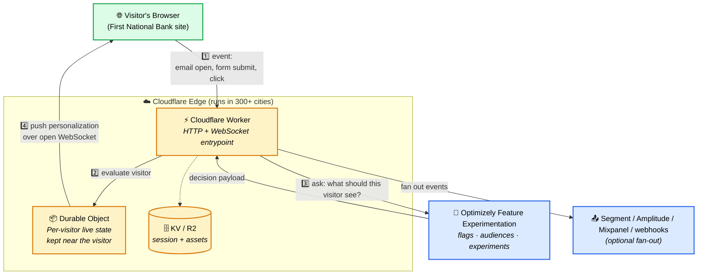

# Architect Walkthrough — Screen Share Guide

**Audience:** Solutions Architects (ours or the customer's) seeing this platform for the first time.
**Format:** A single screen-shareable page. Read top to bottom; don't skip ahead.
**Time:** 10 minutes end to end.

---

## 1. What you're looking at, in one sentence

A **Cloudflare Workers** application that watches what a visitor is doing on a website and **re-personalizes the page while they're still on it** — no reload, no backend round-trip, no nightly CDP batch.

> **Optimizely is the brain** that decides *what* changes.
> **Cloudflare is the muscle** that delivers it within ~50ms anywhere in the world.

That's the entire foundation. Everything below is detail.

---

## 2. The demo we wrapped around it

We took that foundation and built a fictional retail bank — **First National Bank** — on top, so you can *see* it work instead of reading a diagram.

A visitor does three things a real bank customer would do:

| Visitor action | What the platform does |
|---|---|
| Opens a marketing email (Mortgage / Investment / Credit Card) | Scores the interest, adds a segment like `mortgage_interested` |
| Submits the contact form | Promotes them from anonymous to `lead_qualified`, attaches their stated interests |
| Browses (Pricing, Calculator, Compare, Start Application) | Builds intent segments in real time, reshapes the homepage |

The visitor never sees a page reload. The page just becomes more relevant the longer they're on it.

---

## 3. The architecture, in one diagram

This is the only diagram you need for the first conversation. Everything else is a zoom-in on one of these boxes.



### Read it out loud like this

1. **Visitor does something** — opens an email pixel, submits a form, clicks a tile. The browser fires an event to the Worker.
2. **The Worker hands the event to a Durable Object** that holds *this specific visitor's* live state at the edge, right next to them. No central DB round-trip.
3. **The Worker asks Optimizely** — "given this visitor's segments, what flags, audiences, and experiments apply?" Optimizely's edge SDK answers in milliseconds.
4. **The Durable Object pushes the result back** to the browser over an already-open WebSocket. The page rearranges. No reload.

Optionally, the same event is **fanned out** to whatever CDP, analytics, or warehouse pipeline the customer already runs. The edge platform is additive — it doesn't replace existing data infrastructure.

---

## 4. The three things to emphasize

When this diagram is on screen, hit these three points and **stop**. Anything more is for the technical deep-dive.

### 1. State lives at the edge, next to the visitor
Durable Objects co-locate the visitor's profile with the Worker handling their request. That's why decisions are single-digit milliseconds — there's no trip to a central database to figure out who this person is.

### 2. Optimizely is the decision engine
Feature flags, audience targeting, A/B experiments, the management UI marketers actually use — that's Optimizely. The edge platform is the **delivery mechanism**; Optimizely is what drives it.

### 3. One platform, every channel
Web clicks, mobile taps, email pixel opens, server-to-server API events — they all flow through the same segmentation pipeline. One source of truth for "who is this visitor right now?"

---

## 5. The line that usually lands

> *"Most personalization stacks ask 'who was this visitor **yesterday**?'*
> *This one answers 'who is this visitor **right now, this second**?' — and acts on it before they scroll."*

---

## 6. Where to go next on this same screen share

| If they ask about... | Open this |
|---|---|
| What the demo looks like to a prospect | `http://localhost:9100/visual-demo.html` (the bank site) |
| What's happening under the hood while you click | `http://localhost:9100/` (the diagnostic dashboard) |
| The full component breakdown | [`01-system-overview.md`](./01-system-overview.md) |
| Running a real demo end-to-end | [`../SOLUTIONS_ARCHITECT_GUIDE.md`](../SOLUTIONS_ARCHITECT_GUIDE.md) |
| How the demo wiring actually works | [`../DEMO_EXPLANATION.md`](../DEMO_EXPLANATION.md) |

---

## 7. Cheat sheet (keep this visible)

```
ONE-SENTENCE PITCH
  Re-personalize the page while the visitor is still on it — at the edge, in <50ms.

THREE BOXES IN THE DIAGRAM
  Worker         = entrypoint (HTTP + WebSocket)
  Durable Object = per-visitor live state at the edge
  Optimizely     = the brain (flags, audiences, experiments)

THREE TALKING POINTS
  1. State lives at the edge — no central-DB round-trip.
  2. Optimizely is the decision engine — we deliver, it decides.
  3. One pipeline for web, mobile, and email events.

DEMO URLS
  Prospect-facing:  http://localhost:9100/visual-demo.html
  SA diagnostic:    http://localhost:9100/
```
