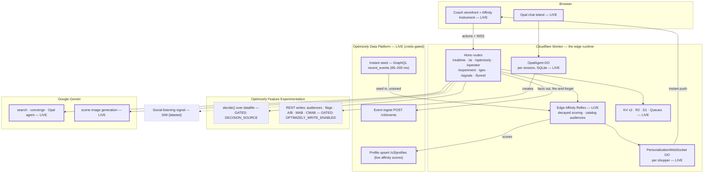

# System Overview — Real-Time Personalization Platform (Coach)

**Status:** as-built, verified against code 2026-07-08. Supersedes the 2025 platform overview (preserved at [legacy/01-system-overview-2025-platform.md](./legacy/01-system-overview-2025-platform.md)).
**Audience:** partner/customer engineering walkthroughs and internal onboarding. Deep dives: [doc 14](./14-architecture-and-optimizely-capability-map.md) (AI capability map) · [doc 15](./15-edge-composition-design.md) (composition design) · [doc 16](./16-edge-affinity-reflex.md) (affinity reflex engineering).

---

## Executive summary

A real-time personalization platform for a luxury storefront (Coach), running on **Cloudflare Workers at the edge**. Three cooperating systems:

- **The Edge Affinity Reflex** — a deterministic, per-shopper behavioral affinity engine (decayed per-dimension scoring, catalog-generated audiences, instant content swaps). The *reflex*.
- **Optimizely Data Platform (ODP)** — the durable, first-party behavioral **memory**: every behavioral fact is forwarded to ODP in real time, the edge seeds from ODP's segments, and the reflex's live scores are written onto the ODP profile. **Live-wired and verified against a real ODP account.**
- **Optimizely Feature Experimentation (FX)** — the decision and experimentation **brain**: flag decisions over the datafile, and gated live creation of audiences, flags, and A/B · MAB · CMAB experiments.

A **Gemini AI layer** powers shopper-facing search/concierge/scene-generation and the operator's Opal chat agent. The platform's honesty model is strict: every integration is a real, named connector; what varies is whether it runs **live**, **gated** (built, awaiting credentials/flags), or **simulated** (clearly labeled in the UI).

## Technology stack

| Layer | Technology |
|---|---|
| Runtime | Cloudflare Workers (global edge), TypeScript, Hono v4 |
| Stateful edge | 4 Durable Objects: `PersonalizationWebSocket` (per-shopper push), `OpalAgent` (per-session AI chat, SQLite-backed), `StateManager`, `RateLimiter` |
| Storage | KV `CACHE` (audiences, datafile, config) · KV `SESSIONS` (sessions incl. reflex state) · R2 `STORAGE` (generated scenes) · D1 `coach-demo-db` (catalog + ODP-shaped history + live demo events) · Queues `events` (async scene generation) |
| Decisioning | `@optimizely/optimizely-sdk` over a KV-cached datafile; FX REST API for gated writes |
| Data platform | ODP REST (`/v3/events`, `/v3/profiles`) + GraphQL (`recent_events` instant seed) |
| AI | Google Gemini (`gemini-2.5-flash` text · `gemini-3.1-flash-image` scenes) via `@ai-sdk/google`; Cloudflare Agents SDK for the Opal chat |
| Observability / verify | Analytics Engine · Browser Rendering (`/__shot`, internal) |

## Architecture at a glance

Node tags carry the status — **LIVE** (runs today) · **GATED** (built; enabled by credentials/flags) · **SIM** (simulated, labeled in-product). Borders reinforce: solid = live, dashed = gated, dotted = simulated.

**The ODP loop (the load-bearing integration, both directions):**
1. **Facts out** — every behavioral event (product view, cart add, wishlist) is forwarded to ODP's event API off the response path, with flattened catalog attributes and a deterministic `vuid`. A delivery receipt is pushed to the shopper's screen.
2. **Seed in** — the edge reads the shopper's qualified ODP audiences via GraphQL, with the session's recent events injected inline (the *instant seed*, ~85–200 ms), and **unions** them with its own evaluation: `segments = local ∪ reflex ∪ ODP`.
3. **Scores on the profile** — the reflex's live affinity numbers are upserted onto the ODP customer profile, so the edge's view is visible on the ODP record.

Split by **responsibility, not speed**: ODP owns the facts, the profile, and the audiences; the edge owns the decay and the scoring; the event stream between them is real time.

## Core concepts

**Connector quad + three switches.** All external integrations sit behind four named connectors — `segments`, `audiences`, `decisions`, `signals` — with mock and live adapters:

| Switch | Default | Effect |
|---|---|---|
| `CONNECTOR_MODE` | `mock` | flips the connector quad to live adapters |
| `DECISION_SOURCE` | `mock` | `optimizely` = real SDK `decide()` over the datafile (independent of `CONNECTOR_MODE`) |
| `OPTIMIZELY_WRITE_ENABLED` | off | `true` + API token = real FX audience/flag/experiment creation |
| ODP credentials | set | the ODP loop is **additive and independent** — live whenever `ODP_API_HOST` + `ODP_PUBLIC_KEY` are present, in any mode |
| `REFLEX_ENABLED` | on | kill switch for the affinity reflex |

**The Edge Affinity Reflex** ([doc 16](./16-edge-affinity-reflex.md), [technical design](../Edge-Affinity-Reflex-Technical-Design.md)): per-shopper, per-dimension scores `a = R/(R+K)` with lazy exponential decay and hysteresis; audiences **generated from the catalog** ("Tote Affinity" = the catalog's `tote` value + a threshold rule) with a population filter and human-edit protection. Deterministic — no ML at this layer; every membership change carries an explain record.

**Geo-cohort cold start** ([doc 13](./13-geo-cohort-coldstart-prd-tdd.md)): first paint for a no-history shopper adapts to edge geolocation + real public census data (curate, never price), then behavior takes over.

**Journey stage:** `early / mid / late`, derived from behavioral counts, gating message and module choices.

## Component inventory (as-built)

| Component | Role | Status |
|---|---|---|
| `public/storefront.html/.js` | Coach storefront + Demo Director + Affinity Instrument + ODP memory-sync feed | live |
| `island/opal-chat.tsx` → `public/opal-chat.js` | operator chat island (Agents SDK) | live |
| `src/reflex/core.ts`, `audienceGenerator.ts` | the affinity engine + catalog audience generator (pure, tested) | live |
| `src/services/odpLoop.ts` | ODP forward / instant seed / profile upsert | live (creds-gated) |
| `src/services/RealtimeSegmentEngine.ts` | per-event pipeline: reflex → qualification → ODP union → decisions → push | live |
| `src/connectors/*` | the quad (segments/audiences/decisions/signals), mock + live adapters | live (mock default) |
| `src/services/optimizelyFx.ts`, `experimentFx.ts` | gated FX REST writes incl. A/B · MAB · CMAB | gated |
| `src/agents/OpalAgent.ts` + tools | Gemini agent: D1 `queryData`, audience/flag/experiment tools, funnel + geo tools | live (writes gated) |
| `src/services/geo/cohort.ts` | geo-cohort cold start (real geo + real census + synthetic first-party) | live |
| `src/services/sceneGen.ts` + Queue | AI scene generation → R2 | live |
| `src/connectors/SignalProvider.ts` | social-listening DETECT | simulated (labeled) |

## Route surface (summary)

`/realtime` (action ingest, WS upgrade, reflex snapshot, session reset) · `/ai` + `/ai/scene` (search, concierge, scenes) · `/optimizely` (decide/preview/track/datafile) · `/operator` (audience suggest→publish, insights, demo-data ops) · `/experiment` (launch, readout, CMAB) · `/signals` · `/geo` (+ `/geo/cohort`) · `/funnel` (+ sim) · `/agents/*` (Opal chat) · `/track` `/pixel` `/webhook` `/cdp` (eventing) · `/auth` `/api` `/health` (platform) · `/__shot` (internal verification). Full reference: [docs/api/01-rest-endpoints.md](../api/01-rest-endpoints.md).

## Honesty tiers (what's real today)

- **Live:** the edge reflex + instrument, the ODP loop (events, instant seed, profile upsert — verified against a real ODP account), Gemini AI surfaces, geo cold start, catalog-generated audiences, event capture to D1.
- **Built, gated:** real FX decisions (`DECISION_SOURCE`), real FX writes (`OPTIMIZELY_WRITE_ENABLED`), live connector adapters (`CONNECTOR_MODE`).
- **Simulated, labeled:** the social-listening signal (badged "SIMULATED · not Optimizely"), representative lift numbers, synthetic first-party history (real schemas, sample rows).

## Reading map

[00 — Architect walkthrough](./00-architect-walkthrough.md) → this doc → [14 (AI capability map)](./14-architecture-and-optimizely-capability-map.md) · [15 (composition design)](./15-edge-composition-design.md) · [16 (affinity reflex)](./16-edge-affinity-reflex.md) · [12 (Signal-Led Moment)](./12-signal-led-moment-build-brief.md) · [13 (geo cold start)](./13-geo-cohort-coldstart-prd-tdd.md) · [API reference](../api/01-rest-endpoints.md) · [WebSocket protocol](../api/02-websocket-protocol.md) · [D1 schema](./10-d1-schema.md) · [Deployment](../deployment/01-deploy.md) · ODP: [wiring spec](../Coach-ODP-Wiring-Spec.md), [recent-events reference](../ODP-Recent-Events-Reference.md), [technical design](../Edge-Affinity-Reflex-Technical-Design.md)
