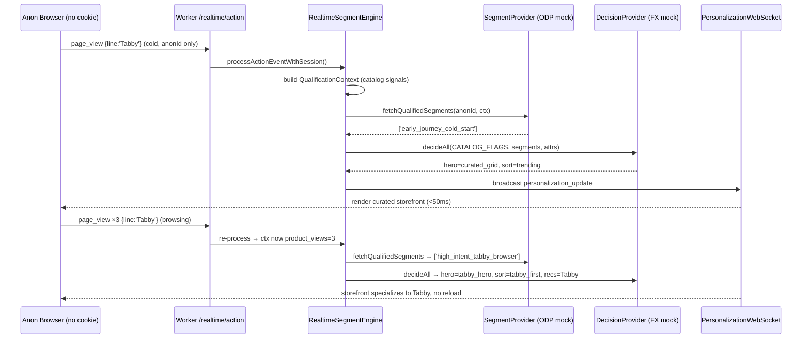
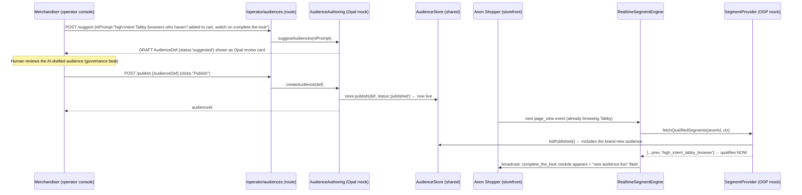

# 05 — Demo Build Spec: Connector Layer, Catalog-Aware Engine & Hero Flows

**For:** Build agents (parallel), reviewing SA, eng lead
**From:** Solutions Architecture
**Status:** Build contract — interface signatures here are normative. Implement to these signatures so the demo is swap-to-live with a single config change.
**Reads against:** [`Tapestry-Coach-North-Star-Brief.md`](../Tapestry-Coach-North-Star-Brief.md) · [`architecture/00-architect-walkthrough.md`](./00-architect-walkthrough.md) · [`architecture/Optimizely-Experimentation-MCP-Server-Technical-Reference.md`](./Optimizely-Experimentation-MCP-Server-Technical-Reference.md) · [`components/01-segment-engine.md`](../components/01-segment-engine.md)

---

## 0. Architecture principle (the one rule)

> **REAL SEAMS, MOCKED CALLS.** Every integration point is a real TypeScript interface **named after the actual Optimizely product** (ODP `fetchQualifiedSegments`, Opal's ODP audience-authoring tools, Optimizely flag/variation decisions). Each interface ships **two adapters**: a `Mock*` adapter returning synthetic Coach North America data shaped to ODP's schema, and an inert `Live*` adapter stub that has the real wiring shape but throws `NotWiredError` until credentials/config are supplied. **The whole demo runs on the mock adapters. Swapping mock → live is a config-flag change, never a code change.**

This mirrors the precedent already in this repo: `OptimizelyService.initialize()` (in [`src/services/OptimizelyService.ts`](../../src/services/OptimizelyService.ts)) already detects a placeholder SDK key and falls back to a mock client. We are generalizing that one-off pattern into a **typed connector layer** under `src/connectors/`.

### Why these three connectors map 1:1 to Optimizely products

| Connector interface | Real Optimizely product it mirrors | Real method it stands in for |
|---|---|---|
| `SegmentProvider` | **ODP** (Optimizely Data Platform) real-time segments | `fetchQualifiedSegments(userId)` (the real ODP/JS-SDK call) |
| `AudienceAuthoring` | **Opal** ODP audience tools / Real-time Audience Builder (exposed via remote MCP `exp_manage_entity_lifecycle`) | natural-language → audience definition → `createAudience` (draft, human-approved) |
| `DecisionProvider` | **Optimizely Feature Experimentation** decisions | `decide` / `getVariation` / `isFeatureEnabled` |

---

## 1. THE CONNECTOR LAYER

All connectors live under `src/connectors/`. Shared types live in `src/connectors/types.ts`. A single factory (`src/connectors/index.ts`) reads one config flag and returns either the mock or live triad.

### 1.0 Shared connector types — `src/connectors/types.ts`

```ts
// src/connectors/types.ts
// Types shaped to ODP's schema so mock and live are interchangeable.

/** A real-time segment/audience key as ODP would return it (snake_case, stable). */
export type SegmentKey = string; // e.g. "high_intent_tabby_browser", "early_journey_cold_start"

/** ODP-style audience/segment definition. This is what Opal drafts and what ODP qualifies against. */
export interface AudienceDef {
  /** Stable key used everywhere downstream (cookies, decisions, ODP qualification). */
  key: SegmentKey;
  /** Human-facing name shown in the operator console / Opal review card. */
  name: string;
  /** What the merchandiser asked for, in plain language (provenance for the demo). */
  description: string;
  /**
   * ODP-style condition tree. Same shape OptimizelyService already evaluates
   * (see evaluateConditions in OptimizelyService.ts): nested ['and'|'or'|'not', ...]
   * with leaf predicates over real-time session/profile attributes.
   */
  conditions: AudienceCondition;
  /** 'realtime' = evaluated per-event at the edge (ODP real-time audiences). */
  evaluation: 'realtime' | 'batch';
  source: 'opal_nl' | 'manual' | 'seed';
  createdAt: number;
  /** Set once createAudience() is called; absent on a draft suggestion. */
  audienceId?: string;
  status: 'suggested' | 'draft' | 'published' | 'archived';
}

/** Leaf predicate over a real-time attribute the edge engine actually computes. */
export interface AudiencePredicate {
  attribute: string;        // e.g. "viewed_product_line", "cart_adds", "journey_stage"
  operator: 'eq' | 'neq' | 'gte' | 'lte' | 'gt' | 'lt' | 'contains' | 'in' | 'not_in';
  value: string | number | boolean | Array<string | number>;
}
export type AudienceCondition =
  | AudiencePredicate
  | ['and', ...AudienceCondition[]]
  | ['or', ...AudienceCondition[]]
  | ['not', AudienceCondition];

/** The real-time signal snapshot the SegmentProvider qualifies a user against. */
export interface QualificationContext {
  userId: string;
  anonymousId?: string;
  attributes: Record<string, any>; // mirrors SessionData.attributes + catalog signals
  segments: SegmentKey[];          // segments already on the profile
}

/** Mirrors an Optimizely OptimizelyDecision (the subset the storefront needs). */
export interface Decision {
  flagKey: string;
  enabled: boolean;
  variationKey: string | null;
  /** Optimizely "variables" map — drives which personalization module + params render. */
  variables: Record<string, any>;
  ruleKey: string | null;
  /** experiment | rollout | bandit (CMAB). Lets the UI label "A/B test measuring this". */
  reason: 'experiment' | 'rollout' | 'bandit' | 'fallback';
}

export class NotWiredError extends Error {
  constructor(connector: string) {
    super(`${connector}: live adapter not wired. Set CONNECTOR_MODE=mock or supply credentials.`);
    this.name = 'NotWiredError';
  }
}
```

### 1.1 (a) `SegmentProvider` — mirrors ODP — `src/connectors/SegmentProvider.ts`

The real-time segment-qualification seam. **`fetchQualifiedSegments` is the exact ODP/JS-SDK method name** so the live swap is literal.

```ts
// src/connectors/SegmentProvider.ts
import type { SegmentKey, QualificationContext } from './types';

export interface SegmentProvider {
  /** ODP: return every real-time segment key the user currently qualifies for. */
  fetchQualifiedSegments(
    userId: string,
    ctx?: QualificationContext
  ): Promise<SegmentKey[]>;

  /** Convenience predicate used by the engine for fast single-segment checks. */
  isQualifiedFor(
    userId: string,
    segment: SegmentKey,
    ctx?: QualificationContext
  ): Promise<boolean>;
}
```

**Mock adapter** — evaluates published `AudienceDef`s (seeded + Opal-created) against the live `QualificationContext` using the same condition-tree evaluator the repo already has. This is the linchpin that makes Hero Moment 3 look real: a brand-new Opal audience becomes qualifiable **with zero code change** because the mock provider reads audiences from the shared `AudienceStore`.

```ts
// src/connectors/SegmentProvider.ts (continued)
import type { AudienceStore } from './AudienceStore';
import { evaluateCondition } from './evaluateCondition'; // pure fn, extracted from OptimizelyService

export class MockSegmentProvider implements SegmentProvider {
  constructor(private store: AudienceStore) {}

  async fetchQualifiedSegments(userId: string, ctx?: QualificationContext): Promise<SegmentKey[]> {
    const audiences = await this.store.listPublished();        // seed + Opal-created, all here
    const context = ctx ?? { userId, attributes: {}, segments: [] };
    return audiences
      .filter(a => a.evaluation === 'realtime' && evaluateCondition(a.conditions, context.attributes))
      .map(a => a.key);
  }

  async isQualifiedFor(userId: string, segment: SegmentKey, ctx?: QualificationContext): Promise<boolean> {
    return (await this.fetchQualifiedSegments(userId, ctx)).includes(segment);
  }
}
```

**Live adapter stub** — real shape, inert until wired. Calls the actual ODP endpoint/SDK.

```ts
// src/connectors/SegmentProvider.ts (continued)
import { NotWiredError } from './types';

export class LiveSegmentProvider implements SegmentProvider {
  constructor(private cfg: { odpApiHost?: string; odpPublicKey?: string }) {}

  async fetchQualifiedSegments(userId: string): Promise<SegmentKey[]> {
    if (!this.cfg.odpApiHost || !this.cfg.odpPublicKey) throw new NotWiredError('SegmentProvider');
    // LIVE: POST {odpApiHost}/v3/graphql  (ODP fetchQualifiedSegments GraphQL),
    // or call optimizelySdk.fetchQualifiedSegments(userId) on a UserContext.
    // Returned segment keys are used identically to the mock path.
    throw new NotWiredError('SegmentProvider'); // remove when credentials are supplied
  }
  async isQualifiedFor(userId: string, segment: SegmentKey): Promise<boolean> {
    return (await this.fetchQualifiedSegments(userId)).includes(segment);
  }
}
```

### 1.2 (b) `AudienceAuthoring` — mirrors Opal's ODP tools — `src/connectors/AudienceAuthoring.ts`

The operator-side wedge. `suggestAudiences` is the AI draft step (Opal NL → ODP audience definitions); `createAudience` is the **human-approved Publish** step. Per the MCP reference (§8.1): **writes are draft-only and a human clicks Publish** — we model that as a hard two-call gate, and frame it as a governance beat, not a limitation.

```ts
// src/connectors/AudienceAuthoring.ts
import type { AudienceDef } from './types';

export interface AudienceAuthoring {
  /**
   * Opal: turn a merchandiser's plain-language request into one or more
   * DRAFT audience definitions (status:'suggested'). NOTHING goes live here.
   */
  suggestAudiences(nlPrompt: string): Promise<AudienceDef[]>;

  /**
   * Human-approved publish. Persists the audience and returns its id.
   * After this, SegmentProvider.fetchQualifiedSegments() can qualify users into it.
   */
  createAudience(def: AudienceDef): Promise<string /* audienceId */>;
}
```

**Mock adapter** — an intent-matching "AI" that maps Coach-specific prompts to ODP-shaped `AudienceDef`s, then writes published audiences into the shared `AudienceStore` (the same store `MockSegmentProvider` reads). This closure is what makes the operator demo behave like the real product.

```ts
// src/connectors/AudienceAuthoring.ts (continued)
import type { AudienceStore } from './AudienceStore';

export class MockAudienceAuthoring implements AudienceAuthoring {
  constructor(private store: AudienceStore) {}

  async suggestAudiences(nlPrompt: string): Promise<AudienceDef[]> {
    // Deterministic NL→audience mapping over Coach product lines (Tabby, Brooklyn, …)
    // e.g. prompt: "high-intent Tabby browsers who haven't added to cart"
    // ⇒ conditions: ['and',
    //      { attribute:'viewed_product_line', operator:'eq',  value:'Tabby' },
    //      { attribute:'product_views',       operator:'gte', value:3 },
    //      { attribute:'cart_adds',           operator:'eq',  value:0 }]
    // Returns status:'suggested' drafts only. (See §3, Hero Moment 3.)
    return suggestFromPrompt(nlPrompt); // pure fn in this module
  }

  async createAudience(def: AudienceDef): Promise<string> {
    const audienceId = `aud_${crypto.randomUUID()}`;
    await this.store.publish({ ...def, audienceId, status: 'published', createdAt: Date.now() });
    return audienceId; // now live to SegmentProvider — no redeploy
  }
}
```

**Live adapter stub** — drives the real Opal/remote-MCP write path (`exp_manage_entity_lifecycle`), staying draft-only.

```ts
// src/connectors/AudienceAuthoring.ts (continued)
import { NotWiredError } from './types';

export class LiveAudienceAuthoring implements AudienceAuthoring {
  constructor(private cfg: { mcpEndpoint?: string; optiIdToken?: string }) {}

  async suggestAudiences(nlPrompt: string): Promise<AudienceDef[]> {
    if (!this.cfg.mcpEndpoint) throw new NotWiredError('AudienceAuthoring');
    // LIVE: drive Opal over remote MCP (https://exp.mcp.opal.optimizely.com/mcp):
    // exp_get_entity_templates(audience) → construct draft → return as AudienceDef[].
    throw new NotWiredError('AudienceAuthoring');
  }
  async createAudience(def: AudienceDef): Promise<string> {
    if (!this.cfg.optiIdToken) throw new NotWiredError('AudienceAuthoring');
    // LIVE: exp_manage_entity_lifecycle(create audience) → DRAFT in Optimizely.
    // NOTE: per MCP ref §8, the agent CANNOT publish; a human clicks Publish in the UI.
    // The returned id maps to the draft; ODP qualification follows once published.
    throw new NotWiredError('AudienceAuthoring');
  }
}
```

### 1.3 (c) `DecisionProvider` — mirrors Optimizely decisions — `src/connectors/DecisionProvider.ts`

Wraps flag/variation decisions. Replaces the hardcoded `getExperimentDecisions` / `getFeatureFlagDecisions` / `getFeatureVariables` loops currently inside `RealtimeSegmentEngine`.

```ts
// src/connectors/DecisionProvider.ts
import type { Decision, SegmentKey } from './types';

export interface DecisionProvider {
  /** Optimizely: decide a single flag for a user given their qualified segments + attrs. */
  decide(
    flagKey: string,
    userId: string,
    segments: SegmentKey[],
    attributes: Record<string, any>
  ): Promise<Decision>;

  /** Batch convenience for the storefront's full module set. */
  decideAll(
    flagKeys: string[],
    userId: string,
    segments: SegmentKey[],
    attributes: Record<string, any>
  ): Promise<Record<string, Decision>>;
}
```

**Mock adapter** — deterministic decisions keyed off qualified segments, returning Coach personalization-module variables (which module renders + its params). **Live adapter** wraps the existing `OptimizelyService` (already in repo) so the live path is literally the SDK we already integrate.

```ts
// src/connectors/DecisionProvider.ts (continued)
import { NotWiredError } from './types';
import { OptimizelyService } from '@/services/OptimizelyService';

export class MockDecisionProvider implements DecisionProvider {
  async decide(flagKey, userId, segments, attributes): Promise<Decision> {
    // Lookup table: segment → { module, variables }, e.g.
    //   "high_intent_tabby_browser" + flag "complete_the_look"
    //   ⇒ { enabled:true, variationKey:'on', reason:'experiment',
    //       variables:{ module:'complete_the_look', anchorLine:'Tabby', slots:3 } }
    return decideFromSegments(flagKey, segments, attributes);
  }
  async decideAll(flagKeys, userId, segments, attributes) {
    const out: Record<string, Decision> = {};
    for (const k of flagKeys) out[k] = await this.decide(k, userId, segments, attributes);
    return out;
  }
}

export class LiveDecisionProvider implements DecisionProvider {
  constructor(private opti: OptimizelyService) {}
  async decide(flagKey, userId, segments, attributes): Promise<Decision> {
    if (!this.opti) throw new NotWiredError('DecisionProvider');
    // LIVE: optimizelyUserContext.decide(flagKey) → map OptimizelyDecision → Decision.
    // (OptimizelyService.getVariation/isFeatureEnabled/getAllFeatureVariables already exist.)
    throw new NotWiredError('DecisionProvider');
  }
  async decideAll(flagKeys, userId, segments, attributes) { /* loop decide() */ }
}
```

### 1.4 The single config flag that flips mock ↔ live — `src/connectors/index.ts`

One environment variable, `CONNECTOR_MODE`, selects the triad. Nothing else in the app knows which mode it is in — they depend only on the interfaces.

```ts
// src/connectors/index.ts
import type { Env } from '@/types/env';
import type { SegmentProvider } from './SegmentProvider';
import type { AudienceAuthoring } from './AudienceAuthoring';
import type { DecisionProvider } from './DecisionProvider';
import { MockSegmentProvider, LiveSegmentProvider } from './SegmentProvider';
import { MockAudienceAuthoring, LiveAudienceAuthoring } from './AudienceAuthoring';
import { MockDecisionProvider, LiveDecisionProvider } from './DecisionProvider';
import { KvAudienceStore } from './AudienceStore';
import { OptimizelyService } from '@/services/OptimizelyService';

export interface Connectors {
  segments: SegmentProvider;
  audiences: AudienceAuthoring;
  decisions: DecisionProvider;
}

export function getConnectors(env: Env): Connectors {
  const mode = env.CONNECTOR_MODE ?? 'mock';        // 'mock' | 'live' — the ONLY switch
  const store = new KvAudienceStore(env);           // shared by SegmentProvider + AudienceAuthoring

  if (mode === 'live') {
    return {
      segments:  new LiveSegmentProvider({ odpApiHost: env.ODP_API_HOST, odpPublicKey: env.ODP_PUBLIC_KEY }),
      audiences: new LiveAudienceAuthoring({ mcpEndpoint: env.OPAL_MCP_ENDPOINT, optiIdToken: env.OPTI_ID_TOKEN }),
      decisions: new LiveDecisionProvider(new OptimizelyService(env)),
    };
  }
  return {
    segments:  new MockSegmentProvider(store),
    audiences: new MockAudienceAuthoring(store),
    decisions: new MockDecisionProvider(),
  };
}
```

Add to [`src/types/env.ts`](../../src/types/env.ts): `CONNECTOR_MODE?: 'mock' | 'live'`, `ODP_API_HOST?`, `ODP_PUBLIC_KEY?`, `OPAL_MCP_ENDPOINT?`, `OPTI_ID_TOKEN?`. Default in [`wrangler.toml`](../../wrangler.toml) `[vars]`: `CONNECTOR_MODE = "mock"`.

> **Demo guarantee:** with `CONNECTOR_MODE="mock"` (the default), there is **no live external dependency** — nothing can fail on stage. Flipping to `"live"` is the only change required to point at real ODP/Opal/FX; the live adapters throw `NotWiredError` until their credentials are also present, so a half-config can never silently degrade.

### 1.5 The shared `AudienceStore` (why Hero Moment 3 is believable)

`AudienceStore` is the small persistence seam that both `SegmentProvider` (reads) and `AudienceAuthoring` (writes) share. It is seeded at boot with the Coach launch audiences and accepts new Opal-created audiences at runtime. Because both mock adapters point at the same store, **an audience created by Opal is immediately qualifiable by ODP** — no redeploy, no code edit. Backed by KV (`SESSIONS`/`CACHE`) so it survives across the demo session.

```ts
// src/connectors/AudienceStore.ts
import type { AudienceDef } from './types';
export interface AudienceStore {
  listPublished(): Promise<AudienceDef[]>;
  publish(def: AudienceDef): Promise<void>;
  get(key: string): Promise<AudienceDef | null>;
  seed(defs: AudienceDef[]): Promise<void>;   // load Coach launch audiences at boot
}
// KvAudienceStore implements this over env.CACHE with key prefix "audience:".
```

---

## 2. REFACTORING THE EXISTING ENGINE TO BE CATALOG-AWARE & CONNECTOR-DRIVEN

Today, `RealtimeSegmentEngine` ([`src/services/RealtimeSegmentEngine.ts`](../../src/services/RealtimeSegmentEngine.ts)) has **hardcoded** B2B segment rules (`getDefaultSegmentRules()`: `email_opener`, `lead_qualified`, `pricing_page_visitor`, …) and hardcoded Optimizely keys (`hero_cta_test`, `premium_content`, …). The refactor removes the hardcoded decisioning and routes it through the connector layer, while adding retail catalog awareness.

### 2.1 `RealtimeSegmentEngine` becomes connector-driven

**Changes (ownership: this is the only agent that edits `RealtimeSegmentEngine.ts`):**

1. **Constructor takes `Connectors`.** `constructor(env, connectors: Connectors, options?)`. Routes (`realtime.ts`) build it via `new RealtimeSegmentEngine(env, getConnectors(env))`.
2. **Replace `evaluateSegmentRules()` body** — instead of looping local `SegmentRule[]`, build a `QualificationContext` from session + catalog signals and call `connectors.segments.fetchQualifiedSegments(userId, ctx)`. The hardcoded rules are **deleted**; qualification logic now lives behind ODP (mock or live). The local `SegmentRule` type/`getDefaultSegmentRules()` are removed.
3. **Replace `getExperimentDecisions` / `getFeatureFlagDecisions` / `getFeatureVariables`** with one call to `connectors.decisions.decideAll(CATALOG_FLAG_KEYS, userId, segments, attributes)`. `PersonalizationConfig` carries `decisions: Record<string, Decision>` in place of the three separate maps.
4. **Engagement scoring becomes catalog-aware** — `calculateEngagementScore` and `updateAttributesWithEvent` learn retail signals (product views, PDP dwell, cart adds, wishlist) instead of email opens / form submits.

### 2.2 New retail signals + `CatalogService`

`updateAttributesWithEvent` is extended (or its retail variant added) to derive the attributes that audiences are written against:

| Attribute (on `SessionData.attributes`) | Meaning | Feeds |
|---|---|---|
| `viewed_product_line` | last/most-viewed line (Tabby, Brooklyn, Willow, Pillow Tabby) | Tabby-affinity audiences |
| `product_views` | count of PDP views this session | high-intent thresholds |
| `category_dwell_ms` | dwell per category | journey-stage signal |
| `cart_adds` / `wishlist_adds` | intent depth | "haven't added to cart" audiences |
| `journey_stage` | `early` \| `mid` \| `late` (derived; see 2.4) | stage-shift personalization |
| `price_band_viewed` | entry / core / elevated | sort + recommendation tuning |

A new `src/services/CatalogService.ts` owns the Coach catalog (real lines: **Tabby, Brooklyn, Willow, Pillow Tabby**, plus categories: shoulder bags, crossbody, totes) and exposes recommendation/sort helpers the decisioning consumes (e.g. `getRecommendations(line, segments)`, `sortForSegments(products, segments)`, `completeTheLook(anchorLine)`). Catalog data is synthetic Coach NA, loaded from `src/data/coach-catalog.json`.

### 2.3 `SessionManager` — minimal change

`SessionData.attributes` is already `Record<string, any>`, so retail signals need **no schema change**. The only change: an optional `journeyStage?: 'early' | 'mid' | 'late'` promoted onto `SessionData.metadata` for fast access and so the WebSocket can broadcast stage transitions. Ownership: SessionManager-owning agent adds the one field + its zod entry; no other edits.

### 2.4 Journey-stage detection

A small pure module `src/services/JourneyStage.ts`: `deriveStage(ctx: QualificationContext): 'early' | 'mid' | 'late'` from `product_views`, `category_dwell_ms`, `cart_adds`, `wishlist_adds`, and `session_count`. The engine calls it during event processing; a stage change is itself a trigger that re-runs `fetchQualifiedSegments` (stage is also an audience attribute) and broadcasts.

### 2.5 `PersonalizationWebSocket` — additive only

The DO ([`src/durable-objects/PersonalizationWebSocket.ts`](../../src/durable-objects/PersonalizationWebSocket.ts)) is catalog-agnostic and stays so. Two additive changes (ownership: DO-owning agent):

1. Extend the `PersonalizationUpdate.data` shape to carry retail payloads: `decisions?: Record<string, Decision>`, `recommendations?: Product[]`, `sortOrder?: string[]`, `journeyStage?`, and `audienceWentLive?: { key, name }` (used by Hero Moment 3 to flash "new audience live").
2. Add an `audience_published` update `type` so the operator action can fan a global notice to matching storefront sessions.

No connection/transport logic changes — the DO remains a dumb, reliable broadcast pipe.

---

## 3. END-TO-END DATA FLOW — THE THREE HERO MOMENTS

Shared setup: the storefront page (reskinned `public/visual-demo.html` + `visual-demo.js`) opens a WebSocket to `/realtime/ws?userId=<anonId>` and POSTs catalog events to `/realtime/action`. The engine is built with `getConnectors(env)`, so **in mock mode every decision is synthetic but flows through the real seams.**

### Hero Moment 1 — Anonymous cold-start specializing in-session



**Point:** the same code path runs every event; specialization emerges purely because the `QualificationContext` accrues catalog signals and ODP returns richer segments. Decisioning is never hardcoded — it comes through `DecisionProvider`.

### Hero Moment 2 — Journey-stage shift (Early → Mid → Late)

1. Each event, the engine calls `JourneyStage.deriveStage(ctx)`.
2. On change (e.g. `early → mid` after dwell + a wishlist add; `mid → late` after a cart add), `journey_stage` is updated on the session **and** is an audience attribute, so `fetchQualifiedSegments` re-qualifies (e.g. into `mid_journey_considering`, `late_journey_ready_to_buy`).
3. `DecisionProvider.decideAll` returns stage-appropriate modules: Early → discovery/editorial hero; Mid → "complete the look" + social proof; Late → shipping/returns reassurance + checkout nudge.
4. The DO broadcasts `journeyStage` + new `decisions`; the storefront restructures live. The operator console shows the stage transition on a timeline.

### Hero Moment 3 — Operator-side Opal audience creation → live on storefront

This is the wedge. It must look and behave real. The mechanism is the **shared `AudienceStore`**: `AudienceAuthoring` writes to it, `SegmentProvider` reads from it, on every subsequent event.



**Exactly how the mock write makes it real:** `MockAudienceAuthoring.createAudience()` persists the new `AudienceDef` (with `evaluation:'realtime'`, `status:'published'`) into the `AudienceStore`. `MockSegmentProvider.fetchQualifiedSegments()` lists **all** published audiences from that same store and evaluates each `conditions` tree against the shopper's live `QualificationContext`. So the moment Publish is clicked, the very next event the shopper generates qualifies them into the new audience — and `DecisionProvider` (which keys modules off segments) turns on `complete_the_look`. No file is edited, nothing is redeployed: it is the identical mechanism the live ODP path would use, which is exactly why it survives a hands-on-keyboard test. To complete the "A/B test already measuring it" beat, `createAudience` also seeds a paired `Decision` with `reason:'experiment'` so the storefront can label it as under test.

---

## 4. FILE / MODULE PLAN (parallel-build ownership boundaries)

Each file has **one owning agent**. Agents in different rows never edit the same file. Connector files depend only on `src/connectors/types.ts` and `AudienceStore.ts`, so they can be built concurrently once those two land.

### Build order gate (must land first)
| Order | File | Why first |
|---|---|---|
| 0 | `src/connectors/types.ts` | All connectors + engine import these types. |
| 0 | `src/connectors/AudienceStore.ts` (interface + `KvAudienceStore`) | Shared by SegmentProvider & AudienceAuthoring. |
| 0 | `src/connectors/evaluateCondition.ts` | Pure condition-tree evaluator (extracted from `OptimizelyService.evaluateConditions`); used by mock SegmentProvider. |

### New files — connector layer (`src/connectors/`)
| File | Owner | Exports | Depends on |
|---|---|---|---|
| `src/connectors/types.ts` | Connector-core agent | `AudienceDef`, `AudienceCondition`, `QualificationContext`, `Decision`, `SegmentKey`, `NotWiredError` | — |
| `src/connectors/AudienceStore.ts` | Connector-core agent | `AudienceStore`, `KvAudienceStore` | `types`, `Env` |
| `src/connectors/evaluateCondition.ts` | Connector-core agent | `evaluateCondition()` | `types` |
| `src/connectors/SegmentProvider.ts` | ODP-connector agent | `SegmentProvider`, `MockSegmentProvider`, `LiveSegmentProvider` | `types`, `AudienceStore`, `evaluateCondition` |
| `src/connectors/AudienceAuthoring.ts` | Opal-connector agent | `AudienceAuthoring`, `MockAudienceAuthoring`, `LiveAudienceAuthoring` | `types`, `AudienceStore` |
| `src/connectors/DecisionProvider.ts` | FX-connector agent | `DecisionProvider`, `MockDecisionProvider`, `LiveDecisionProvider` | `types`, `OptimizelyService` |
| `src/connectors/index.ts` | Connector-core agent | `getConnectors()`, `Connectors` | all of the above, `Env` |

### New files — retail services & data
| File | Owner | Purpose |
|---|---|---|
| `src/services/CatalogService.ts` | Catalog agent | Coach catalog (Tabby/Brooklyn/Willow/Pillow Tabby), recommendations, personalized sort, complete-the-look. |
| `src/services/JourneyStage.ts` | Catalog agent | Pure `deriveStage(ctx)` → early/mid/late. |
| `src/data/coach-catalog.json` | Catalog agent | Synthetic Coach NA catalog (products, lines, categories, price bands, imagery refs). |
| `src/data/seed-audiences.ts` | Opal-connector agent | The Coach launch `AudienceDef[]` seeded into `AudienceStore` at boot (cold-start, Tabby-affinity, journey-stage audiences). |

### New files — operator surface
| File | Owner | Purpose |
|---|---|---|
| `src/routes/operator.ts` | Operator agent | `POST /operator/audiences/suggest`, `POST /operator/audiences/publish`, `GET /operator/audiences` → drives `AudienceAuthoring`. Mounted in `index.ts` as `app.route('/operator', operatorRoutes)`. |
| `public/operator-console.html` + `operator-console.js` | Operator-UI agent | Second-screen merchandiser console: NL prompt box → Opal review card → Publish, live audience list, "went live" confirmation. |

### Modified files (one owner each — do not co-edit)
| File | Owner | Change |
|---|---|---|
| `src/services/RealtimeSegmentEngine.ts` | Engine agent | Constructor takes `Connectors`; delete hardcoded `SegmentRule`s; route qualification through `SegmentProvider`; route decisions through `DecisionProvider`; catalog-aware signals/scoring; call `JourneyStage`. |
| `src/services/SessionManager.ts` | Session agent | Add `metadata.journeyStage?` + its zod field. Nothing else. |
| `src/durable-objects/PersonalizationWebSocket.ts` | DO agent | Extend `PersonalizationUpdate.data` (decisions/recommendations/sortOrder/journeyStage/audienceWentLive); add `audience_published` type. Transport untouched. |
| `src/routes/realtime.ts` | Routes agent | Build engine via `new RealtimeSegmentEngine(env, getConnectors(env))`; accept retail event types/payloads. |
| `src/types/env.ts` | Connector-core agent | Add `CONNECTOR_MODE`, `ODP_API_HOST`, `ODP_PUBLIC_KEY`, `OPAL_MCP_ENDPOINT`, `OPTI_ID_TOKEN`. |
| `wrangler.toml` | Connector-core agent | `[vars] CONNECTOR_MODE = "mock"`. |
| `src/index.ts` | Routes agent | `app.route('/operator', operatorRoutes)`. |
| `public/visual-demo.html` / `visual-demo.js` | Storefront-UI agent | Reskin to Coach storefront; render `decisions`/recommendations/sort/journeyStage from WebSocket; show "new audience live" flash. |

**Concurrency summary:** once the three order-0 files exist, the ODP / Opal / FX connector agents, the catalog agent, the operator agents, and the storefront-UI agent all work in parallel on disjoint files. The only serialized edits are the four modified `src/services` / `src/durable-objects` / `src/routes` files, each assigned to exactly one owner.

---

## Appendix A — Connector interface signatures (the contract, collected)

```ts
// (a) SegmentProvider — mirrors ODP
interface SegmentProvider {
  fetchQualifiedSegments(userId: string, ctx?: QualificationContext): Promise<SegmentKey[]>;
  isQualifiedFor(userId: string, segment: SegmentKey, ctx?: QualificationContext): Promise<boolean>;
}

// (b) AudienceAuthoring — mirrors Opal's ODP audience tools
interface AudienceAuthoring {
  suggestAudiences(nlPrompt: string): Promise<AudienceDef[]>;   // AI draft (status:'suggested')
  createAudience(def: AudienceDef): Promise<string /* audienceId */>; // human-approved publish
}

// (c) DecisionProvider — mirrors Optimizely flag/variation decisions
interface DecisionProvider {
  decide(flagKey: string, userId: string, segments: SegmentKey[], attributes: Record<string, any>): Promise<Decision>;
  decideAll(flagKeys: string[], userId: string, segments: SegmentKey[], attributes: Record<string, any>): Promise<Record<string, Decision>>;
}

// Config flip (the only switch)
function getConnectors(env: Env): { segments: SegmentProvider; audiences: AudienceAuthoring; decisions: DecisionProvider };
// env.CONNECTOR_MODE: 'mock' (default, no external deps) | 'live'
```

See §1.0 for `AudienceDef`, `AudienceCondition`, `AudiencePredicate`, `QualificationContext`, `Decision`, `SegmentKey`.
