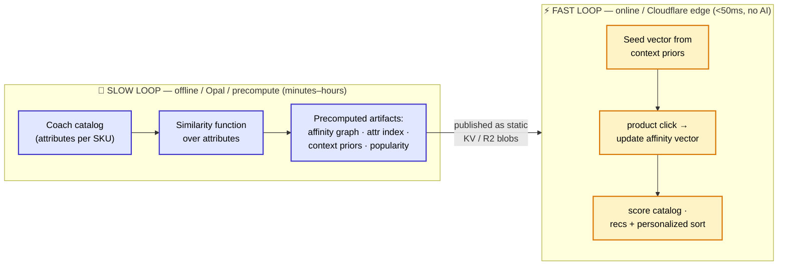

# 06 — Cold-Start + Affinity Design

**Component:** Anonymous cold-start personalization · item-item affinity · in-session specialization
**Pillar:** A — The Experience (we build, real, at the edge)
**Status:** Real mechanism, catalog-bootstrapped. Demo runs on synthetic Coach NA data shaped to ODP's schema; tuning to validated relevance needs Coach's first-party data (we say this out loud — see North-Star brief).
**Audience:** Solutions Architects, edge engineers implementing the hot path, anyone asking "how does the *first* click already feel personal?"

---

## 0. The one-paragraph version

A brand-new, **signed-out** shopper lands on Coach and clicks **one** product — *any* product, not a scripted one. Before that click we already had a defensible opinion about her taste from **context priors** (where she came from, what campaign, what page she landed on). The instant she clicks, we look that product up in a **precomputed item-item affinity graph** (built offline from catalog attributes), fold its attributes into a **lightweight per-session affinity vector**, and re-rank the catalog against that vector — recommendations + a personalized product sort, computed **at the edge in under 50ms with no AI and no network call in the hot path**. This is the classic **slow loop / fast loop** split: an offline **"slow loop"** (the Opal/precompute side) does all the heavy thinking and emits small, static artifacts; the **online "fast loop"** (Cloudflare Workers) does nothing but cheap array math against those artifacts. Swapping the synthetic precompute for Coach's real ODP-derived data is a config change, not a code change.



> **Why this matters against Dynamic Yield:** DY leans on proprietary prediction models + Mastercard transaction data we don't have. We don't try to out-predict them. We win on *architecture*: the cold-start decision is **computed next to the shopper in single-digit-to-low-double-digit milliseconds**, off a tiny artifact, with a clean seam where Coach's own ODP data plugs in. It is honest, fast, and swap-to-live.

---

## 1. Design constraints (read these first — every decision below follows from them)

| Constraint | Consequence for the design |
|---|---|
| **Anonymous.** No login, no history, no cross-session profile on the first hit. | Cold-start cannot rely on user history. It must bootstrap from **catalog structure** + **request context** only. |
| **Survives *any* product click.** | The mechanism is **data-driven over the whole catalog**, never a `switch` on hand-picked SKUs. Every SKU has a precomputed neighbor list and an attribute row. New SKU → it gets a row in the nightly build → it just works. |
| **&lt;50ms at the edge, no AI in the hot path.** | The online step is **vector/array arithmetic over small fixed-size structures**, all resident in memory or one KV read. No model inference, no embedding service call, no DB round-trip during the request. |
| **No live external dependency (demo).** | All artifacts are **static blobs** generated by the slow loop and shipped to the edge (KV/R2). The "ODP" seam is a real interface returning mocked, ODP-shaped data. |
| **Swap mock → live = config only.** | The fast loop reads artifacts through a provider interface. Demo provider = bundled/KV blobs from synthetic data. Live provider = same shapes, sourced from Coach's ODP + Recommendations. Hot-path code is identical. |

---

## 2. The catalog: attribute model (input to the slow loop)

Everything starts from the catalog. Each Coach SKU is reduced to a small, **categorical** attribute record. We use **real Coach product lines** (Tabby, Brooklyn, Willow, Rogue, Pillow Tabby, Kacey, etc.) so the demo reads as authentically Coach.

```ts
// src/types/catalog.ts
export type PriceBand = 'accessible' | 'core' | 'premium' | 'luxury'; // ordinal
export type Category =
  | 'shoulder_bag' | 'crossbody' | 'tote' | 'satchel' | 'top_handle'
  | 'wallet' | 'card_case' | 'belt_bag' | 'backpack' | 'shoes' | 'rtw' | 'accessory';
export type Occasion = 'everyday' | 'work' | 'evening' | 'travel' | 'weekend';

export interface CatalogItem {
  sku: string;              // "CO-TABBY-26-BLK"
  title: string;            // "Tabby Shoulder Bag 26"
  line: string;            // "Tabby" | "Brooklyn" | "Willow" | "Rogue" | ...
  category: Category;       // "shoulder_bag"
  silhouette: string;      // "shoulder" | "crossbody" | "tote" | "hobo" | ...
  priceBand: PriceBand;     // ordinal band, NOT raw price
  price: number;            // raw price, kept for display + band recompute
  color: string;           // canonical color token: "black" | "chalk" | "cherry" ...
  colorFamily: string;     // "neutral" | "warm" | "cool" | "bright"
  material: string;        // "refined_calf" | "signature_canvas" | "pebbled_leather" | "suede"
  hardware?: string;       // "brass" | "silver" | "gold"
  occasion: Occasion[];     // multi-valued: ["everyday","work"]
  gender: 'women' | 'men' | 'unisex';
  isNew: boolean;
  popularityRank: number;   // 1 = most popular (from synthetic behavioral data / later ODP)
}
```

> **Demo data source:** publicly scraped coach.com catalog attributes + synthetic popularity. **Live source:** Coach PIM/catalog feed for attributes, ODP/Recommendations for `popularityRank`. The attribute *schema* doesn't change between the two.

We also define an **attribute weight vector** `W` — how much each attribute contributes to "two products feel similar / this shopper will cross-shop them." These weights are the one tunable knob a merchandiser (or later, a fitted model) owns:

```ts
// Higher = stronger pull. Tuned by hand for the demo; fit from co-view/co-purchase data when live.
export const ATTR_WEIGHTS = {
  line:        0.30, // strongest: Coach shoppers shop by line (Tabby person stays Tabby)
  category:    0.22,
  silhouette:  0.10,
  occasion:    0.14, // Jaccard over the multi-valued set
  colorFamily: 0.08,
  material:    0.08,
  priceBand:   0.08, // ordinal distance, see below
} as const;
// sum = 1.00 by construction (normalize if you edit these)
```

---

## 3. The similarity function (heart of the slow loop)

We compute a symmetric similarity `sim(a, b) ∈ [0, 1]` between every pair of catalog items, as a **weighted sum of per-attribute similarities**. Each attribute type has its own tiny similarity kernel:

| Attribute | Kernel | Definition |
|---|---|---|
| `line`, `category`, `silhouette`, `colorFamily`, `material` | **exact match** | `1` if equal, else `0` |
| `priceBand` | **ordinal proximity** | `1 - |band(a) − band(b)| / (Bmax − 1)` with bands mapped `accessible=0, core=1, premium=2, luxury=3` (so `Bmax=4`). Adjacent bands ≈ 0.67, opposite ends = 0. Captures "she'll cross-shop one tier up, rarely four tiers." |
| `occasion` | **Jaccard** | `|A ∩ B| / |A ∪ B|` over the occasion sets (multi-valued). |

Combined:

```
sim(a, b) = Σ_attr  W[attr] · kernel_attr(a, b)
```

Pseudocode (this is exactly what the build script runs):

```ts
function sim(a: CatalogItem, b: CatalogItem): number {
  const eq = (x: unknown, y: unknown) => (x === y ? 1 : 0);

  const bandIdx = (p: PriceBand) =>
    ({ accessible: 0, core: 1, premium: 2, luxury: 3 }[p]);
  const priceSim = 1 - Math.abs(bandIdx(a.priceBand) - bandIdx(b.priceBand)) / 3;

  const setA = new Set(a.occasion), setB = new Set(b.occasion);
  const inter = [...setA].filter(o => setB.has(o)).length;
  const union = new Set([...setA, ...setB]).size;
  const occSim = union === 0 ? 0 : inter / union;

  return (
    ATTR_WEIGHTS.line        * eq(a.line, b.line) +
    ATTR_WEIGHTS.category    * eq(a.category, b.category) +
    ATTR_WEIGHTS.silhouette  * eq(a.silhouette, b.silhouette) +
    ATTR_WEIGHTS.colorFamily * eq(a.colorFamily, b.colorFamily) +
    ATTR_WEIGHTS.material    * eq(a.material, b.material) +
    ATTR_WEIGHTS.priceBand   * priceSim +
    ATTR_WEIGHTS.occasion    * occSim
  ); // ∈ [0,1]
}
```

**Design notes**
- **Why categorical attribute similarity and not learned embeddings?** Embeddings would mean a model in (or feeding) the hot path and an opaque blob. Attribute similarity is (a) explainable to a luxury merchandiser ("these surface together because both are Tabby, premium, work-occasion"), (b) trivially recomputable when the catalog changes, (c) literally how Coach merchandisers already think. It is the honest, demo-safe, swap-to-live choice. The interface is built so embeddings/Recommendations can replace the kernel later without touching the edge.
- **Same-line affinity is deliberately dominant** (`line=0.30`). Coach shoppers are line-loyal; a Tabby click should pull *more Tabby* first, then adjacent silhouettes.
- **Self is excluded** (`sim(a,a)` is never stored as a neighbor).

---

## 4. Precompute step → the artifacts (slow loop output)

The build is a single offline job (Node script, or a Cloudflare **Cron Trigger** Worker writing to KV/R2 — `wrangler.toml` already wires `scheduled`/cron, and `src/index.ts` has a `scheduled` handler stub we extend). It runs nightly, or on catalog change, or once for the demo. It produces **four small static artifacts**. None of them are AI; all of them are deterministic functions of the catalog.

### Artifact A — Item-Item Affinity Graph (`affinity_graph.json`)

For each SKU, the **top-K most similar SKUs** (K = 12) with weights. This is the recommendation backbone and the click→vector translator.

```jsonc
// affinity_graph.json  — built once, ~K entries per SKU
{
  "version": "2026-06-25T00:00:00Z",
  "k": 12,
  "neighbors": {
    "CO-TABBY-26-BLK": [
      { "sku": "CO-TABBY-20-BLK", "w": 0.94 },
      { "sku": "CO-TABBY-26-CHK", "w": 0.88 },
      { "sku": "CO-PILLOWTABBY-18-CHERRY", "w": 0.71 },
      { "sku": "CO-BROOKLYN-28-BLK", "w": 0.66 },
      { "sku": "CO-WILLOW-24-BLK", "w": 0.61 }
      // … up to K
    ]
    // … one list per SKU
  }
}
```

**Build algorithm**

```
for each item a in catalog:
    scored = []
    for each item b in catalog where b.sku != a.sku:
        s = sim(a, b)
        if s > MIN_EDGE (=0.15):  scored.push({sku: b.sku, w: s})
    neighbors[a.sku] = topK(scored by w desc, K)
normalize each neighbor list so max w = 1.0   // per-anchor normalization → comparable across anchors
```

Complexity is `O(N²)` per build. For Coach NA's bag/SLG catalog (low thousands of active SKUs) that's milliseconds-to-seconds offline — completely fine because it's the **slow loop**. If the catalog ever blows past ~50k, block by `category` (only compare within plausibly-cross-shopped categories) to cut the constant; the demo doesn't need it.

### Artifact B — Attribute Index (`attr_index.json`)

The per-SKU attribute row, plus a compact **attribute→one-hot id map**, so the fast loop can build/update the session affinity *vector* and score items without re-deriving anything.

```jsonc
// attr_index.json
{
  "version": "2026-06-25T00:00:00Z",
  "dims": {                      // stable integer ids per attribute value → vector slots
    "line:Tabby": 0, "line:Brooklyn": 1, "line:Willow": 2, "...": "...",
    "category:shoulder_bag": 40, "category:crossbody": 41, "...": "...",
    "occasion:work": 70, "occasion:evening": 71, "...": "...",
    "colorFamily:neutral": 80, "material:refined_calf": 90, "priceBand:premium": 100
  },
  "items": {
    "CO-TABBY-26-BLK": {
      "vec": [0, 40, 70, 80, 90, 100],   // sparse: indices into `dims` that this SKU "is"
      "priceBand": 2,                     // ordinal kept raw for band proximity
      "category": "shoulder_bag",
      "line": "Tabby",
      "popularityRank": 7
    }
    // … one per SKU
  }
}
```

> `vec` is a **sparse one-hot** (list of active dimension ids). Scoring a session against an item = a weighted intersection count — O(active dims), tiny.

### Artifact C — Context Priors Table (`context_priors.json`) — see §5

### Artifact D — Popularity / Fallback Sort (`popularity.json`)

A plain ranked SKU list per top-level category, for the **pre-click** state (shopper has landed but not clicked anything yet) and as the tie-breaker / backfill everywhere.

```jsonc
{ "version": "…", "global": ["CO-TABBY-26-BLK", "CO-BROOKLYN-28-CHK", "…"],
  "by_category": { "shoulder_bag": ["…"], "crossbody": ["…"] } }
```

**Where the artifacts live for the edge:** written to KV (`CACHE` namespace, keys `affinity:graph:v…`, `affinity:attr:v…`, `affinity:priors:v…`, `affinity:pop:v…`) and/or bundled. The graph + attr index for a few-thousand-SKU catalog is small enough (low hundreds of KB gzipped) to **hold in Worker memory after the first read**, so steady-state hot-path cost is zero network. R2 is the home for larger/full-catalog variants.

---

## 5. Context Priors — making the click *before* the click

Cold-start's secret is that we are **not** actually at zero before the first click. The request itself carries signal: geography, referrer, landing page, and campaign UTMs. We map that signal to a **starting affinity vector** so the homepage and first product list are already leaning the right way, and so the *first* click lands on top of an informed prior rather than a blank slate.

This is a **mapping table** — a precomputed artifact, not logic. Each rule matches request context and contributes a set of `(dimension, weight)` nudges into the seed vector. Rules are additive; multiple can fire.

```jsonc
// context_priors.json
{
  "version": "2026-06-25T00:00:00Z",
  "default_seed": [                         // applied to everyone, low weight
    { "dim": "line:Tabby",        "w": 0.20 },
    { "dim": "category:shoulder_bag", "w": 0.15 }
  ],
  "rules": [
    {
      "id": "utm_tabby_launch",
      "match": { "utm_campaign": "tabby-ss26" },
      "seed":  [ { "dim": "line:Tabby", "w": 0.60 },
                 { "dim": "occasion:evening", "w": 0.20 } ]
    },
    {
      "id": "ref_pinterest_workbag",
      "match": { "referrer_host": "pinterest.com", "landing_path": "/work-bags" },
      "seed":  [ { "dim": "occasion:work", "w": 0.45 },
                 { "dim": "category:tote", "w": 0.30 },
                 { "dim": "priceBand:premium", "w": 0.15 } ]
    },
    {
      "id": "geo_us_gift",
      "match": { "geo_country": "US", "landing_path": "/gifts" },
      "seed":  [ { "dim": "category:wallet", "w": 0.35 },
                 { "dim": "category:card_case", "w": 0.25 },
                 { "dim": "priceBand:accessible", "w": 0.20 } ]
    },
    {
      "id": "ref_instagram_brooklyn",
      "match": { "referrer_host": "instagram.com", "utm_content": "brooklyn" },
      "seed":  [ { "dim": "line:Brooklyn", "w": 0.55 },
                 { "dim": "colorFamily:neutral", "w": 0.15 } ]
    },
    {
      "id": "mens_landing",
      "match": { "landing_path_prefix": "/men" },
      "seed":  [ { "dim": "category:backpack", "w": 0.30 },
                 { "dim": "line:Rogue", "w": 0.25 },
                 { "dim": "occasion:work", "w": 0.20 } ]
    }
  ]
}
```

**Match fields available at the edge** (all from the incoming request — Cloudflare gives geo for free via `request.cf`):

| Field | Source on the edge |
|---|---|
| `geo_country`, `geo_region` | `request.cf.country` / `request.cf.region` |
| `referrer_host` | `Referer` header → hostname |
| `landing_path`, `landing_path_prefix` | first-seen URL path this session |
| `utm_campaign`, `utm_source`, `utm_medium`, `utm_content` | landing URL query string |

**Seed construction (fast loop, on session start):** start from `default_seed`, add the `seed` nudges of every rule whose `match` is satisfied (AND within a rule, OR across rules), accumulating weights per dimension. The result is the **initial affinity vector** `V₀`. Store it on the session (KV `SESSIONS` via `SessionManager.attributes.affinityVector`, mirrored to the Durable Object for the live socket).

> **ODP seam:** in the live build, these priors can also be *seeded by ODP*. A `fetchQualifiedSegments`-style call (real interface, mocked response in the demo) can return audience memberships like `tabby_intender` that map, via the same table mechanism, to seed nudges. For the demo the table is static synthetic data; the function signature is the real ODP one. **Swap = config.**

---

## 6. In-session specialization — the fast loop, step by step

This is what runs **on every product click**, at the edge, in &lt;50ms, no AI. State is the **affinity vector** `V` (a `Map<dimId, number>`, a few dozen non-zero entries) plus a small **recently-seen set** for diversity.

### 6.1 The session affinity vector

```ts
// Lives on the session (KV) and in the PersonalizationWebSocket Durable Object.
interface SessionAffinity {
  v: Record<number, number>;     // dimId → weight  (the affinity vector V)
  clicks: string[];              // last N clicked SKUs (recency / dedupe)
  lastSku?: string;
  updatedAt: number;
}
```

### 6.2 The update rule (the *entire* learning step)

On a click of SKU `c`:

```
1. row   = attr_index.items[c]                       // O(1) lookup
2. decay V:   for each dim in V:  V[dim] *= GAMMA      // GAMMA = 0.85, recency-weights toward latest taste
3. reinforce: for each dim in row.vec:  V[dim] += BETA_CLICK   // BETA_CLICK = 1.0
4. graph spread (optional, cheap): for each neighbor n in affinity_graph[c] (top few):
        for each dim in attr_index.items[n.sku].vec:
            V[dim] += BETA_NEIGHBOR * n.w             // BETA_NEIGHBOR = 0.15
5. record:  clicks.push(c); lastSku = c; trim to last N=10
6. (optional) L1-normalize V so scores stay comparable across click counts
```

That's it. No model, no training, no remote call. Decay (`GAMMA`) is what makes the experience *specialize*: the most recent clicks dominate, so a shopper who pivots from Tabby to Brooklyn mid-session is followed, not anchored to the first thing she touched. The optional graph-spread step (4) lets a single click also pull in *adjacent* taste (a Tabby click nudges "premium / shoulder / work" a bit harder because Tabby's neighbors share those), which makes the very first click feel richer.

### 6.3 Scoring an item against the session

```
score(item) =
      w_aff   * affinityScore(V, item)          // weighted intersection of V with item.vec
    + w_pop   * popularityScore(item)           // 1 - rank/N, the prior on "good for everyone"
    + w_band  * bandProximity(V, item)          // ordinal price-band fit (from V's price-band mass)
    - w_seen  * seenPenalty(item)               // demote already-clicked / just-shown
    + w_new   * isNewBoost(item)                // small merchandising nudge for new arrivals
```

```ts
function affinityScore(V: Record<number, number>, item: { vec: number[] }): number {
  let s = 0;
  for (const dim of item.vec) s += V[dim] ?? 0;   // sparse dot product, O(active dims)
  return s;
}
```

Suggested starting blend (these are the merchandiser/A-B knobs, served as an Optimizely feature variable so they're tunable live — see §8):
`w_aff = 1.0, w_pop = 0.25, w_band = 0.20, w_seen = 0.6, w_new = 0.1`.

### 6.4 The two outputs

- **Recommendations ("Complete the look" / "You may also like"):** take `affinity_graph[lastSku]` as the candidate seed (already the most-similar items), **re-rank** those candidates by the full `score()` above (so the recs reflect the *whole session*, not just the last click), drop seen items, return top 4–8. Falls back to `popularity.by_category` if a SKU has thin neighbors.
- **Personalized SORT:** score the **current product-list page's** SKUs (the PLP the shopper is on) with `score()` and return them in descending order. The list visibly reorganizes around her taste. For a small PLP this is sorting a few dozen items — sub-millisecond.

### 6.5 Latency budget (why &lt;50ms holds)

| Step | Cost |
|---|---|
| Parse click event + load session | one KV read (or in-DO state) — single-digit ms; **0 network** once artifacts are memory-resident |
| Vector update (§6.2) | O(active dims + K·dims) ≈ tens of additions — microseconds |
| Score + sort a PLP (≤ ~200 items) | O(items · active dims) — sub-millisecond |
| Build recs from neighbor list | O(K) — microseconds |
| Push over open WebSocket (existing `PersonalizationWebSocket`) | the socket is already open; broadcast is a `send()` |

The dominant term is I/O (the session read), and after warm-up the artifacts are in Worker memory, so the **compute** is comfortably **&lt;1ms**; the end-to-end stays well under the 50ms budget. There is **no model call anywhere in this path**.

---

## 7. End-to-end sequence (anonymous first click)

```mermaid
sequenceDiagram
    participant B as Browser (signed-out)
    participant W as Cloudflare Worker (edge)
    participant DO as PersonalizationWebSocket (DO)
    participant KV as KV / R2 (artifacts + session)

    Note over W,KV: SLOW LOOP already ran → affinity_graph, attr_index,<br/>context_priors, popularity sitting in KV/memory

    B->>W: Landing request (Referer, UTMs, cf.country)
    W->>KV: read context_priors (cached in mem)
    W->>W: build seed vector V₀ from matching prior rules
    W->>KV: write session {affinityVector: V₀}
    W-->>B: page + popularity-sorted PLP already leaning to V₀

    B->>W: CLICK product c  (any SKU)
    W->>KV: read session V, read attr_index[c] (mem)
    W->>W: V = decay(V)·γ + reinforce(c) + graphSpread(c)   ⏱ <1ms
    W->>W: recs = rerank(affinity_graph[c]) ; sort = score(PLP)
    W->>KV: persist updated V
    W->>DO: broadcast personalization_update {recs, sort, vector}
    DO-->>B: live update over open WebSocket (no reload)
    Note over B: PLP reorders + "Complete the look" appears<br/>around the FIRST click — <50ms, no AI
```

---

## 8. How this rides the existing platform (concrete integration points)

| Need | Existing piece we extend |
|---|---|
| Receive the click | `POST /realtime/action` (`src/routes/realtime.ts`) already accepts `button_click` / `page_view`; add a `product_click` shape carrying `sku`. |
| Process the click | `RealtimeSegmentEngine.processActionEvent` is the natural home for an `updateAffinity(session, sku)` call alongside the existing segment-rule evaluation. |
| Hold per-session state | `SessionManager` already persists `attributes` in KV `SESSIONS`; store `affinityVector` + `clicks` there. Live mirror in `PersonalizationWebSocket` DO for the socket. |
| Push the result live | `PersonalizationWebSocket.broadcastUpdate` already exists; add `recommendations` + `sort` to the `PersonalizationUpdate.data` payload. |
| Tunable knobs (weights, `GAMMA`, blend) | Serve via an Optimizely **feature variable** through `FeatureVariableManager` (e.g. feature `cold_start_affinity` with vars `gamma`, `w_aff`, `w_pop`, …) so the demo can A/B the sort live and a merchandiser can retune without a deploy. |
| Generate artifacts | Extend the `scheduled` handler in `src/index.ts` (cron already declared) to run the §4 build over the catalog and write the four blobs to KV/R2. |
| ODP seam (priors / popularity from real audiences) | A provider interface (`AffinityDataProvider`) with a `MockProvider` (synthetic, ODP-shaped) and a future `OdpProvider` (`fetchQualifiedSegments`, Recommendations). Hot path depends only on the interface. **Swap = config.** |

---

## 9. Slow loop vs. fast loop — the framing to say out loud

| | **Slow loop (offline)** | **Fast loop (online / edge)** |
|---|---|---|
| **Where** | Build job / Cron Worker / (conceptually) the Opal + precompute side | Cloudflare Worker next to the shopper |
| **When** | Nightly / on catalog change / once for demo | Every single click, &lt;50ms |
| **What it does** | All the *thinking*: similarity over the whole catalog, top-K neighbors, prior tables, popularity | Cheap *arithmetic*: lookup, decay, add, dot-product, sort |
| **AI allowed?** | Yes — this is where embeddings / Opal / Recommendations *could* enrich the artifacts later | **No.** Deterministic array math only |
| **Output / input** | Emits small static artifacts → | Consumes those artifacts, emits recs + sort |
| **Cost of being wrong** | Recompute and republish; shopper never waits on it | Must be right *and* instant |

> **The line for Coach:** "The expensive intelligence runs *offline* and produces a tiny map. The shopper-facing decision is just *reading that map* — which is why it's sub-50ms at the edge with nothing to spin up. When you put your ODP data behind it, the map gets smarter; the speed never changes." This is exactly the slow-loop/fast-loop, aggregate-then-serve pattern the North-Star brief argues is the *right* fix for the Opal "spinning" problem — here applied to recommendations.

---

## 10. Honesty boundary (consistent with the North-Star brief)

- **Real:** the mechanism — affinity graph, context priors, in-session vector, edge sort/recs, sub-50ms, no-AI hot path. It runs live and survives "can I drive?" against any click.
- **Representative:** the *data*. Catalog attributes are scraped/synthetic; `popularityRank`, priors, and `ATTR_WEIGHTS` are hand-seeded. **Relevance quality is not validated on Coach conversions** until the artifacts are built from Coach's ODP/first-party data — which is a config swap, not a rebuild.
- **We do not claim:** proven lift, or production-grade cold-start quality without Coach's data to tune `ATTR_WEIGHTS` and the priors.

---

## 11. Implementation checklist

- [ ] `src/types/catalog.ts` — `CatalogItem`, `ATTR_WEIGHTS`, affinity/prior types.
- [ ] `data/coach-catalog.json` — synthetic Coach NA catalog (real lines: Tabby, Brooklyn, Willow, Rogue, Pillow Tabby, Kacey…).
- [ ] `scripts/build-affinity.ts` (or Cron Worker) — emits `affinity_graph.json`, `attr_index.json`, `context_priors.json`, `popularity.json` → KV/R2.
- [ ] `src/services/AffinityEngine.ts` — `seedFromContext(req)`, `updateAffinity(session, sku)`, `recommend(session)`, `sortPLP(session, skus)`; pure functions, no I/O in scoring.
- [ ] `src/services/AffinityDataProvider.ts` — interface + `MockProvider` (synthetic) / `OdpProvider` (live `fetchQualifiedSegments`).
- [ ] Wire `product_click` through `/realtime/action` → `RealtimeSegmentEngine` → `AffinityEngine` → `PersonalizationWebSocket`.
- [ ] Feature variable `cold_start_affinity` (γ + blend weights) via `FeatureVariableManager`.
- [ ] Storefront: render recs module + reorder PLP on `personalization_update`.
```
