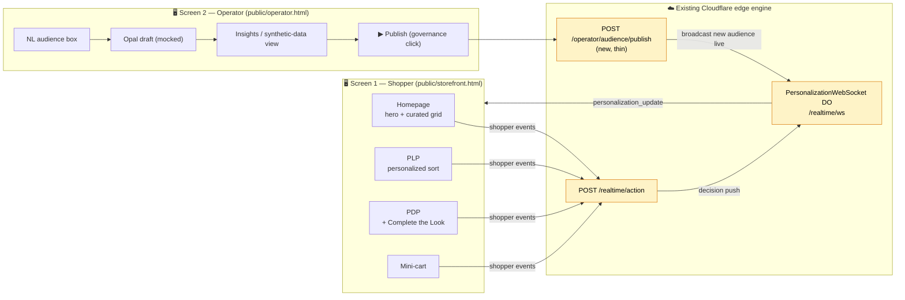
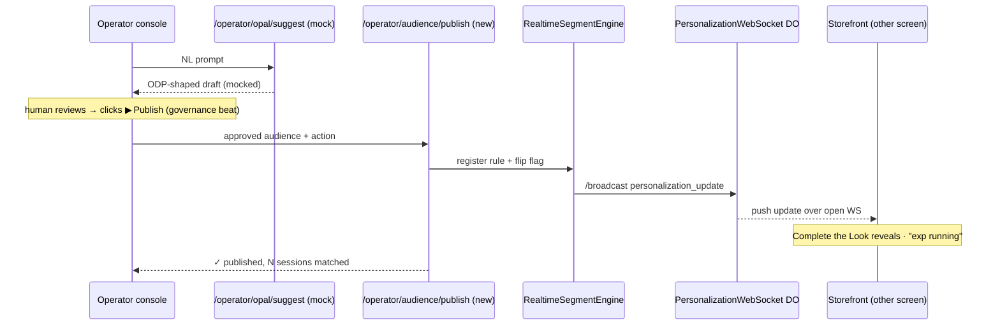

# 07 — Storefront UX Spec (Coach Luxury Retail Reskin)

**Audience:** Front-end / SA building the demo storefront; CSM + AE reading what the buyer will see.
**Status:** Implementable on the existing Cloudflare Workers + Hono + static-assets (`public/`) setup. No new infrastructure required.
**Theme:** Re-skin of the existing First National Bank visual demo (`public/visual-demo.html` + `public/visual-demo.js`) into a **Coach North America** luxury storefront, plus a second **operator console** for the Opal audience-builder moment.
**Reads with:** [North-Star Brief](../Tapestry-Coach-North-Star-Brief.md) · [00 — Architect Walkthrough](./00-architect-walkthrough.md) · [01 — System Overview](./01-system-overview.md) · [Optimizely Experimentation MCP Reference](./Optimizely-Experimentation-MCP-Server-Technical-Reference.md)

---

## 0. What this spec delivers, in one sentence

Two browser surfaces that share one edge engine: a **shopper storefront** (`public/storefront.html`) that re-arranges itself in real time for an anonymous Coach shopper, and an **operator console** (`public/operator.html`) where a merchandiser describes an audience in plain language, Opal (mocked) drafts it, they click **Publish**, and the storefront on the other screen changes — all over the WebSocket + `/realtime` endpoints that already exist.

> The bank demo proved the *mechanism*. This spec re-dresses the mechanism as Coach and adds the operator-side "talk to Optimizely, watch the store change" beat that is our wedge against Dynamic Yield.

### Two-surface map



Everything in the **Edge** box except `POST /operator/audience/publish` already exists today. That one route is a thin addition described in §6.

---

## 1. Luxury aesthetic — the design system

The bank demo is `Georgia`/serif on `#1e3c72` navy with emoji icons. Coach is quieter, warmer, and more editorial. Define this once as CSS custom properties at the top of `storefront.html` (and reuse in `operator.html`).

| Token | Value | Notes |
|---|---|---|
| `--coach-ink` | `#1A1A1A` | Near-black for type; never pure `#000`. |
| `--coach-paper` | `#FAF8F5` | Warm off-white page background ("Coach cream"). |
| `--coach-tan` | `#C8A063` | Signature Coach tan / leather gold — accents, active states. |
| `--coach-tan-deep` | `#8A6D3B` | Hover / pressed gold. |
| `--coach-line` | `#E7E1D8` | Hairline borders, 1px. |
| `--coach-sale` | `#7A2E2E` | Muted oxblood for price markdowns (no bright red). |
| `--font-display` | `'Tiempos','Playfair Display',Georgia,serif` | Editorial headlines. |
| `--font-body` | `'Inter','Helvetica Neue',Arial,sans-serif` | Body, UI, prices. |
| Radius | `2px` | Sharp, not rounded — luxury reads as crisp. |
| Motion | `cubic-bezier(0.4,0,0.2,1)`, 400–600ms | Slow, deliberate fades/cross-dissolves. No bounce. |

**Imagery:** product cards use a flat tonal placeholder block (`background: linear-gradient(135deg,#EFEAE2,#E0D7C8)`) with the product name overlaid, OR locally-hosted scraped `coach.com` catalog imagery if available under `public/img/` (see North-Star dependency #3). No emoji in the storefront chrome — emoji stay only in the operator console's "AI" affordances where a playful agent tone is acceptable.

**Catalog vocabulary (authentic Coach, North America):** lines referenced throughout the demo must be real Coach product families: **Tabby** (shoulder bag, the hero line per the North Star), **Brooklyn** (shoulder/tote), **Willow** (tote), **Pillow Tabby**, **Rogue**, **Town Tote**, plus categories **Bags · Wallets & Cases · Shoes · Ready-to-Wear · Jewelry**. Collections: **Coach Originals / Heritage**, **New Arrivals**, **Coachtopia** (sustainability sub-brand) for an "eco-minded" audience angle.

---

## 2. Pages / Zones

The storefront is a **single-page app inside one HTML file** (matching the bank demo's tab pattern), with four "views" swapped in the main column. A left rail drives the demo (the SA clicks shopper actions); the center is the live store; an optional right rail is the "Edge Engine" telemetry panel (the bank demo's dev console, re-themed). This keeps the SA-in-control demo ergonomics the team already rehearses.

```
┌──────────────────────────────────────────────────────────────────────┐
│  COACH  ·  New  Bags  Ready-to-Wear  Shoes  Coachtopia      🔍  ♡  🛍 2 │  ← persistent chrome
├───────────────┬───────────────────────────────────────┬──────────────┤
│ DEMO DRIVER   │            LIVE STOREFRONT            │  EDGE ENGINE │
│ (SA controls) │  Home / PLP / PDP views swap here     │  (telemetry) │
│               │                                       │              │
│ • land cold   │                                       │ segments[]   │
│ • view Tabby  │                                       │ stage: early │
│ • view 2nd    │                                       │ decision 41ms│
│ • add to cart │                                       │ flags on/off │
└───────────────┴───────────────────────────────────────┴──────────────┘
```

### 2.1 Homepage — Hero + Curated Grid

| Region | id | Behavior |
|---|---|---|
| **Hero** | `#hero-zone` | Full-bleed editorial banner. Cold-start = brand/seasonal ("The Tabby Shop — Coach Originals"). Personalizes headline, subcopy, CTA, and background per dominant affinity. |
| **Curated grid** | `#curated-grid` | 6–8 product tiles under the hero ("Curated for you" / cold-start: "New Arrivals"). Tiles re-order and swap as affinity sharpens. Each tile: image block, name (`Tabby 26`), price, ♡ wishlist. |
| **Editorial strip** | `#story-strip` | One horizontal "story" card (e.g. Coachtopia sustainability, or Heritage craftsmanship) — swaps by journey stage / values signal. |
| **Category rail** | `#category-rail` | Static-ish nav tiles (Bags / RTW / Shoes…). Lowest-priority personalization (re-orders only late). |

### 2.2 PLP — Product List with **Personalized Sort**

The flagship "sort rules" proof.

| Region | id | Behavior |
|---|---|---|
| **Sort control** | `#plp-sort` | Dropdown: `Featured` · `Newest` · `Price` · **`Recommended for you`**. When personalization is live, default flips to **Recommended for you** and a small caption reads *"Sorted for you · updated live"*. |
| **Result grid** | `#plp-grid` | 12–18 tiles. The **order is the personalization** — the engine returns a ranked product-id list; the grid re-sequences with a FLIP animation (see §3). A `★ Recommended` ribbon marks engine-boosted items. |
| **Refinement rail** | `#plp-facets` | Category / price / color filters. The engine can pre-expand the facet matching detected affinity (e.g. auto-expand "Shoulder bags"). |
| **Sort-explainer chip** | `#plp-why` | Tooltip/expandable: *"Why this order? You've viewed Tabby and Brooklyn shoulder bags."* — makes the 1:1 decision legible to a technical buyer. |

### 2.3 PDP — Product Detail

| Region | id | Behavior |
|---|---|---|
| **Gallery** | `#pdp-gallery` | Product imagery. Static per product. |
| **Buy box** | `#pdp-buybox` | Name, price, color/size, **Add to Bag**. Stage-aware urgency line lives here (`#pdp-urgency`). |
| **"You may also like"** | `#pdp-recs` | 4 cross-sell tiles, engine-ranked, same family/price band. |
| **Complete the Look** | `#complete-the-look` | See §2.4 — the headline personalization module. |
| **Details / provenance** | `#pdp-details` | Craftsmanship copy. A "Heritage" or "Coachtopia" badge can be toggled by values segment. |

### 2.4 "Complete the Look" Module

This module is the North Star's named beat — Opal can switch it on for an audience.

- **id:** `#complete-the-look`, default hidden (`display:none` / `aria-hidden`).
- **Trigger:** appears when (a) the shopper qualifies for an audience that has the `complete_the_look` flag on, OR (b) a PDP view pushes affinity past the mid-funnel threshold.
- **Content:** the focal product + 2–3 complementary items styled as an outfit ("Style the Tabby 26": a matching wallet, a pair of shoes, a charm), with a single **"Add the look — 3 items"** CTA that drops all into the mini-cart.
- **Render source:** a "look" is a small JSON object (focal id + companion ids + headline) served by the engine's content library (`FeatureVariableManager`, feature key `complete_the_look`). The merchandiser does **not** author HTML via Opal — Opal flips the *decision*; our engine owns the *content* (this matches the brief's MCP landmine #2).

### 2.5 Mini-cart

| Region | id | Behavior |
|---|---|---|
| **Cart drawer** | `#mini-cart` | Slides from right on add-to-bag. Line items, subtotal. |
| **Cart-level rec** | `#cart-rec` | One "Pairs well" upsell tile, engine-ranked. |
| **Stage nudge** | `#cart-nudge` | Late-funnel only: free-shipping threshold / complimentary monogramming line (`#cart-nudge`). No discount spam — luxury tone. |
| **Badge** | `#cart-count` | Header bag count; animates on add. |

---

## 3. Personalization Zones — what updates live, and how it animates

A **personalization zone** is any DOM region the engine can rewrite from a `personalization_update` WebSocket message without a reload. Reuse the bank demo's `.personalization-zone` wrapper convention (a positioned container with an optional `.zone-label` that the SA can reveal to show "this is engine-controlled").

### 3.1 Zone registry

| Zone id | Page | What changes | Trigger signal | Transition treatment |
|---|---|---|---|---|
| `#hero-zone` | Home | headline, subcopy, CTA label/href, background image | dominant `affinity_*` segment | **Cross-dissolve** 500ms: old `.hero-content` fades to 0, swap innerHTML, fade to 1. (Bank demo's `.transitioning` opacity pattern, slowed.) |
| `#curated-grid` | Home | tile set + order | affinity + recency | **Stagger fade-in**: tiles fade/translate-Y 8px in sequence (40ms apart). |
| `#plp-grid` | PLP | **re-rank order** of existing tiles | every PDP view / affinity shift | **FLIP reorder**: record positions → reorder DOM → animate transforms 450ms. Boosted items briefly pulse a `--coach-tan` outline. |
| `#plp-sort` caption | PLP | default sort flips to "Recommended", caption appears | personalization active | Caption slides down + fades, 300ms. |
| `#complete-the-look` | PDP | module reveals / content fills | audience flag OR mid-funnel | **Reveal**: height 0→auto + fade, 600ms; a one-time `--coach-tan` left-border sweep to draw the eye. |
| `#pdp-recs` / `#cart-rec` | PDP/Cart | rec tiles + order | affinity | Stagger fade. |
| `#pdp-urgency`, `#cart-nudge`, `#story-strip` | various | stage-specific copy | journey stage change | Text cross-fade, 300ms. |
| `#segment-badges` (telemetry) | chrome | live segment chips | any segment change | Bank demo's `badgeAppear` scale-in (keep). |

### 3.2 Animation principles (luxury, not flashy)

- **One zone draws attention at a time.** When a `personalization_update` touches multiple zones, the front end animates them in a short cascade (hero → grid → telemetry) rather than flashing everything at once. Jank reads as cheap.
- **Slow and confident.** 400–600ms cross-dissolves; never hard-cut, never bounce.
- **Demo-legible mode.** A toggle in the demo driver ("Show personalization zones") adds a subtle `--coach-tan` dotted outline + corner label to every zone, so the SA can *prove* which regions are engine-controlled. Off by default for the "clean store" look; on for the technical teardown. (This is the re-themed evolution of the bank demo's `zone-label` + dev-mode toggle.)
- **Latency badge.** The telemetry rail shows the decision round-trip (`decision 41ms`) on every update — this is the "sub-50ms at the edge" claim, on screen, live.

---

## 4. Journey-stage surfaces (Early / Mid / Late funnel)

The engine already derives an engagement score and journey stage (`RealtimeSegmentEngine` → `aware/interested/engaged/qualified/ready`). For Coach we map those to three retail funnel stages and change **messaging, not layout** (luxury restraint). The stage is just another field in the personalization payload; the front end reads `data.stage` (mapped from `engagementScore`) and selects copy from the content library.

| Stage | Maps from | Hero / store tone | Complete-the-Look | Urgency (`#pdp-urgency`) | Cart nudge |
|---|---|---|---|---|---|
| **Early — Discover** | `aware` / `interested` (score < 15) | Brand & seasonal: *"The Tabby Shop — Coach Originals"*; broad curated grid; editorial story prominent. | Hidden. | None — invite to explore: *"Discover the family"*. | None. |
| **Mid — Consider** | `engaged` / `qualified` (15–34) | Affinity-led: *"Your Tabby, your way"*; curated grid tightens to the affinity family; cross-sell appears. | **Reveals** (style-the-look). | Soft social proof: *"A signature, loved across our community."* | "Pairs well" upsell shown. |
| **Late — Decide** | `ready` (≥ 35) or cart activity | Reassurance + commitment: *"Complete your look"*; recently-viewed rail; fewer net-new items. | Persistent, with "Add the look" emphasized. | Scarcity/service, tasteful: *"Few remaining in this color"* or *"Complimentary monogramming."* | Free-shipping / monogramming line; gentle. |

**Cold-start (signed-out, zero history)** is the Early default: the store curates from catalog popularity (the brief's "catalog-bootstrapped cold start"), then specializes the instant the first PDP view lands. The demo's opening beat is literally this transition — land cold → view a Tabby → watch hero + grid + sort re-form (§7 script).

> Stage copy lives in the content library keyed by feature variable (e.g. `hero_content.stage_early|stage_mid|stage_late`), so the *messaging* is data, swappable by a flag — never hard-coded in the page. This is the same `FeatureVariableManager` pattern the bank demo uses for `hero_content`.

---

## 5. Operator-side panel — the Opal audience-builder moment

A **separate** static page, `public/operator.html`, styled as an internal Optimizely-adjacent tool (clean, neutral admin UI — not the luxury storefront skin; this is back-office). Run it side-by-side with the storefront on a second screen/monitor. This is the wedge: *operator-facing* conversational audience creation, which we believe DY does not offer.

### 5.1 Layout

```
┌── OPERATOR CONSOLE — Coach Merchandising × Optimizely Opal ───────────┐
│                                                                      │
│  ① TALK TO OPAL                                                       │
│  ┌────────────────────────────────────────────────────────────┐     │
│  │ "Create an audience of high-intent Tabby browsers who        │     │
│  │  haven't added to cart, and turn on Complete the Look."      │     │
│  └────────────────────────────────────────────────────────────┘     │
│                                              [ Ask Opal ▷ ]           │
│                                                                      │
│  ② OPAL'S DRAFT  (AI-suggested · review before publishing)           │
│  ┌────────────────────────────────────────────────────────────┐     │
│  │ Audience: "High-Intent Tabby — No Cart"                      │     │
│  │ ODP segment conditions:                                      │     │
│  │   • product_family = "Tabby"     (viewed ≥ 2 in session)    │     │
│  │   • added_to_cart  = false                                   │     │
│  │   • session_intent_score ≥ 60                                │     │
│  │ Est. live audience: ~3,180 shoppers (synthetic NA, 30d)     │     │
│  │ Action: enable flag complete_the_look  ·  A/B 50/50         │     │
│  │                                  [ View insights ]          │     │
│  └────────────────────────────────────────────────────────────┘     │
│                          [ Edit conditions ]   [ ▶ Publish to store ] │
│                                                                      │
│  ③ STATUS                                                            │
│   ✓ Published 13:42:07 · live for matching shoppers · exp running   │
└──────────────────────────────────────────────────────────────────────┘
```

### 5.2 The five beats (and what's real vs mocked)

1. **Natural-language box (①).** Merchandiser types a plain-English audience. Free text. (Real interaction.)
2. **Ask Opal → draft (②).** The page calls a **local mocked Opal endpoint** that returns a structured audience suggestion shaped to the **ODP schema** — segment name, conditions, estimated size, and the recommended flag/experiment action. The connector is named and shaped after Opal's real ODP audience-authoring tools; the *response is mocked* from a small lookup of pre-authored scenarios keyed to the demo prompts. **This is "real seam, mocked call."** Swapping to the live Opal ODP tool (via the MCP server at `https://exp.mcp.opal.optimizely.com/mcp`) is a config change, exactly as the brief promises.
3. **Insights view (③ / "View insights").** Opens a back-office analytics panel (§5.3) that shows the **synthetic-data analysis behind the suggestion** — *why* Opal proposed this audience. This is the "we understand the data/Opal pattern" proof: aggregate-first, then reason.
4. **Approve / Publish (the governance click).** Human clicks **▶ Publish to store**. This is deliberately a manual step — the brief frames draft-only + human-publish as a **governance beat**, not a limitation. On click, the page POSTs the approved audience to the edge (`POST /operator/audience/publish`, §6).
5. **Goes live (status).** The edge registers the new audience rule and broadcasts; any matching shopper session on the storefront updates within seconds — and an A/B test is shown "running" against it. The operator sees a timestamped confirmation; the SA points at the other screen where Complete the Look has just appeared.

### 5.3 Back-office insights view (the synthetic-data analysis)

A modal/drawer that justifies the suggestion using the synthetic Coach NA dataset. Purely presentational; reads a pre-computed aggregate JSON shipped in `public/data/`.

| Panel | Content (synthetic, NA, last 30d) | Why it sells |
|---|---|---|
| **Behavioral cohort** | "4,120 sessions viewed Tabby ≥ 2×; 23% added to cart, **77% did not**." | Shows Opal reasoned from an *aggregate*, not raw rows — the brief's "aggregate-first" thesis made visible. |
| **Opportunity** | "Non-cart Tabby viewers convert **+0** today; lookalike cart-adders attach a 2nd item 38% of the time." | Frames the upside the audience targets. |
| **Why Complete-the-Look** | "Cart-adders who saw a styled look attach **1.4×** more items." | Connects the *action* to the *audience*. |
| **Proposed measurement** | "A/B 50/50, primary metric = items-per-order; guardrail = AOV." | Makes the experimentation native + honest (measurement real, numbers are demo data). |
| **Provenance banner** | *"Synthetic Coach NA data, shaped to ODP schema. Live mode reads from Coach's ODP."* | The honesty framing, on screen. Non-negotiable per the brief. |

> The provenance banner is mandatory on the insights view and as a small footer on the operator console. We are transparent the calls are mocked; the *capability* (Opal + ODP real-time audiences) is GA.

---

## 6. How the front end connects to the edge engine

Both surfaces talk to the **existing** `/realtime/*` API and the `PersonalizationWebSocket` Durable Object. One new thin route is added for the operator publish. No engine internals change.

### 6.1 Shopper storefront wiring (reuse, re-skin)

The bank demo's `VisualPersonalizationDemo` class is the template; rename to `CoachStorefront` and keep the transport intact:

- **Connect:** on load, open `wss://<host>/realtime/ws?userId=<anonId>` (cold-start anon id = `v-…`, matching the existing scheme). Auto-reconnect on close (already implemented).
- **Receive:** on `message`, handle `personalization_update` / `segment_update`. Extend `handleWebSocketMessage` to read the Coach-shaped payload and route each field to its zone renderer:

  ```js
  // data.data carries: segments[], featureVariables{}, stage, decisionMs
  applyHero(fv.hero_content);          // #hero-zone  — cross-dissolve
  applyCuratedGrid(fv.curated_grid);   // #curated-grid — stagger
  rerankPLP(fv.plp_ranking);           // #plp-grid — FLIP
  toggleCompleteLook(fv.complete_the_look); // #complete-the-look — reveal
  applyStageCopy(data.data.stage);     // urgency / nudges / story
  updateTelemetry(segments, decisionMs);    // right rail + #segment-badges
  ```

- **Send shopper actions:** every shopper interaction POSTs to the **existing** `POST /realtime/action` with the existing envelope `{type,userId,visitorId,sessionId,data,source,timestamp}` (the bank demo's `triggerAction` is reused verbatim). Event-type mapping to the engine's current Zod enum (`email_open|form_submit|page_view|button_click|custom`):

  | Storefront action | `type` | `data` payload |
  |---|---|---|
  | View product (PDP) | `page_view` | `{ path:'/pdp/tabby-26', productId, family:'Tabby', priceBand }` |
  | View category (PLP) | `page_view` | `{ path:'/plp/bags', category:'bags' }` |
  | Wishlist ♡ | `button_click` | `{ buttonId:'wishlist', productId, family }` |
  | Add to bag | `custom` | `{ eventName:'add_to_cart', productId, family, value }` |
  | Add the look | `custom` | `{ eventName:'add_look', focalId, companionIds[] }` |
  | Begin checkout | `custom` | `{ eventName:'begin_checkout', cartValue }` |

  > Note: `add_to_cart` rides on `custom` to avoid touching the engine's Zod enum. If we'd rather have first-class cart events, add `'add_to_cart'` to the enum in `src/routes/realtime.ts` and a matching `SegmentRule` — a ~2-line change, optional. Either way the storefront contract is stable.

- **The response is also synchronous.** `POST /realtime/action` returns the recomputed `update` in its JSON body (see `realtime.ts`). The storefront can apply personalization from **either** the POST response (immediate, same shopper) **or** the WebSocket broadcast (push, e.g. when an operator publishes an audience mid-session). Use the POST response for the shopper's own actions and the WS channel for operator-driven changes — this gives the clean "I clicked nothing and the store changed" moment.

### 6.2 Operator console wiring

- **Ask Opal (mocked):** `POST /operator/opal/suggest` → returns the ODP-shaped draft. Implemented as a new tiny Hono route backed by a mock module (lookup of pre-authored scenarios). Named/shaped as the real Opal ODP tool; mock-vs-live is a flag. *(Alternatively, for a fully static fallback, the page can read `public/data/opal-scenarios.json` directly — but the route form keeps the seam honest and demo-driveable.)*
- **Publish (new thin route):** `POST /operator/audience/publish` with the approved audience `{ name, conditions[], action:{ flag, experiment }, estimatedSize }`. The handler:
  1. registers the audience as a runtime segment rule (the engine already supports manual segment assignment: `POST /realtime/segments/:userId` and `assignSegment()` in `RealtimeSegmentEngine`),
  2. flips the named feature flag for that audience in the content library,
  3. **broadcasts** a `personalization_update` to matching connected shoppers via the `PersonalizationWebSocket` DO's existing `/broadcast` (used today by `RealtimeSegmentEngine.broadcastUpdate`).
- **Live confirmation:** the route returns `{ published:true, audienceId, matchedSessions, experimentId, ts }`; the console renders the green status line. The storefront, already subscribed, receives the broadcast and reveals Complete the Look.



### 6.3 Files to add/change (implementation checklist)

| Path | Action | Notes |
|---|---|---|
| `public/storefront.html` | **new** | Coach re-skin of `visual-demo.html` structure; design tokens §1; zones §2. |
| `public/storefront.js` | **new** | `CoachStorefront` class; transport copied from `visual-demo.js`; zone renderers §3/§6.1. |
| `public/operator.html` | **new** | Operator console §5; neutral admin skin. |
| `public/operator.js` | **new** | NL box, draft render, insights modal, publish call §6.2. |
| `public/data/catalog.json` | **new** | Synthetic Coach NA catalog (Tabby/Brooklyn/Willow…) — products, prices, families, look-companions. |
| `public/data/opal-scenarios.json` | **new** | Pre-authored Opal drafts + insights aggregates keyed to demo prompts. |
| `public/img/` | optional | Locally-hosted catalog imagery (pending data approval). |
| `src/routes/operator.ts` | **new (thin)** | `POST /operator/opal/suggest` (mock) + `POST /operator/audience/publish`. |
| `src/index.ts` | edit | `app.route('/operator', operatorRoutes)` — one line. |
| `src/routes/realtime.ts` | optional edit | add `'add_to_cart'` to the action enum if first-class cart events wanted. |
| `src/services/FeatureVariableManager.ts` | edit | swap bank fallback content for Coach content keys: `hero_content`, `curated_grid`, `plp_ranking`, `complete_the_look`, stage copy. (Content library = real seam; this is where module content lives.) |

> Nothing in `PersonalizationWebSocket`, `SessionManager`, or the core of `RealtimeSegmentEngine` needs to change. The storefront is a re-skin + payload-field additions; the operator console is two new pages and one new thin route. This satisfies the brief's "swapping mock→live is a config change."

---

## 7. The hero demo flow (what the two screens show, in order)

1. **Cold start.** Storefront loads signed-out, anon id minted, WS connects. Hero = brand/seasonal; grid = New Arrivals; sort = Featured. Telemetry: `segments: [new_visitor]`, `stage: early`.
2. **First signal.** SA (driver rail) clicks *View Tabby 26* → `page_view`. POST response returns an update: hero cross-dissolves to *"Your Tabby, your way"*, curated grid re-orders toward shoulder bags, telemetry shows `affinity_tabby`, `decision 41ms`.
3. **Sharpen.** *View a second Tabby* → PLP visited → **personalized sort flips to "Recommended for you,"** grid FLIP-reorders, `★ Recommended` ribbons appear, stage → `mid`. Complete-the-Look reveals on PDP.
4. **Operator moment (second screen).** Merchandiser types the Tabby-no-cart prompt → **Ask Opal** → ODP-shaped draft → **View insights** (the 77%-didn't-cart story) → **▶ Publish.**
5. **Live propagation.** Back on the storefront — *with the shopper having clicked nothing* — the WS push lands: Complete the Look surfaces for the qualifying session, "experiment running" appears. SA narrates the <50ms edge + operator-AI wedge.
6. **(Optional) Late funnel.** *Add the look* → mini-cart with stage-appropriate monogramming nudge; telemetry `stage: late`.

---

## 8. Summary

**Pages / views (one SPA, `public/storefront.html`):**
- **Homepage** — `#hero-zone` (editorial hero) + `#curated-grid` (curated tiles) + `#story-strip` + `#category-rail`.
- **PLP** — `#plp-sort` with a **"Recommended for you" personalized sort** + `#plp-grid` (re-ranked) + `#plp-facets` + `#plp-why` explainer.
- **PDP** — `#pdp-buybox` + `#pdp-recs` + **`#complete-the-look`** + provenance details.
- **Complete the Look** — styled-outfit module, engine-content-driven, audience-flag toggle-able.
- **Mini-cart** — `#mini-cart` drawer + `#cart-rec` upsell + stage-aware `#cart-nudge`.

**Personalization zones (live, no reload):** `#hero-zone` (cross-dissolve), `#curated-grid` (stagger), `#plp-grid` (FLIP re-rank — the sort proof), `#complete-the-look` (reveal), `#pdp-recs`/`#cart-rec` (stagger), and stage copy in `#pdp-urgency`/`#cart-nudge`/`#story-strip` (cross-fade). Luxury motion: 400–600ms, one zone at a time, optional dotted zone outlines for the technical teardown, live `decision Xms` latency badge. Journey stages **Early/Mid/Late** change *messaging, not layout*, mapped from the engine's existing engagement score and served from the content library.

**Operator panel (`public/operator.html`):** a natural-language box → **mocked Opal** returns an **ODP-schema-shaped audience draft** (real seam, mocked call) → a back-office **insights view** showing the synthetic Coach-NA aggregate analysis behind the suggestion (with a mandatory "synthetic data / live reads from ODP" provenance banner) → human **▶ Publish** (the governance beat) → `POST /operator/audience/publish` registers the audience + flips the flag + **broadcasts over the existing WebSocket**, so the storefront on the second screen updates within seconds with an A/B test "running."

**Wiring:** both surfaces use the **existing** `/realtime/ws` WebSocket + `POST /realtime/action`; only additions are two static operator pages, two `public/data/*.json` files, one thin `src/routes/operator.ts` (two routes), and Coach content in `FeatureVariableManager`. No changes to the Durable Object or session core — mock→live remains a config change, per the North-Star Brief.
