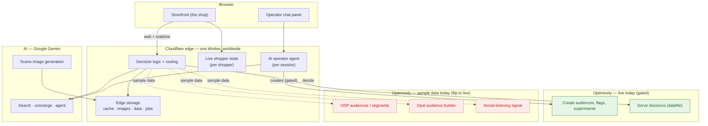
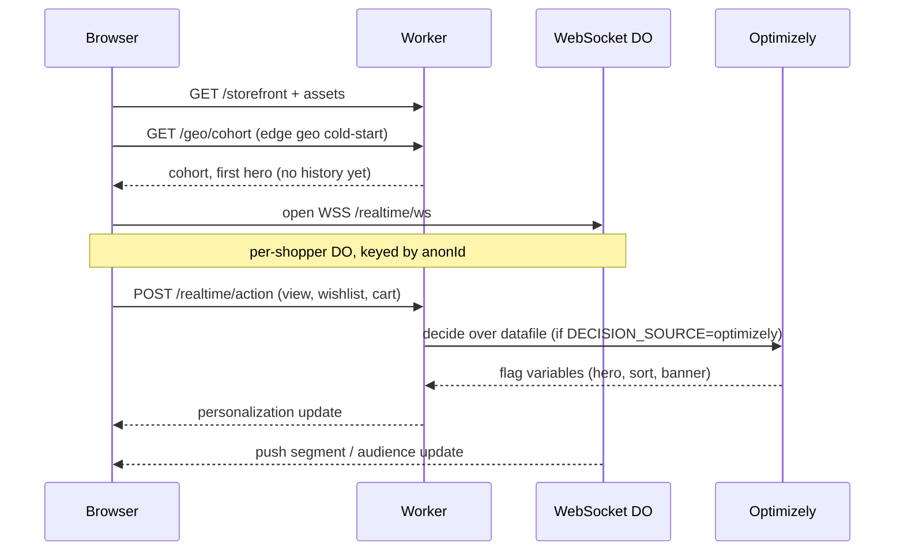
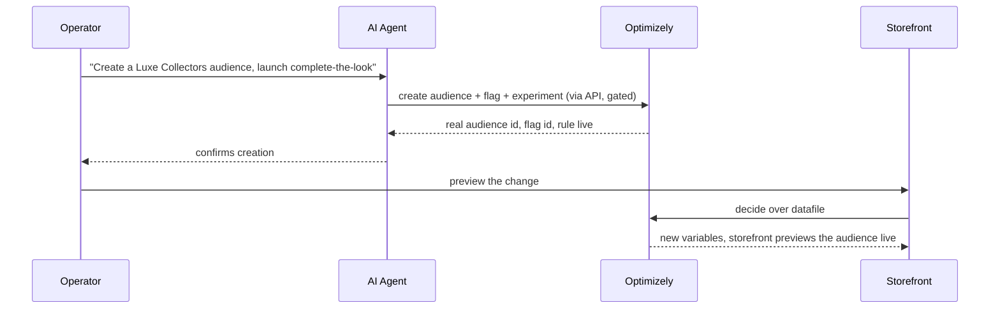

# Real-Time AI Personalization — Architecture & How the Pieces Come Together

**Audience:** Optimizely Product (semi-technical)
**Purpose:** Show how the platform's pieces fit together — and, above all, **where AI does the real work and why it matters.** This is the *AI-forward* direction. There is a separate, deterministic direction (component composition, the HD Supply pattern) designed in [doc 15](./15-edge-composition-design.md); this document is **not** that one, and keeping the two straight is part of the point.

**Reading guide:** all high-level. The diagrams show the components; the prose stays plain. Engineers who want the exact wiring have the pointer at the end.

---

## 1. In a Nutshell

A real-time personalization platform for a luxury storefront (Coach), running on **Cloudflare's edge** so decisions happen in **milliseconds, close to the shopper**. It has two sides, and **AI is central to both**:

- **The shopper experience** — an anonymous, signed-out shopper gets a store that adapts *within the session*: AI understands what she searches for, generates a styled scene of the real product, and answers her like a concierge.
- **The operator** — a merchandiser types a sentence in plain English and AI turns it into a **live** audience and experiment on the store. "Describe it and it ships."

Some parts already call the **live** Optimizely APIs today; others run on **sample data** behind real connectors, so switching them on is a **config change, not a rebuild**.

---

## 2. Where AI Does the Work (and Why It Matters)

This is the heart of this direction. AI isn't a garnish here — it's doing work the shopper and the merchandiser feel directly.

**On the shopper side:**
- **Search that understands intent.** She types *"bags for a winter wedding."* AI reads the **intent** (occasion, style) and ranks the **real catalog** by it — not keyword matching. → *Relevance from the very first result.*
- **A generated scene.** AI creates a styled, editorial image of the **real product** (the "Edit") on the fly. → *She sees herself there, not a stock grid.*
- **A conversational concierge.** An AI stylist chats in plain language, styles a look, and pulls **real catalog pieces**. → *Conversational commerce that taps straight to product.*

**On the operator side:**
- **Language becomes a live change.** The merchandiser says *"create a Luxe Collectors audience and launch complete-the-look."* An AI agent turns that sentence into **real Optimizely audiences, flags, and experiments** through the API. → *Merchandisers move at the speed of language — no dev cycle.*

**Why this matters for the conversation:** in *this* direction, AI is the engine of both the experience and the operator's productivity. (The other direction — doc 15 — is deliberately deterministic, with AI used at most at design time. Don't blur them.)

---

## 3. Architecture at a Glance

**In plain terms:** the browser runs the storefront plus a small chat panel. Both talk to a single **Cloudflare Worker** at the edge. The Worker holds the decision logic, calls **AI (Google Gemini)** for the smart parts, is the only thing that talks to **Optimizely**, and keeps fast state at the edge. Optimizely shows up in two roles: parts that call the **live** APIs today (green), and parts running on **sample data** until we connect them (red).

---

## 4. How It Flows

**The shopper — real-time personalization:**

*She lands → the store cold-starts from her region (no history yet) → she browses → each action updates her in-session profile → the store re-personalizes (hero, sort, banner) in milliseconds.*

**The operator — language becomes a live change:**

*She types a request → the AI agent creates the real audience/flag/experiment in Optimizely → the store previews the change live.*

---

## 5. The Edge Building Blocks (High Level)

| Piece | What it does |
|---|---|
| **One Worker at the edge** | Runs the decision logic worldwide, close to the shopper — the reason it's fast. |
| **Live shopper state** | Holds each shopper's in-session profile and pushes live updates — their own private slice, so many shoppers (and presenters) never cross over. |
| **AI operator agent** | Runs the merchandiser's chat and turns language into Optimizely changes. |
| **Edge storage** | Caches the Optimizely datafile + config, holds generated images, and runs background jobs so the page never waits on an AI call. |

**Why edge:** the decision is computed in the *same request*, in the data center nearest the shopper — no round-trip to a central server — which is what makes the in-session, **sub-50ms** personalization possible.

---

## 6. What's Live vs. Running on Sample Data

Every Optimizely integration is a **real connector**, named after the actual product. What differs is whether it returns **live** data or **sample** data today:

- **Live today** (gated behind a flag): creating real audiences, flags, and A/B · MAB · CMAB experiments through the Optimizely API; serving real decisions from the datafile; event tracking. Plus real edge geo and real Gemini AI.
- **Live when credentials are present:** the **ODP loop** — behavioral events forwarded to ODP in real time, the instant `recent_events` segment seed, and the affinity-score profile upsert (verified against a real ODP account; additive, independent of the other switches).
- **Built, sample data today** (flip a switch to go live): the Opal audience builder, the ODP segment-qualification connector, and the bandit's live serving. The connector is real; it returns sample data until credentials are plugged in.
- **Simulated on purpose** (clearly labeled): social-listening (badged *"simulated · not Optimizely"*), the representative lift numbers, and the local recommendations math.

**The config-flip (sample → live):**

| Switch | Default | Flip to | Turns on |
|---|---|---|---|
| `OPTIMIZELY_WRITE_ENABLED` | off | on | real audience / flag / experiment creation |
| `DECISION_SOURCE` | sample | `optimizely` | real decisions from the datafile |
| `CONNECTOR_MODE` | sample | `live` (+ ODP creds) | real ODP audiences, Opal authoring, live signals |

> **Honesty note (on purpose):** simulated pieces are labeled on screen, and the lift numbers are representative demo data. The *measurement* is real; the *numbers* are demo data — held deliberately so nothing overstates what Optimizely does.

---

## 7. Capability Map — What Maps to Which Optimizely Product

| Capability (as shown) | Status today | Optimizely product |
|---|---|---|
| Operator types a sentence → creates an audience | **Live** (gated) | Feature Experimentation (audiences) |
| Create a flag + rule and take it live | **Live** (gated) | Feature Experimentation |
| Launch A/B · MAB · CMAB | **Live** (gated) | Feature Experimentation |
| Personalized banner / hero decisions | **Live** (opt-in) | FX decisions (datafile) |
| The creative values that drive "the moment" | **Live** | FX feature variables |
| Real-time audiences / segments | **Live** (creds-gated: events out + instant seed + profile upsert) | ODP |
| Natural-language audience building | **Sample data** | Opal (ODP audience builder) |
| The bandit's live winner + lift chart | **Sample data** (real rule created) | MAB / CMAB serving |
| Product recommendations | **Sample data** | Optimizely Recommendations |
| Social-listening signal | **Simulated** (labeled) | none (partner) |
| Shopper AI (search · scene · concierge) | **Live** | our AI layer (Gemini) |

---

## 8. The Questions This Opens with Product

High-level, and genuinely open — this is where a product conversation would start:

1. **Which "audience" do we mean?** The experiment-targeting kind (live today via the API) or ODP's real-time audiences (which need credentials and carry approval/governance rules)? They're different objects.
2. **How do the two layers divide responsibility?** ODP owns the facts, the profile, and the audiences (with the `recent_events` read answering in ~85–200 ms); the edge owns in-session decay and scoring at sub-50 ms. What belongs to the durable profile vs. the in-session edge?
3. **Whose AI agent orchestrates?** Build on Optimizely's own AI agent (Opal, credit-based, human-approves), or keep our agent talking to the API directly?
4. **What's realistic for optimization?** The bandit learns over *hours* on real traffic — so live convergence is a real-world outcome, not a 30-minute-demo one. Set that expectation.
5. **Recommendations** — which recs product, and how its daily refresh sits under a live, in-session experience.

---

## 9. The Other Direction (for context)

There is a **second, different** conversation: **deterministic component composition** (the HD Supply pattern) — assembling approved page pieces with governed rules, where **AI is *not* central** (used at most at design time). That's designed in **[doc 15](./15-edge-composition-design.md)**. This document is the AI-forward experience; doc 15 is the deterministic engine. Same platform, two directions.

**Under the hood (for engineers):** the exact Cloudflare bindings, the WebSocket wiring, and the Optimizely write/decision code paths live in `src/` and are summarized in [doc 12](./12-signal-led-moment-build-brief.md). Happy to walk through any of it.

---

🔗 **Related:** [Edge Composition Design (the deterministic direction)](./15-edge-composition-design.md) · [Signal-Led Moment Build](./12-signal-led-moment-build-brief.md) · [Optimizely API Plan](./09-optimizely-api-plan.md)
