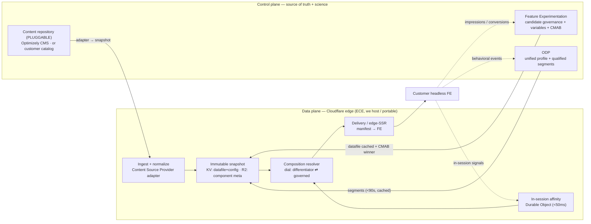

# Edge Composition Engine — Design (Component-Level Personalization Runtime)

**Audience:** Optimizely engineering, enterprise architecture, and the Coach solution team
**Status:** Prescriptive design — the actual-design companion to [doc 14, §8](./14-architecture-and-optimizely-capability-map.md)
**Working name:** ECE (Edge Composition Engine). Not final branding.

This document turns the component-level personalization concept (doc 14, §8) into a buildable design. It specifies the layers, the build/buy line, the content-source abstraction, the composition resolver, the data contracts, the Cloudflare runtime, and the hosting/portability model.

---

## 1. What this designs, and the locked decisions

ECE resolves, per shopper and per request, a **page composition** — which **approved** components/variants fill which slots, and in what order — and returns a **manifest** the customer's headless front-end renders. It never generates markup and never invents a component.

Three decisions are locked and shape everything below:

| # | Decision | Design consequence |
|---|---|---|
| D-1 | **Content repository is a requirement, not a product** | Content sits behind a pluggable **Content Source Provider** adapter (Optimizely CMS *or* the customer's catalog). The one product-agnostic layer. |
| D-2 | **We host it; it must be portable** | Cloudflare-primitives-only, config-driven, per-tenant isolated. Managed by us today; deployable to a customer's Cloudflare account later — same codebase. |
| D-3 | **Resolver dial is configurable; default = differentiator** | Per-slot mode with a global default of **1:1 edge-affinity**, switchable to **governed FX/CMAB** per slot or globally. |

---

## 2. Design Principles

- **Control plane vs data plane.** Optimizely (and the content repository) are the **source of truth and science**; the Cloudflare edge is the **runtime**. We snapshot the control plane to the edge and decide locally.
- **No synchronous runtime dependency.** Every upstream (content, datafile, segments) is **ingested and cached** at the edge. An upstream outage degrades freshness, never availability — the edge keeps serving the last good snapshot.
- **Requirement over product** for content; **required primitives** for decisioning/optimization/profile (FX, CMAB, ODP), themselves consumed via snapshots.
- **Never arbitrary fill.** No eligible approved component for a required slot → an **explicit fallback layout**, never a random arrangement. (Borrowed from the CRePE resolver invariant.)
- **Explainable by construction.** Every slot decision carries *which mode and which signal/decision chose this component, and why.*
- **Portable by construction.** Only Cloudflare primitives; all customer/tenant specifics live in config.

---

## 3. Architecture Overview



---

## 4. Layer Map & the Build/Buy Line

| Layer | Provided by | ECE role (what we own) | Required? |
|---|---|---|---|
| **Content repository** | **Pluggable** — Optimizely CMS *or* customer catalog | Ingest via adapter → immutable edge snapshot | Requirement (not a specific product) |
| **Audience / profile** | **ODP** | Cache qualified segments; run **in-session affinity** at the edge | Required primitive |
| **Candidate governance** | **Feature Experimentation** | Cache datafile; `decide()` locally for eligible components per slot | Required primitive |
| **Optimization** | **CMAB** (in FX) | Consume the allocation | Required primitive (for governed mode) |
| **Composition / assembly** | **ECE** | Per-individual manifest resolver (the differentiator) | We own |
| **Delivery / render** | **ECE** | Manifest API / edge-SSR contract | We own |
| **Explainability** | **ECE** | Per-slot decision trace | We own |

---

## 5. The Content-Source Abstraction (the one pluggable layer)

ECE never assumes a specific CMS. It depends on a **Content Source Provider** contract; each repository ships an adapter that satisfies it.

**Provider contract (conceptual):**

```
ContentSourceProvider:
  listComponents(cursor?)  -> Page<ComponentItem>   # full or incremental pull
  health()                 -> ok | degraded
```

```json
// ComponentItem — the normalized shape ECE ingests from ANY repository
{
  "componentId": "cmp_gallery_editorial",
  "kind": "gallery",
  "allowedSlots": ["gallery"],
  "variants": [
    { "variantId": "lifestyle-first", "props": { "layout": "hero" }, "previewRef": "r2://.../a.jpg" }
  ],
  "status": "active",
  "publishAt": "2026-06-01T00:00:00Z",
  "expireAt": null,
  "constraints": { "exclusiveWith": ["cmp_gallery_grid"], "brandLocked": true },
  "weight": 500,
  "sourceRef": "content-graph://guid | customer-cms://id"
}
```

- **Adapters:** `OptimizelyContentGraphAdapter`, `CustomerCatalogAdapter` (generic REST/GraphQL), etc. New repository = new adapter, no resolver change.
- **Ingestion → immutable snapshot:** pull → normalize → validate → write candidate snapshot → build in-memory index → **activate atomically** (the CRePE snapshot pattern). Requests never read a half-loaded catalog; a failed sync leaves the prior snapshot serving.
- This is the layer that stays **product-agnostic**. Everything else is a required primitive.

---

## 6. The Composition Resolver (the piece we own)

### 6.1 Two modes, one dial (D-3)

| Mode | How a slot's component/variant is chosen | When |
|---|---|---|
| **Differentiator (default)** | Score eligible approved candidates against the **live affinity vector** → pick top; order by intent | True 1:1, real-time, edge-owned |
| **Governed** | Take the **FX/CMAB winner** for the shopper's context | Native, predictable, segment-bounded |

The dial is set **per slot** with a **global default of `differentiator`**, overridable to `governed` per slot or globally. Both modes select **only** from the approved candidate set — the dial changes *how* we choose, never *what's allowed*.

### 6.2 Resolution pipeline (deterministic given the same inputs)

```text
1. Load: active content snapshot, active config (slot grammar + dial), FX decision, ODP segments, affinity vector.
2. For each slot in the template grammar:
   a. Candidate pool = approved components allowed in this slot AND eligible per FX.
   b. Apply constraints + exclusions (fail closed).
   c. Select variant by mode:
        differentiator -> affinity score -> top candidate
        governed       -> FX/CMAB winner
   d. Compute order (intent stage priority, then weight, then deterministic tie-break).
3. Validate the layout against the grammar (required slots present, mutual-exclusions honored).
4. If a required slot is unresolved -> explicit fallback layout (never arbitrary).
5. Attach per-slot explainability (mode, deciding signal/decision, candidate reason).
6. Emit manifest; record decision for events/debug.
```

### 6.3 Layout grammar (the governance guardrail)

Each template declares its slot grammar: which slots are **fixed** vs **re-orderable**, which are **required** (e.g., buy box on a PDP), min/max per slot, and mutual exclusions. The resolver must emit a **valid** layout or fall back — an invalid or un-governed arrangement can never be produced.

---

## 7. Data Contracts

```json
// Candidate set + winner (FX datafile decision → edge), per slot
{ "slotId": "gallery", "eligibleComponentIds": ["cmp_gallery_editorial","cmp_gallery_grid"],
  "cmabWinner": { "componentId": "cmp_gallery_editorial", "variantId": "lifestyle-first" },
  "experimentKey": "pdp_gallery" }
```

```json
// Affinity vector (edge Durable Object, in-session)
{ "dims": { "editorial": 0.72, "transactional": 0.28, "occasion:winter": 0.6 },
  "intentStage": "explore", "updatedAt": "..." }
```

```json
// Manifest (edge → headless FE) — what the FE renders
{ "template": "pdp", "mode": "differentiator",
  "audience": "affinity:editorial-lean · segment:winter-occasion",
  "slots": [
    { "slot": "gallery", "component": "cmp_gallery_editorial", "variant": "lifestyle-first", "order": 1 },
    { "slot": "buybox",  "component": "cmp_buybox_standard",   "variant": "financing-on",    "order": 2 }
  ],
  "fallback": "pdp_default", "source": "edge-decide", "latencyMs": 34,
  "debug": [{ "slot": "gallery", "mode": "differentiator", "chosenBy": "affinity:editorial=0.72", "pool": 2 }] }
```

- **ODP → edge:** `qualifiedSegments[]`, cached per profile (<90 s cadence).
- **FE → Optimizely (async):** impressions/conversions → FX metrics (feed CMAB); behavioral events → ODP; in-session signals → the affinity DO.

---

## 8. Cloudflare Runtime

**Bindings (portable set — nothing proprietary beyond Cloudflare):**

| Concern | Binding |
|---|---|
| Compute / routing | Worker (Hono) |
| Datafile + config snapshot | KV |
| Component metadata / preview assets | R2 |
| In-session affinity (per shopper) | Durable Object |
| Ingestion jobs | Queues |

**Request flow (per page hit):** Worker resolves the shopper → reads affinity (DO) + cached ODP segments → `decide()` on the cached datafile → resolver assembles the per-individual manifest (§6) → return manifest / edge-SSR → async events to FX/ODP/DO.

**Cadence & consistency:**

| Data | Refresh | Runtime read |
|---|---|---|
| Content snapshot | On repository change (webhook) or scheduled; immutable activation | in-memory index |
| FX datafile | Cached in KV, webhook-refreshed | local `decide()` |
| ODP segments | `<90 s`, cached per profile | KV |
| CMAB allocation | Hourly (in FX), rides the datafile | local read |
| In-session affinity | Real-time | DO (`<50 ms`) |

**Failure posture:** any upstream failure → serve the **last good snapshot**; unresolved required slot → **fallback layout**; no active snapshot at cold start → readiness fails (do not serve invented data).

---

## 9. Hosting & Portability Model (D-2)

- **Deploy mode A — Managed (today):** we operate ECE as a **multi-tenant edge service**. Per-tenant config (content adapter, slot grammar, dial defaults, FX/ODP credentials) is isolated by namespace. Coach consumes an API; they host nothing.
- **Deploy mode B — Customer-deployed (future):** the **same codebase** ships to a customer's own Cloudflare account. Only the config and credentials differ.
- **What makes B possible (design constraints we hold from day one):**
  - Only Cloudflare primitives (Worker/KV/R2/DO/Queues) — no dependency on our private infrastructure.
  - All tenant specifics in **config-as-code**; no hardcoded customer logic.
  - Clean **adapter boundaries** (content source, FX, ODP) so credentials/endpoints are swappable.
  - Per-tenant snapshot/config namespacing so a single build serves one or many tenants.
- **Why:** it lets us control our destiny now (we run it, we set the roadmap) without foreclosing a future where customers self-deploy — there is no architectural reason they couldn't.

---

## 10. Governance & Safety (borrowed playbook)

- **Approved-only:** the resolver can emit only components present and `active` in the snapshot.
- **Fail-closed constraints:** unknown exclusion/constraint data makes the affected component ineligible, not silently allowed.
- **Never arbitrary fill:** unresolved required slot → explicit fallback layout only.
- **Immutable snapshots:** requests never see a mid-ingestion catalog.
- **Explainability:** per-slot decision trace available in an authorized debug mode.
- **Deterministic:** identical inputs (snapshot + config + context) → identical manifest.

---

## 11. Open Implementation Inputs (to confirm before TDD)

| ID | Input | Owner |
|---|---|---|
| II-1 | Coach's content repository + the **Content Source adapter** to build | Coach eng + us |
| II-2 | Slot **taxonomy + grammar** per template (fixed/movable/required, exclusions) | Coach eng + merchandising |
| II-3 | The **affinity model**: dimensions, signals, scoring (differentiator mode) | Us |
| II-4 | **CMAB** metric + context attributes (governed mode) | Us + Optimizely |
| II-5 | **ODP** segment set + Advanced Audience Targeting wiring | Us + Optimizely |
| II-6 | **Fallback layouts** per template | Coach merchandising |
| II-7 | Auth model between the FE and the ECE edge | Coach eng + us |
| II-8 | Where the **compose/SSR boundary** sits (their edge, Next middleware, or our Worker in front) | Coach eng |

---

🔗 **Related:** [Architecture & Optimizely Capability Map](./14-architecture-and-optimizely-capability-map.md) (§8 use case) · [Component-Level Personalization Field Brief](../Coach-Component-Personalization-Field-Brief.md)
