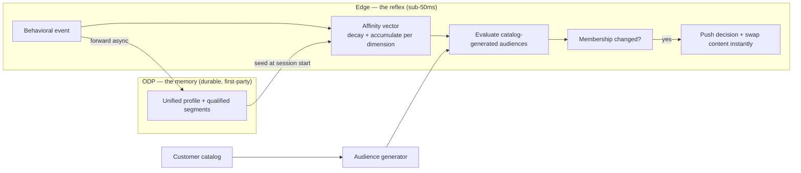

# Edge Affinity Reflex — Engineering Design

**Audience:** Optimizely engineering + enterprise architecture
**Status:** Buildable design — the source of truth for the build and for the customer-facing derivative (a Mandeep-facing version is produced *from* this; it is not this).
**Working name:** the **Edge Affinity Reflex**.

This design specifies a real-time behavioral affinity engine that **matches, then beats, Dynamic Yield's automatic affinity audiences** — deterministically, at the Cloudflare edge, with ODP as an additive durable memory. It is surgical by intent: most of the pipeline already exists (see §3); this doc defines the one missing organ and how it wires in.

---

## 1. Thesis & at-a-glance

Compute a **decayed, per-dimension affinity vector** for each shopper, live, at the edge. Move shoppers **in and out** of **catalog-generated audiences** as their vector rises and decays, and swap content **instantly** on membership change. ODP is the durable, cross-session, first-party memory the reflex seeds from and feeds into.



**Two properties DY cannot match, by construction:** *instant* (edge milliseconds vs. seconds-to-90s), and *glass* (every audience is a legible threshold, on the customer's own first-party data). **One myth retired:** DY's affinity audiences are **not** ML — they are deterministic decayed scoring; so is this. Real ML (propensity/churn) is ODP's predictive insights; discovery/suggestion is Opal.

---

## 2. Locked decisions

| # | Decision |
|---|---|
| D-1 | **Deterministic, not ML.** Affinity = recency/frequency-weighted, time-decayed scoring per catalog dimension. No model. (ODP supplies predictive ML; Opal supplies suggestion.) |
| D-2 | **Per-dimension decayed vector** held **hot** per shopper — the one missing organ. |
| D-3 | **Catalog-driven audience generator** — the catalog writes the audiences; the vector scores them. Governed, transparent, tunable. |
| D-4 | **Edge reflex + ODP memory, additive.** Runs with or without ODP; ODP is a flip-on durable/cross-session/governed layer, never a hard dependency. |
| D-5 | **Sub-50ms** — state + compute live inside the per-shopper Durable Object; no KV round-trip on the hot path. |
| D-6 | **Catalog-agnostic** — dimensions, weights, thresholds, price bands are config; the same engine serves any customer. |

---

## 3. Current baseline — what exists, and the gap (audit 2026-07-02, verified to file:line)

**Already built and reusable (~80%):**
- One ingestion seam — `RealtimeSegmentEngine.updateAttributesWithEvent`.
- The live loop — per-event recompute → change-detect → push.
- The per-shopper `PersonalizationWebSocket` Durable Object + WebSocket + client apply.
- A **7-dimension item-item similarity kernel** — `CatalogService.sim()` (weights in one const `ATTR_WEIGHTS`), fully attribute-driven → catalog-agnostic.
- **Numeric** audience operators (`gte/lt`) — can threshold on scores today.
- **ODP-optional by default** — the mock evaluates the *same* realtime condition trees the live path would; the live ODP GraphQL is written but commented in `LiveSegmentProvider`.
- A shipped **edge → instant-swap** template with no ODP and no round-trip — the geo cold-start.
- A rich 6-axis catalog + **latent per-line affinity vectors in the synthetic data that are dropped at load** (`customers.json._rollup.viewed_line_counts`).

**The gap (the whole build):** shopper affinity today is two **last-write-wins scalars** (`viewed_product_line`, `price_band_viewed`) + **monotonic counters**, rebuilt per-request in KV. Consequences: not per-dimension, **nothing decays** (so shoppers can never move *out* — the exact thing DY does), and not hot (round-trip, not reflex).

---

## 4. The affinity model (the math)

For each **dimension** `d` (line, silhouette, occasion, category, subcategory, priceBand) and **value** `v`, keep a raw score `R[d][v]` and a last-touch time `t[d][v]`.

**On an event touching `(d, v)` with action weight `w` at time `now`:**
```
R[d][v] ← R[d][v] · exp( −(now − t[d][v]) / τ_d )   # decay since last touch
R[d][v] ← R[d][v] + w                                # accumulate
t[d][v] ← now
```

**Normalize to an affinity score `a[d][v] ∈ [0,1]`** (saturating — "absolute affinity to v", which is what DY's audiences use):
```
a[d][v] = R[d][v] / ( R[d][v] + K_d )                # a=0.5 at R=K_d; →1 with engagement, →0 as it decays
```
*(Alternative for "dominant-v" audiences: share of attention `a = R[d][v] / Σ_v R[d][v]`. Default is saturating.)*

**Audience membership (with hysteresis to prevent flapping):**
```
enter "{v} Affinity"  when  a[d][v] ≥ θ_in
exit                  when  a[d][v] < θ_out           # θ_out < θ_in
```

**Decay is what produces "move out."** A shopper who stops engaging with `v` sees `a[d][v]` fall below `θ_out` and exits — the behavior that is impossible in the current code. Idle shoppers are re-evaluated by a DO alarm (§6) so they decay out even with no new events.

**Parameters (config; demo defaults):**

| Param | Meaning | Demo default | Production |
|---|---|---|---|
| `τ_d` (half-life) | how fast affinity fades | **short** (~30–60s of browsing) so shifts are visible live | minutes–hours, tuned |
| `w(action)` | event weight | view 1 · wishlist 2 · cart 3 · purchase 5 | tuned |
| `K_d` | soft midpoint | ~2–3 engaged views cross 0.5 | tuned |
| `θ_in / θ_out` | enter/exit thresholds | 0.60 / 0.45 | tuned |

The demo runs an **accelerated half-life** so "move in and out" happens in seconds on screen; production tunes it to real cadence. This is a config value, stated honestly.

**Engineering invariants (what makes this an engine, not a demo trick):**

- **Store raw, read lazily.** Persisted state is only `(R, tLast)` — never pre-decayed. Every read computes `R_eff = R · exp(−(now − tLast)/τ_d)` as a **pure function of state and time**: nothing mutates on a timer, replays are deterministic, and the same state gives the same answer on any host (request path or DO).
- **The engine clock is authoritative.** Events are stamped on arrival; client timestamps are advisory only — a forged or skewed clock cannot inflate affinity.
- **Multi-value dimensions** (a product carries `occasion[]`): each value is touched with the full action weight by default; `splitWeight` is a config option where share semantics are wanted.
- **Determinism.** `ReflexCore.apply(state, event, now, config) → (state′, changes)` is a pure function — identical inputs produce identical membership transitions everywhere. This is the testing seam (§12) and the portability seam (§13).

---

## 5. The catalog-driven audience generator

The "automatic audiences like Dynamic Yield" — and the point to be precise about: **nobody invents the audience names. The catalog supplies them.** Two things get blurred in the DY perception; separate them:

- **Affinity *scoring* is automatic** — derived from the feed's own dimensions (the decayed per-dimension vector, §4). This is the real engine.
- **The named audiences are a naming *template* over the catalog** — `"{catalog value} Affinity"`. "Backpack Affinity" is literally the catalog's `Backpack` value + `"Affinity"`. The catalog is the dictionary; the audiences are its words in audience form — no invention, by DY or by us.

**The one bit of judgment — *which* values become audiences.** Not every value earns one ("Winter Affinity" off a single winter SKU is noise). So the generator applies a **deterministic population filter**: keep a value only if it clears a minimum product count *and* a minimum behavioral-traffic count. Counting, not ML — and exactly where DY "suggests" audiences and where Opal surfaces *"a Tote-affinity cohort is forming."*

```
generateAudiences(catalog, events, config):
  A = []
  for d in config.affinityDimensions:              # [line, silhouette, occasion, category, priceBand]
    for v in distinctValues(catalog, d):
      if productCount(catalog, d, v) < config.minProducts: continue   # population filter:
      if eventCount(events, d, v)    < config.minTraffic:  continue   #   keep only values with catalog + demand
      A.push({                                             # the NAME below comes straight from the catalog value
        key:        slug(d + "_" + v + "_affinity"),      # dimension-namespaced — "Work" (occasion) can never collide with another axis
        name:       v + " Affinity",
        evaluation: "realtime",
        condition:  { attr: d + "_affinity." + v, op: "gte", value: config.threshold[d] ?? 0.6 },
        provenance: "catalog-generated",
      })
  A.push(HIGH_INTENT, CART_ABANDONER, ...)          # intent/journey cuts from behavioral counters
  return A
```

- **Automatic to stand up:** the catalog's taxonomy enumerates the audiences (Tabby/Tote/Crossbody/Evening/Work/Luxe Affinity…) — no hand-definition, same as DY. When the customer opens it, the audiences "already exist and are filling," because we generated them from *their* catalog.
- **Controllable after:** the generated set is reviewable — a human can rename ("Backpack Affinity" → "Backpack Shoppers"), merge, prune, or retune a threshold. Automatic, not uncontrolled.
- **Glass, not black box:** every audience is a legible predicate, not an opaque score; it syncs to ODP as a real segment.
- **Regeneration is a diff, not a clobber.** The generator runs on catalog sync (and on demand): it *adds* audiences for new catalog values and *retires* audiences whose values left the catalog — but never overwrites a `pinned` or human-edited audience (the `provenance` field governs ownership). Human curation survives every regeneration.
- Feeds the existing `KvAudienceStore` + `evaluateCondition` engine unchanged — the numeric operators already exist.

---

## 6. Runtime architecture — the `ShopperReflex` Durable Object

The reflex lives **inside a per-shopper Durable Object** so state and compute are co-located and hot. Concretely: a **new, SQLite-backed DO class — `ShopperReflex`** (wrangler migration v4, `new_sqlite_classes`) — that owns **both the WebSocket and the affinity state**. One object per shopper: every tab/device carrying the same stable id lands on the same object and receives the same pushes. The existing `PersonalizationWebSocket` relay is retired after cutover (it holds no shopper state worth migrating).

**In-DO state — lives in `ctx.storage` (SQLite), never in the socket attachment** (the hibernation attachment is capped ~2KB and carries only `{shopperId}`):
```
AffinityState {
  shopperId,                 # STABLE id (not the per-load anonId)
  R: { line:{Tabby:{score,tLast}, ...}, silhouette:{...}, occasion:{...}, ... },
  audiences: Set<key>,       # current membership
  odpSeed: string[],         # durable segments seeded at session start (§8)
  configVersion,             # ReflexConfig version this state was last evaluated under
}
```

**Ingestion — one handler, two doors.** `webSocketMessage` is the primary door; `fetch POST /ingest` serves no-WS clients, `sendBeacon` on unload, and the existing `POST /realtime/action` (which forwards here during transition). Both doors call the same pure core:

```
ingest(event):                                   # DO stamps time — client ts is advisory only
  now = Date.now()
  (state', changes) = ReflexCore.apply(state, event, now, config)    # pure core (§12) — no I/O
  if changes.membership not empty:
    push({ decision: decide(state'.audiences), affinity: snapshot(state', now), changed: changes.membership })
  ctx.storage.put('affinity', state')            # SQLite write, coalesced by output gates
  scheduleNextCrossing(state', now)              # closed-form alarm (below)
```

**Exit-by-decay without polling — closed-form alarm scheduling.** Decay is exponential, so the exact future instant any *current* membership will cross `θ_out` (absent new events) is solvable, not polled:

```
t*(d,v)    = tLast + τ_d · ln( R · (1 − θ_out) / (K_d · θ_out) )
next alarm = min t*(d,v) over current memberships
```

`alarm()` wakes the object at exactly that instant (alarms wake hibernated objects), re-reads the lazily-decayed scores, pushes the exit, and schedules the next crossing. **No polling, no wasted wakeups, exact-time exits** — and the alarm never mutates state (decay is a read-time function, §4). This is the "they drop out when they wander off" beat, delivered with zero waste.

**Hibernation & identity (the two real lifts):**
- Adopt the **WebSocket Hibernation API** (`state.acceptWebSocket` / `webSocketMessage`) so per-shopper objects park at near-zero cost between events and survive eviction. The affinity state rehydrates from `ctx.storage` on wake; the socket attachment carries only the shopper id (2KB cap respected by design).
- Key the DO on a **stable visitor id** (persisted client-side via `localStorage` / the `opt_session_id` cookie; mapped to the ODP `vuid`, §8) — not the `anonId` that regenerates every page load.

**Config distribution.** A versioned **`ReflexConfig`** (dimensions, `τ/K/θ`, action weights, generator thresholds) lives in KV; each object caches it and refreshes on version bump. Tuning is a config change, never a redeploy.

```
   ┌────────── per-shopper Durable Object (hot, hibernating) ──────────┐
   │  event ─▶ decay+add ─▶ evaluate audiences ─▶ changed? ─▶ push     │
   │     ▲                                            │                 │
   │     └─────────── alarm(): idle decay-out ────────┘                 │
   └───────────────────────────────────────────────────────────────────┘
```

---

## 7. Instant swap (delivery)

On a membership change the DO resolves the content decision and pushes it over the socket **in the same object, in one send** — no KV, no cross-object hop.

- Reuse the proven pattern: the geo cold-start already does edge-computed-signal → instant hero/grid swap with no round-trip.
- Client fixes: **remove the own-action double-apply**, and **trim the ~340ms render cascade** so the swap reads as instant.
- Decision resolution reuses `DecisionProvider.decideFromSegments` (deterministic) or the real FX `decide()` when `DECISION_SOURCE=optimizely`.

---

## 8. The additive ODP loop

ODP is the durable, cross-session, first-party **memory**; the edge is the **reflex**. A loop, not a handoff.

- **Seed (memory → edge):** on session start, `fetchQualifiedSegments(vuid)` → seed `odpSeed`, so the reflex starts from the shopper's durable history. Uncomment the live GraphQL in `LiveSegmentProvider` (`POST {ODP_API_HOST}/v3/graphql`, `x-api-key`), supply creds. Cache in KV.
- **Forward (edge → memory):** async-forward each behavioral event to ODP's ingestion API (`POST {ODP_API_HOST}/v3/events`) via the `waitUntil` pattern (mirrors `captureDemoEvent`) or a queue-consumer branch. The engine already normalizes events into ODP-shaped attributes.
- **Additive, never either/or:** make `LiveSegmentProvider` **union** ODP's qualified segments with the local edge evaluator — mirroring the live-with-mock-fallback pattern `LiveDecisionProvider` already has. (`getConnectors` `live` mode currently *replaces* the triad; that's the one change.) So the reflex qualifies at the edge whether or not ODP answers.
- **Identity:** map `anonId ⇄ ODP vuid ⇄ stable shopperId`. On login, ODP stitches; the edge re-seeds from the richer profile.
- **ODP-optional (the demo):** default `CONNECTOR_MODE=mock` runs the full reflex with **no ODP** — the demo needs no ODP wiring. Flipping ODP on adds durability, cross-session, cross-channel, and governance.

---

## 9. Flexibility layer (any customer catalog)

The engine is a product, not a Coach one-off:
- **Item-item affinity is already attribute-driven** (`CatalogService`, weights in one const) → any catalog reweights with no code change.
- **Generalize the shopper-tier affinity** to any axis via `config.affinityDimensions` (today it's hardcoded to line + price).
- **Single-source the config** now duplicated/hardcoded: the enum lists (in ~4 places), the price-band cuts `150/400` (in ~4 places), `HERO_CATEGORY`. One config object.
- The **generator** (§5) and the **audience store** are already catalog/definition-driven.

Result: onboard a new customer = point at their catalog + set config; no engine rewrite.

---

## 10. Demo choreography (the visual — "watch it adapt")

The moment that rocks the room. An on-screen **affinity instrument** (extend the existing Personalization Activity panel):

1. Shopper browses **Tabby** bags → the `line.Tabby` bar **fills live** → crosses `θ_in` → **"Tabby Affinity" lights up** → the hero **swaps instantly**.
2. Shopper wanders to **totes** → `silhouette.Tote` rises, `line.Tabby` **decays** → they **exit "Tabby Affinity", enter "Tote Affinity"** → content changes again.
3. Shopper goes idle → the **alarm fires at the exact, precomputed crossing time** (closed-form, §6) → they **drop out** of the audience → content reverts.

Show the **scores (bars), the audience in/out flips (badges), and the content swap**, all in real time, all at the edge, all **sub-50ms**. Caption honestly: *"deterministic — no black box — and it loops into your ODP as the durable, first-party memory."* The demo runs with `CONNECTOR_MODE=mock` (no ODP required).

---

## 11. Data contracts

```json
// Event (client → DO, over the socket or POST /ingest). "ts" is advisory — the DO stamps arrival time (§4).
{ "type": "product_view", "productId": "COA-CH857", "action": "view", "ts": 1750000000000 }

// Affinity snapshot (DO → client, for the instrument)
{ "dims": { "line": {"Tabby": 0.72, "Brooklyn": 0.20}, "silhouette": {"Tote": 0.10} },
  "audiences": ["tabby_affinity"], "changed": [{"key":"tabby_affinity","enter":true}] }

// Push envelope (DO → client) — reuses the existing personalization_update shape + affinity
{ "type": "personalization_update", "data": { "decisions": {...}, "affinity": { ... }, "audiences": [...] } }
```

---

## 12. Productization hardening (defensibility)

**Explainability — the glass box, operationalized.** Every membership change carries an explain record — `{event, dimension, value, score_before → score_after, threshold, configVersion}` — and an authorized debug endpoint returns any shopper's live vector, memberships, and last-N transitions. *"Why is this shopper in Tabby Affinity?"* always has an exact, replayable answer. (The CRePE lesson applied: explainability is what wins the engineering org — and the one thing a black-box affinity engine can never offer.)

**Metrics** (Analytics Engine): audience entries/exits, ingest→push latency, alarm precision, active vs. hibernated object counts, config-version spread, ODP seed/forward success rates.

**Testing — the core is a pure module.** `ReflexCore.apply(state, event, now, config) → (state′, changes)` does no I/O, so it is tested as math: **golden event-stream tests** (a recorded stream must reproduce an exact membership timeline), **property invariants** (scores only decay between events; never enter below `θ_in`; never exit above `θ_out`; replay is deterministic), and fuzzed event storms. The DO is a thin host around a fully-tested core.

**Trust & abuse.** Events are validated against the in-memory catalog index (unknown `productId` dropped and counted), arrival-time stamped (§4), and rate-limited per object (the existing `RateLimiter` pattern). A client can only influence its own vector — and only by behaving like a shopper.

**Privacy & lifecycle.** The vector holds no PII — catalog values and timestamps only. Idle objects self-expire (a retention alarm runs `ctx.storage.deleteAll()` after N idle days, configurable), and `DELETE /reflex/:shopperId` satisfies GDPR/CCPA erasure. ODP remains the governed system of record; the reflex is a disciplined cache with a lifecycle.

---

## 13. Build plan (phased, with effort and file targets)

| Phase | What | Key file targets | Effort |
|---|---|---|---|
| **P0 — Pure core** | `ReflexCore` (decay math + evaluation + hysteresis + explain) as a pure module, with golden/property tests; wired into the existing request path behind a flag | new `src/reflex/core.ts` (+ tests), `RealtimeSegmentEngine.updateAttributesWithEvent` | days |
| **P1 — Generator** | catalog-driven audience generation | new `audienceGenerator`, `CatalogService` dimension enum, `KvAudienceStore` | days |
| **P2 — Hot DO** | new **`ShopperReflex` DO** (SQLite, migration v4): socket + `POST /ingest` + hibernation + closed-form alarms + **stable id**; the P0 core moves in **unchanged** | new `src/durable-objects/ShopperReflex.ts`, `wrangler.toml` (migration), `realtime.ts`, client transport | **~1 week (the real lift)** |
| **P3 — Instant + viz** | push on threshold, kill double-apply, trim cascade, the **Affinity Instrument**, `GET /realtime/reflex` snapshot for first-paint (no flash) *(as built)* | `storefront.js` (apply + panel), `realtime.ts` | days |
| **P4 — ODP loop** | live GraphQL seed, event forwarder, **additive** provider, identity | `SegmentProvider`, `index.ts` (connectors + queue), `realtime.ts` | days–week |
| **P5 — Dimensions** | silhouette/occasion capture → rollup → whitelist → audiences | `demo_events`, `v_demo_profiles`, `coach_odp_profiles`, `meta_attribute_catalog`, `insights.json` | days (mechanical) |

- **Demo slice** = P0 + P1 + P3, running the **same pure core** on the existing request path — a **few days**, ODP-optional, and **zero throwaway**: P2 relocates the hosting for latency, not the engine for correctness.
- **Product** = all phases — a genuine **couple of weeks**.

---

## 14. Risks & mitigations

| Risk | Mitigation |
|---|---|
| Hot-DO relocation (hibernation, stable id) is the biggest lift | Contained to P2; the transport substrate already exists; hibernation is a documented CF API |
| Decay tuning feels wrong on stage | Config-driven; rehearse with the accelerated demo half-life; hysteresis prevents flapping |
| Identity (`anonId ⇄ vuid ⇄ stable id`) | Introduce the stable id in P2; ODP mapping in P4; degrade gracefully to anon |
| Two-speed edge/ODP disagreement | Edge is the leading indicator; ODP reconciles; state it as a two-speed model |
| Over-claiming "automatic/AI" | Doc is explicit: deterministic; ODP = predictive ML; Opal = suggestion |
| Generator regeneration clobbers human edits | Diff-based regeneration; `provenance`/`pinned` ownership (§5) |
| Config drift across objects | Versioned `ReflexConfig` in KV; version stamped on state + surfaced in metrics |

---

## 15. The customer-facing derivative (later)

A Mandeep-facing architecture/value document is produced **from** this design — same substance, reframed for value + integration (what Coach implements on their side, the governance story, the DY comparison), and stripped of internal file paths. This doc stays the engineering source of truth.

---

🔗 **Related:** [Real-Time AI Personalization](./14-architecture-and-optimizely-capability-map.md) · [Edge Composition Design](./15-edge-composition-design.md) · [Optimizely capabilities](./09-optimizely-api-plan.md)
