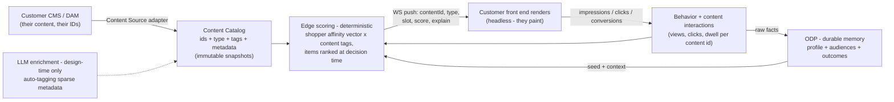

# Content Affinity Engine — Engineering Design

**Audience:** Optimizely engineering + enterprise architecture (internal source of truth; the Tapestry proposal and the ASOS overview are derivatives of this doc).
**Status:** committed direction (leadership-approved, multi-customer). Design locked pending the co-design inputs in §9.
**Position in the family:** doc 16 built the **reflex** (behavioral scoring). Doc 15 designed the **composition** lane (layout/experience — the ~6-month tier). This doc is the middle tier: **content personalization** — the reflex pointed at a **content catalog**, delivered by ID to headless front ends.

---

## 1. Thesis

**This is a fusion, not an invention.** We have already built both halves for different customers:
- **CRePE (HD Supply)** proved the *content-by-ID, governed-resolution, headless* contract: a content catalog with reference codes, metadata, exclusions, fallbacks, explain metadata — served to a head app that paints.
- **The Edge Affinity Reflex (doc 16, live)** proved the *behavioral scoring*: decayed per-dimension vectors, catalog-generated audiences, instant membership, explain records — and it is **catalog-agnostic by locked decision (D-6)**.

Content personalization = point the reflex at a **second catalog** (content instead of / alongside products), score the shopper's affinity against **content tags**, rank **content items** at decision time, and push `{contentId, type, score, explain}` over the existing WebSocket to the customer's front end. The customer paints; we decide.



## 2. Locked decisions

| # | Decision |
|---|---|
| D-1 | **Deterministic runtime; LLM off the hot path.** Per-request selection is decayed scoring + ranking — no model call ever in the render path. LLMs serve **design time** (auto-tagging/enriching the content catalog from sparse CMS metadata) and **insight time** (Opal explanation + proposals). |
| D-2 | **Two-level scoring** (the scale answer): the shopper's vector scores **tags/dimensions** (bounded state, ε-pruned — never a score per item); **items** rank at decision time against the vector (the existing recs pattern). Scales from 71 SKUs to an ASOS-sized catalog. |
| D-3 | **The learning ladder** — three shippable stages: S1 *learns the shopper* (affinity-matched content; behavior-learned, not hand-coded variations); S2 *learns what works* (**per-item outcome statistics over the open catalog folded into ranking scores as lift** — item-level like product recs, never variation buckets; exploration policy for new content; CMAB only as an optional per-slot instrument, never the algorithm); S3 *learns what matters* (offline pattern discovery over ODP/D1, proposed through Opal, human-approved). Each stage's data exhaust feeds the next — rungs cannot be skipped. |
| D-4 | **Delivery = decisions by ID over the socket.** We push `{contentId, type, slot?, score, explain}`; the customer's front end paints. Agreed with Tapestry engineering on-call; identical contract for every customer. CMAB attribute-feeding remains the secondary, platform-native path. |
| D-5 | **Multi-tenant, customer-agnostic core** from day one (doc 15 D-2 posture): pluggable Content Source adapters, per-tenant config/catalog/thresholds, no customer named in core code. Per-customer specifics live in annex docs. |
| D-6 | **Governed + explainable throughout:** approved-content-only selection (CRePE's never-arbitrary-fill invariant), every decision carries an explain record, Opal is the transparency surface (the pre-condition for any customer trusting autonomy). |

## 3. The Content Catalog

The registry — deliberately parallel to the product catalog:

```json
{
  "systemId": "cnt_8f3a…",              // ours (stable)
  "customerContentId": "CMP1234",        // theirs (their CMS id — the id we echo back)
  "type": "image | text | module | layout",
  "url": "https://…",                    // render reference (we never host their assets)
  "tags": ["evening", "model-worn", "ugc", "reviews"],
  "metadata": { "slotTypes": ["pdp-hero"], "constraints": {…} },
  "lifecycle": { "status": "active", "publishAt": …, "expireAt": … }
}
```

- **Ingestion:** a `ContentSourceProvider` adapter per CMS (the doc 15 abstraction — one adapter per customer stack), pulled into **immutable snapshots** (the CRePE pattern: build → validate → activate atomically; requests never see a half-loaded catalog).
- **Enrichment (LLM, design-time):** CMS tagging is always sparse. An offline Gemini pass proposes tags/attributes per item (image + copy in, taxonomy out), written into the catalog **as suggestions a human approves** — the governed way to make thin metadata rich enough to score against.
- **Population filter + generated audiences:** the same generator (doc 16 §5) runs over the content taxonomy — content-tag affinity audiences appear automatically, dimension-namespaced, diff-regenerated.

## 4. Content interaction telemetry

New event types through the **existing ingestion seam**: `content_impression`, `content_click`, `content_dwell` — keyed by `systemId`/`customerContentId`, carrying the content's tags (flattened, as product events do today). They flow to: the reflex (S1 scoring), D1 `demo_events`-style capture (S2 aggregation), and ODP (durable facts). The customer SDK emits them automatically for pushed content; manual emit for content we didn't choose.

## 5. Scoring and selection (S1 mechanics)

1. Content events touch **tag dimensions** in the shopper's existing vector (`content_tone`, `content_format`, plus the shared occasion/line/price dims — one vector, both catalogs).
2. At decision time, candidate content for the slot/request is ranked: `score(item) = Σ_tag a[dim][tag] · w_tag` (the exact shape of today's item ranking), filtered by lifecycle + constraints, **top item pushed with the explain record**.
3. **Context dimensions** join the vector as first-class attributes: **entry channel** (paid social / search / email / direct — Tapestry's #1 predictor), **visit count** (via the stable visitor id + ODP memory — the "60% buy on visit 2–3" signal), referrer. These gate and weight selection (first visit → romance imagery; return visit → detail + reviews) *as scored preferences, not hand-coded rules*: the defaults are seeded, then behavior reweights them.

## 6. Learning ladder — implementation notes

- **S1 (weeks):** everything in §3–§5. No new math — config + catalog + telemetry + ranker.
- **S2 (~2 months):** an aggregation layer (D1 tables: content × context × outcome counts, computed off the telemetry + conversion events) that reweights ranking (`score × lift(context)`), and/or **CMAB per slot with content items as arms and affinity scores as context attributes** (the existing "memberships gate, scores teach" pattern — real FX CMAB rules, gated writes). Needs live traffic accumulating first — this is why S2 cannot ship before S1.
- **S3 (co-innovation):** offline jobs over ODP/D1 (clustering, predictive-attribute analysis per channel; converters-vs-non-converters contrasts) surfacing **proposals through Opal tools** ("this behavior predicts conversion for paid-social visitors — create the audience? reweight the dimension?") — human-approved, fully explained. Also the reporting surface: which content, to whom, why, at what lift (the transparency pre-condition for autonomy).

## 7. Delivery — the customer SDK

A thin embeddable client, extracted from what `storefront.js` already does: **connect** (WS with the stable visitor id) · **emit** (behavior + content interactions) · **listen** (decision push → customer's event handler). Push payload (v1, to be co-designed with each customer's front-end team — the schema is the partnership artifact):

```json
{ "kind": "content_decision", "slot": "pdp-hero",
  "content": { "customerContentId": "CMP1234", "systemId": "cnt_8f3a…", "type": "image", "url": "…" },
  "score": 0.78,
  "explain": { "drivers": [{"dim": "occasion", "tag": "evening", "a": 0.72}], "context": {"channel": "paid_social", "visit": 2} },
  "ts": … }
```

Snapshot endpoint for first-paint (no flash), graceful absence (no decision → customer default renders — never blocked, never arbitrary).

## 8. The tuning UI (committed: days, not weeks)

The behavior→affinity map surface promised to Tapestry: per-dimension **weight / decay (τ) / thresholds (θ)** editing over the versioned ReflexConfig (tuning ≠ redeploy — the KV-config design finally cashes in), audience review (rename/pin/prune the generated set), and per-audience **next-best-content association** (audience/affinity → candidate content list) as the S1 mapping surface. Their feedback shapes the layout; the API surface already exists.

## 9. Co-design inputs required per customer (the annex content)

Content inventory + metadata sample · CMS/DAM API access for the Source adapter · the SDK payload workshop with their front-end team · slot taxonomy (which slots accept pushed content) · success metrics for S2 learning · tuning-UI feedback session.

## 10. Risks

| Risk | Mitigation |
|---|---|
| "Algorithmic" over-read as deep ML | The ladder names each mechanism + date; S2 is aggregation + CMAB, stated plainly |
| Catalog scale (ASOS) | D-2 two-level scoring; per-dim caps + ε-pruning; item ranking only at decision time |
| Sparse CMS metadata | LLM enrichment pipeline, human-approved |
| Cross-customer leakage | D-5 multi-tenant core; customer names only in annexes; docs never cross-name |
| Commitment drift | §8 tuning UI is date-bound; the customer docs carry the same staged dates as this design |

---

🔗 [16 — Edge Affinity Reflex](./16-edge-affinity-reflex.md) (the engine) · [15 — Edge Composition Design](./15-edge-composition-design.md) (the ~6-month experience/layout lane) · [ODP wiring spec](../Coach-ODP-Wiring-Spec.md) · derivatives: `docs/Tapestry-Content-Personalization-Proposal.md`, `docs/ASOS-Edge-Personalization-Overview.md`
