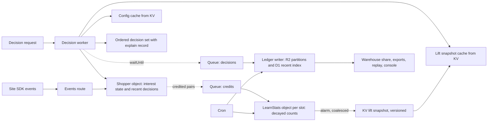

# 22 · Outcome Learning: how the engine learns what works

**Design specification for stage two of the learning ladder.** Written to be read by our own engineers
and, with light editing, by Tapestry's data science team. Every symbol is defined where it is used. Every
number the engine learns is a count that anyone can recompute from the ledger.

---

## 0 · Why this document exists, and what "learn" means here

The engine learns at three levels, on three timescales, and the word "learn" means something different at
each. Naming them once removes most of the confusion that surrounds this subject.

| Level | What updates | From what | Timescale | Status |
|---|---|---|---|---|
| **Learning the shopper** | One shopper's interest state | Their own behavior | Milliseconds, and across visits | Live |
| **Learning what works** | Per-item outcome rates, per context | Outcomes credited to decisions across all shoppers | Minutes to weeks | **This document** |
| **Learning what matters** | Proposals for new dimensions, weights, audiences | Offline analysis of the accumulated ledger | Weeks | Stage three, human-approved |

Level one is inference: the parameters never move, only the shopper's state does. Level two is
estimation: parameters move, from evidence. Both are arithmetic, both are inspectable, and neither puts an
opaque model on the decision path. This document specifies level two completely, and defines the surfaces
through which a data science team can watch it, steer it, and replace parts of it with their own.

---

## 1 · Principles

1. **The decision path only reads.** No learning happens while a decision is being made. The request path
   performs the same multiplication it performs today, with one additional term whose value was computed
   earlier and cached in the isolate. Learning runs beside the request path, never on it.
2. **Every learned number is a count.** A lift is a ratio of two smoothed rates, each a ratio of two
   decayed counts. The explain record shows the counts. Anyone with the ledger recomputes the lift.
3. **Everything is versioned and reversible.** Every configuration group lives in one versioned document
   store as its own document kind, and every version carries a human-readable label and a monotonic
   revision number. Lift tables are immutable snapshots with version IDs. Every decision records the
   config revision, lift version, prior version, attribution policy version and holdout arm it was made
   under. A rollback is a new revision whose content equals an earlier one; no counter ever rewinds, so
   the audit trail keeps what was undone.
4. **Nothing changes until someone says so.** Learning runs first in shadow: computed, displayed, and
   weighted at zero. A single dial per slot raises its influence from zero to full.
5. **Three kinds of state never mix.** Shopper state (personal, in the shopper's own object),
   population statistics (aggregates, no identifiers), and configuration (versioned, in the registry).

---

## 2 · The picture

Nine components. Four of them exist today (the decision worker, the shopper object, the events route, the
config cache is in build). Five are new: the decision and credit queues, the ledger writer, the LearnStats
object, and the lift snapshot.

---

## 3 · The ledger

Two append-only streams. Together they are the system of record for everything in this document, the
warehouse share promised in the scope appendix, and the input to every report.

### 3.1 Decision records

One per served decision. Written off the response path.

| Field | Meaning |
|---|---|
| `decision_id` | Unique, sortable by time |
| `tenant`, `brand` | Isolation keys. Nothing pools across them unless configured |
| `visitor_id`, `session_id` | Pseudonymous first-party identifiers |
| `identity_anchor` | `visitor` when the shopper's state hung on the durable first-party id, `session` when only a session id was available, `none` when no state could be read. Evidence pooled on a session-only anchor is weaker; the ledger is the only place that distinction survives (added 2026-09-02, from CW7) |
| `ts` | Server time at decision |
| `page`, `slot`, `position` | Where the item was served, and at what rank inside the slot |
| `item_id` | What was served |
| `candidates` | The top N considered, with their base scores. N configurable, default 10 |
| `cell` | The context cell the shopper was in (section 5.4) |
| `arm` | `personalized`, `default`, or `no_learning` (section 10) |
| `explored` | Whether this placement was an exploration pick (section 7) |
| `authority` | `engine`, `pin`, `gate`, `default` |
| `versions` | `config_v`, `lift_v`, `prior_v`, `policy_v` as integers, plus the human-readable label of the configuration revision |
| `explain` | Drivers, scores, the lift term with its counts |

### 3.2 Outcome records

One per reward-bearing event. These already arrive through the SDK as actions; the ledger keeps the
subset that a reward definition names.

| Field | Meaning |
|---|---|
| `outcome_id`, `ts` | |
| `visitor_id`, `session_id` | Same identifiers as decisions |
| `type` | `click`, `dwell`, `video_complete`, `wishlist`, `add_to_bag`, `purchase`, or a custom name |
| `item_id` | The content or product the outcome concerns, where applicable |
| `value` | Unit, revenue, or margin, per the reward definition |
| `arm` | Copied from the visitor's holdout assignment |

### 3.3 Storage tiers

| Tier | Holds | Why |
|---|---|---|
| **Shopper object** (Durable Object SQLite) | This visitor's last 200 decisions or 7 days, whichever is smaller | Online attribution needs the visitor's own recent decisions and nothing else |
| **R2** | Every record, immutable, hourly NDJSON partitions per tenant | System of record. Cheap, unbounded, and it *is* the Snowflake share: the warehouse reads the partitions |
| **D1** | Last 30 days, indexed by `decision_id` and `visitor_id` | Random access for the explain lookup, the console, and replay. Pruned by cron; stays well under the 10 GB ceiling |
| **LearnStats object** (Durable Object SQLite) | Decayed counts per key (section 5) | The live aggregates, one object per tenant, brand and slot |

---

## 4 · Attribution: crediting an outcome to a decision

This is the layer that turns two streams into evidence, and it is the layer where most systems hide their
assumptions. Here it is a **policy**, declared in configuration, with four independent axes.

### 4.1 The four axes

| Axis | Question it answers | Values |
|---|---|---|
| **Scope** | Which decisions are even eligible? | `session` (same session only), `visitor` (same first-party ID), `identity` (across devices, where identity is resolved) |
| **Window** | How long after a decision can an outcome still count? | A duration per reward type. Defaults: click 30 minutes, add-to-bag the session, purchase 7 days |
| **Match** | How closely must the outcome relate to the item served? | `direct` (same item), `line`, `category` (the served item's line or category), `any` |
| **Credit** | Among eligible decisions, who gets credit and how much? | `last` (most recent, 1.0), `first`, `linear` (split evenly), `time_decay` (with a half-life), `position` (U-shaped) |

These are not alternatives. Last-touch is a credit rule; a time window is a window; per-session is a
scope. A policy chooses one value on each axis, per reward type.

### 4.2 Learning policies and reporting policies

Because both ledgers are immutable, attribution is a read, not a write. That has a consequence worth
stating plainly: **any number of policies can run over the same data at the same time.**

- Exactly **one learning policy per reward type per slot** produces the credited pairs that feed the
  statistics in section 5.
- Any number of **reporting policies** produce parallel views for comparison. A data scientist can see
  what the lift table *would* be under first-touch versus last-touch, or under a 1-day versus a 7-day
  purchase window, without changing what the engine serves.
- **Promoting** a reporting policy to the learning policy is a configuration change. The statistics are
  recomputed from the ledger under the new policy and published as a new lift version. The old version
  remains available. This is what makes the choice of attribution reversible rather than baked in.

**Proposed default learning policy:** scope `session`, match `direct`, credit `last`, with the per-reward
windows above. It is the most conservative choice, the hardest to game, and the easiest to explain. The
looser policies are the natural first reporting overlays.

### 4.3 Online and batch

Attribution runs in two places, deliberately.

**Online, in the shopper's own object.** The object already holds this visitor's recent decisions and
already receives their events. When an outcome arrives it applies the learning policy locally, emits the
credited pair to the credits queue, and moves on. No global join, no cross-visitor read. This is what keeps
the learning loop fresh to the minute (section 6.3).

**Batch, over the ledger.** Reporting policies, recomputation after a policy change, long windows that
outlive the object's retention, and the holdout report all run as scheduled jobs over R2 and D1.

Cross-device attribution (`identity` scope) depends on identity stitching between anonymous and
recognized sessions and is available exactly where that resolution exists.

---

## 5 · The statistics

### 5.1 Symbols

Every learned quantity is indexed by a **key** k = (tenant, brand, slot, item, cell) and a reward type.

| Symbol | Meaning | Where it comes from |
|---|---|---|
| n_k | Decayed count of exposures: decisions that served this item in this slot to a shopper in this cell | Decision records |
| s_k | Decayed count of credited successes for the reward type | Credited pairs from section 4 |
| v_k | Decayed sum of outcome value, for value-based rewards | Credited pairs |
| p₀ | Baseline rate for this slot and cell: the parent level's smoothed rate (section 5.4) | Computed |
| n₀ | Prior strength: how many pseudo-observations the baseline is worth | Configuration, default 30 |
| p̂_k | Smoothed rate for the key | Formula below |
| lift_k | How much better or worse this item performs than its baseline | Formula below |
| τ_learn | Decay horizon for evidence | Configuration, default 21 days |
| γ | Trust dial: how much lift influences ranking, from 0 to 1 | Configuration, per slot, default 0 |

### 5.2 The formulas

Smoothed rate, empirical-Bayes shrinkage toward the baseline:

    p̂_k = (s_k + n₀ · p₀) / (n_k + n₀)

Lift, clamped so a single hot item cannot run away:

    lift_k = clamp( p̂_k / p₀ , L_min , L_max )        defaults L_min = 0.5, L_max = 2.0

Applied to ranking, through the trust dial:

    score_final = score_base × lift_k ^ γ

With γ = 0 the lift is computed, displayed and ignored: shadow mode. With γ = 1 it applies in full.
Because γ is per slot, a merchandiser can let the homepage hero learn while the editorial rail stays
under manual control.

Evidence decays on the same machinery the shopper state uses. For any count c with last update t_last:

    c(t) = c(t_last) · e ^ ( −(t − t_last) / τ_learn )

So an item that performed well in spring is not still riding that evidence in autumn, and the horizon is
a single readable number.

### 5.3 A worked example

Homepage hero, item X, cell (paid social, first visit, New York). Reward: add-to-bag.

| Quantity | Value | Reading |
|---|---|---|
| n_k | 120 | X was served 120 times to shoppers in this cell, after decay |
| s_k | 9 | 9 of those were credited an add-to-bag under the learning policy |
| p₀ | 0.05 | The cell's baseline: 5% of hero exposures in this cell lead to an add-to-bag |
| n₀ | 30 | The baseline counts as 30 pseudo-observations |
| p̂_k | (9 + 30 × 0.05) / (120 + 30) = 10.5 / 150 = **0.070** | Smoothed rate: 7% |
| lift_k | 0.070 / 0.05 = **1.40** | X performs 40% above baseline for this cell |
| γ | 1.0 | Full trust |
| Effect | score_base × 1.40 | X rises for this cell, and only for this cell |

The explain record for any decision that used this lift shows exactly this table.

### 5.4 Cells, and pooling across "shoppers like her"

A **cell** is the context a decision was made in. Its components, in the default pooling order:

| Component | Values | Source |
|---|---|---|
| Channel | Direct, paid social, paid search, email, organic, referral | Entry channel dimension. **Ratified 2026-09-02:** `organic` means organic *search*; an untagged click from a social host is `referral`, because pooling untagged social with search compares populations that are not comparable. Six values; no seventh |
| Visit bucket | 1, 2 to 3, 4 or more | Visit number dimension |
| Region | Country and region code | Request geolocation |
| Affinity cell | The shopper's leading interest, if any dimension is above its entry threshold; otherwise `none` | The interest state |
| Position bucket | Rank inside the slot, for carousels and rails; omitted for single-item slots | Decision record |

The full cell is fine-grained by design, which means most keys are sparse. Sparse keys are handled by
**hierarchical pooling**: each level's baseline p₀ is the smoothed rate of the level above it, and the
engine uses the finest level that has at least n_min observations (default 30, the same gate the regional
cold start uses).

    Level 0   (slot, item)                                       everyone
    Level 1   (slot, item, channel)
    Level 2   (slot, item, channel, visit bucket)
    Level 3   (slot, item, channel, visit bucket, region)
    Level 4   (slot, item, channel, visit bucket, region, affinity cell)

This is the direct answer to "can what we learn be applied across a larger population of similar
shoppers." Evidence from a fine cell is shrunk toward its parent, and a shopper in a cell with no evidence
inherits the nearest populated ancestor. Which level was used is a field in the explain record, in words:
*"evidence level: channel and visit bucket, 84 observations; region and affinity cell too sparse."*

The pooling order is configuration. A team that believes region matters more than channel reorders the
ladder and the statistics recompute.

### 5.5 Two honest adjustments

**Position.** An item at rank 1 is clicked more than the same item at rank 4 regardless of merit. For
multi-item slots the position bucket is part of the cell, so rates are compared like with like. Single-
item slots have one position and need nothing.

**Pinned placements.** A merchandiser's pin serves an item the engine did not choose. Its exposures and
outcomes are recorded with `authority: pin` and, by default, still inform the item's rate, because a real
shopper really responded. A configuration flag excludes them for teams that prefer engine-chosen evidence
only.

---

## 6 · Serving: how learned lift reaches a decision

### 6.1 The lift snapshot

The LearnStats object publishes, on a coalescing alarm (default every 60 seconds if anything changed), a
compact map for its slot: item → (lift, n, level) per cell, at every pooling level that has data. It is
written to KV under a versioned key and the version marker is bumped. Snapshots are immutable; the last
K versions are retained (default 30).

### 6.2 The hot path

The decision worker keeps the current snapshot in isolate memory and checks the version marker on a
short TTL (default 60 seconds). In steady state the additional work per decision is:

| Step | Cost |
|---|---|
| Holdout arm | One hash of the visitor ID |
| Cell lookup | Computed from state the worker already holds |
| Lift lookup | One in-memory map read per candidate item |
| Exploration check | One scan over candidates |
| Apply γ | One multiplication per candidate |
| Decision record | Enqueued in `waitUntil`, after the response is sent |

No network I/O is added to the request in steady state. On a version bump, one edge-cached KV read. The
existing measured decision budget is 85 to 200 milliseconds; this design adds microseconds to it.

### 6.3 Freshness

An outcome becomes influence along this path: outcome arrives at the shopper object, credited pair
enqueued, LearnStats object updates its counts, alarm publishes a snapshot (up to 60 seconds), workers
refresh on their TTL (up to 60 seconds). **Learned lift is at most about two minutes behind reality**, and
the decision latency does not change at all. Both intervals are configuration.

---

## 7 · Exploration

Without exploration a new asset never accumulates evidence and can never win. With too much, the
merchandiser's curated ranking is diluted. Both the share and the mechanism are per-slot configuration.

| Setting | Values | Default |
|---|---|---|
| `mode` | `rotation`, `thompson`, `epsilon`, `off` | `rotation` |
| `share` | Fraction of decisions in this slot reserved for exploration | 0.10 |
| `floor` | Observations below which an item is considered under-observed | 50 |
| `cooldown` | Minimum time between exploration picks of the same item for one visitor | Session |

**Rotation** is deterministic: every k-th decision in the slot serves the eligible item with the fewest
observations, where k = 1 / share. It is auditable by inspection and it is the default because it is the
easiest to explain. **Thompson** samples each item's rate from its posterior and ranks by the sample; it
explores more intelligently and its explain record shows the sampled value alongside the mean, so it is
still readable. **Epsilon** is uniform random at the configured share.

Every exploration pick is flagged in the decision record. Exploration outcomes feed learning like any
other, and the console reports them separately so the exploration share can be verified rather than
trusted.

---

## 8 · Priors: what the engine believes before it has evidence

Three sources, all entering through the same two numbers: a rate p₀ and a strength n₀.

| Source | What it provides | How it enters |
|---|---|---|
| **The population** | The parent cell's smoothed rate | Automatic, section 5.4 |
| **The region** | What is trending among shoppers in this region right now | The regional-trending blend on the base score, not on lift. A separate mechanism for a separate question: interest, not performance |
| **Imported priors** | Rates the data science team estimated elsewhere, for example in Snowflake | A versioned file of rows (`slot`, `item`, `cell`, `p_prior`, `n_equiv`). The engine uses `p_prior` as p₀ and `n_equiv` as n₀ for that key until live evidence outweighs it |

The imported form is deliberately the simplest possible: a prior is pseudo-counts. The team decides how
strongly it should be believed by choosing `n_equiv`. A prior worth 20 observations yields to live
evidence quickly; one worth 2,000 holds for a long time. The explain record names the prior version in
force.

---

## 9 · Bringing their own model

The design says yes to a model, on one condition that keeps the receipts intact: **its output is one named,
weighted term in the same explain record.**

| Setting | Meaning |
|---|---|
| `kind` | `service` (a Worker they own, called over a service binding), `table` (a scoring table they publish to KV), or `workers_ai` (a hosted model) |
| `ref` | The binding, key, or model identifier |
| `weight` | w_ext, the term's weight in the base score |
| `timeout_ms` | Hard budget, default 20. Runs in parallel with the engine's own scoring |
| `fallback` | `omit`: on timeout or error the term is dropped and the decision is flagged `ext: unavailable` |

The contract is small: given the shopper's interest state, the candidate items and the cell, return a score
in [0, 1] per item and a version tag. The engine adds w_ext × score to the base score and lists it beside
every other driver. Nitin's team owns the model, its training, and its versioning. The engine stays
inspectable at the term level, and every decision still shows what the model contributed.

The `table` kind matters more than it looks: a great deal of what a data science team wants to inject is a
lookup they computed offline, and a KV table has no latency cost at all.

---

## 10 · Holdout and measurement

Without a holdout there is no incrementality number, and traffic that ran without one cannot be re-run.
So the holdout is part of the design rather than a later study, and **assignment exists before the first
decision is recorded**, not merely before the first report. It is the one setting in the catalog that cannot
be applied retroactively: traffic served without an arm can never be given one afterwards.

| Setting | Meaning | Default |
|---|---|---|
| `share` | Fraction of visitors assigned to the holdout | 0.05 |
| `arms` | `default` (the site's own defaults, no personalization); optionally `no_learning` (personalized with γ = 0) | `default` |
| `sticky` | Assignment persists for the visitor | true |
| `salt` | Rotated to reassign | per brand |

Assignment is a hash of the visitor ID, so it is deterministic, sticky, and needs no storage. The holdout
arm's decisions are still recorded, with their arm, so the report is a join over the same ledger under the
same attribution policies. Two rules are absolute: holdout outcomes never feed the statistics, and the arm
is visible in every explain record.

The `no_learning` arm is the one a data scientist will ask for. It separates what stage one contributes
from what stage two adds on top, which is the number that justifies stage two.

---

## 11 · Autonomy per slot

The scope appendix commits to per-slot weight mixing that can adjust itself from outcomes, logged,
reversible, and pinnable. Here is what that means precisely.

| Mode | Behavior |
|---|---|
| `configured` | The slot's dimension weights are what a person set. Lift may still apply through γ |
| `assisted` | A scheduled job evaluates the attributed reward under small perturbations of the weights and **proposes** a change, with the evidence. A person approves or rejects. Nothing moves on its own |
| `autonomous` | The same job **applies** the change, within bounds |

| Bound | Meaning | Default |
|---|---|---|
| `step` | Maximum change to any weight per cycle | 0.05 |
| `min`, `max` | Hard range per weight | 0.0, 1.0 |
| `pinned` | Weights excluded from adjustment | none |
| `cadence` | How often the job runs | daily |
| `min_n` | Observations required before a cycle may act | 500 |

Every applied or proposed change is a configuration version with the evidence attached, and a rollback is
a new revision whose content equals an earlier one. The revision counter never rewinds, so the audit trail
records that a reversal happened and what it undid; a job that rewound a counter would erase exactly the
evidence a person needs to promote or demote the slot. The recommendation is to launch every slot in `assisted` and let the team promote slots
to `autonomous` once they have watched the proposals for a few cycles. That is the order in which trust is
earned, and it is the condition Tapestry set.

---

## 12 · Transparency surfaces

### 12.1 The explain record, extended

Every field below is present on every decision. Example, for the worked case in section 5.3:

    {
      "decision_id": "d_01J9...",
      "slot": "home.hero",
      "item": "cont_8841",
      "arm": "personalized",
      "explored": false,
      "authority": "engine",
      "versions": { "config": 41, "lift": 1187, "prior": 3, "policy": 2 },
      "config_label": "home-v3+r41",
      "drivers": [
        { "term": "affinity", "dimension": "occasion", "value": "evening", "a": 0.71, "w": 0.35, "contribution": 0.249 },
        { "term": "affinity", "dimension": "line", "value": "drover", "a": 0.58, "w": 0.30, "contribution": 0.174 },
        { "term": "regional", "region": "US-NY", "lambda": 0.22, "contribution": 0.061 },
        { "term": "external", "model": "tapestry-ctr-v3", "score": 0.44, "w": 0.10, "contribution": 0.044 }
      ],
      "score_base": 0.528,
      "lift": {
        "reward": "add_to_bag",
        "level": "channel+visit+region", "level_words": "paid social, first visit, New York",
        "n": 120, "s": 9, "p0": 0.05, "n0": 30, "p_hat": 0.070, "lift": 1.40, "gamma": 1.0
      },
      "score_final": 0.739,
      "runner_up": { "item": "cont_9120", "score_final": 0.611 }
    }

A person can read this. A script can recompute it.

### 12.2 The learning console

Per tenant, brand and slot:

- **The lift grid**: items by cells, showing p̂, n, level and confidence, with the baseline. Sortable,
  filterable, exportable.
- **What is exploring**: the under-observed items, their observation counts, and the realized exploration
  share against the configured one.
- **Policy comparison**: the same grid under any reporting policy, side by side with the learning policy.
- **Version history**: every lift, config, prior and policy version, who or what produced it, and a diff.
- **Item controls, for merchandisers**: *freeze* (hold an item's lift at its current value), *reset*
  (discard an item's evidence and start again from the prior), *reject* (ignore learned lift for an item
  and rank it on base score only). Each is a versioned configuration change.
- **The dials**: γ, exploration share and mode, attribution policy, pooling order, holdout share, and the
  autonomy mode with its bounds, per slot.

### 12.3 Replay

Given a `decision_id`, recompute the decision from the ledger and the recorded versions and compare it to
what was served. Equality is the proof that the system is deterministic and that the explain record is the
truth rather than a narrative about it.

### 12.4 Export

The R2 partitions are the export. A warehouse reads them directly; nothing is transformed on the way out.
The console's grids and the policy comparisons are downloadable as CSV.

---

## 13 · The configuration catalog

Everything a person can change, who typically changes it, and the default. Every entry lives in one
versioned document store as part of a document kind, with change history, and applies without a
deployment.

| Group | Parameter | Owner | Default |
|---|---|---|---|
| Reward | Reward types and their values (unit, revenue, margin) per slot | Data science with marketing | click, add_to_bag, purchase; unit |
| Attribution | Learning policy per reward per slot: scope, window, match, credit | Data science | session, per-reward window, direct, last |
| Attribution | Reporting policies, any number | Data science | first-touch, 7-day, line-match overlays |
| Statistics | n₀ prior strength | Data science | 30 |
| Statistics | τ_learn evidence decay | Data science | 21 days |
| Statistics | L_min, L_max lift clamp | Data science | 0.5, 2.0 |
| Statistics | Pooling ladder order and n_min | Data science | channel, visit, region, affinity; 30 |
| Statistics | Position bucketing on or off per slot | Data science | on for multi-item slots |
| Statistics | Learn from pinned placements | Marketing | on |
| Serving | γ trust dial per slot | Marketing | 0 |
| Serving | Snapshot cadence and worker TTL | Engineering | 60 s, 60 s |
| Exploration | mode, share, floor, cooldown per slot | Marketing with data science | rotation, 0.10, 50, session |
| Priors | Imported prior file and version | Data science | none |
| External | Model hook: kind, ref, weight, timeout, fallback | Data science | off |
| Holdout | share, arms, sticky, salt | Data science | 0.05, default, true |
| Autonomy | mode, step, min, max, pinned, cadence, min_n per slot | Marketing with data science | assisted, 0.05, 0, 1, none, daily, 500 |
| Item controls | freeze, reset, reject per item | Marketing | none |
| Isolation | Cross-brand pooling | Leadership | off |

The split is deliberate. The data science team owns the estimator and the policies. The marketing team
owns what each slot is optimizing for, how much to trust the learning, how much to explore, and any item
they want to protect from it. Both see the same explain record and the same grid.

---

## 14 · Cloudflare mapping

| Component | Primitive | Why this one |
|---|---|---|
| Decision worker | Worker, per-isolate cache | Reads only; no added I/O in steady state |
| Shopper object | Durable Object with SQLite | Already holds the visitor's state; the cheapest possible attribution join is local to it |
| Decision and credit queues | Queues, batched | Takes every write off the response path |
| Ledger writer | Queue consumer Worker | Appends to R2, indexes into D1 |
| System of record | R2, hourly NDJSON partitions | Immutable, unbounded, and it is the warehouse share |
| Recent index | D1, 30-day window, cron-pruned | Random access for explain, console, replay |
| LearnStats object | Durable Object with SQLite, alarms | One per tenant, brand and slot; keeps decayed counts; publishes on a coalescing alarm |
| Lift snapshot | KV, versioned keys plus a version marker | Edge-cached reads, zero per-decision cost |
| Batch jobs | Cron triggers | Reporting policies, recomputation, holdout report, autonomy cycles, D1 pruning |
| External model | Service binding, KV table, or Workers AI | Bounded by a hard timeout, in parallel |

### 14.1 Sizing

| Store | Per tenant and brand, order of magnitude |
|---|---|
| Shopper object | Plus about 200 rows per visitor |
| LearnStats object | Items × populated cells. With 2,000 items and pooling levels only materialized where n > 0, tens of thousands of rows per slot. SQLite is comfortable at millions |
| Lift snapshot | Tens to a few hundred kilobytes per slot per version |
| R2 | Event-level; at a million decisions a day, low single-digit GB per month compressed |
| D1 | Bounded by the 30-day window and pruning; well under the ceiling at that volume |

### 14.2 Latency budget, stated once

Decision latency: unchanged. Learning freshness: about two minutes. External model, if enabled: bounded at
20 ms and run in parallel, so it does not extend the decision unless it is the slowest term.

---

## 15 · Privacy, isolation, lifecycle

- **Statistics contain no identifiers.** A LearnStats object holds counts per item and cell. There is no
  path from a count back to a person.
- **The ledger holds pseudonymous first-party IDs.** Erasure deletes a visitor's ledger rows in D1
  immediately and in R2 through a scheduled compaction; aggregates are unaffected because counts are not
  personal data.
- **Nothing pools across brands** unless the cross-brand flag is deliberately set. Objects, snapshots and
  partitions are keyed by tenant and brand.
- **Content lifecycle.** An item that expires keeps its statistics archived for the decay horizon and
  drops out of serving through the eligibility gate. A new item starts at its parent's rate with n = 0 and
  is picked up by exploration.

---

## 16 · Rollout

Each phase is complete when it is visible in the console and in the explain record.

| Phase | What turns on | What people see |
|---|---|---|
| **0 · Record** | Decision and outcome ledgers, holdout assignment | Nothing learns yet. Evidence accumulates from day one, the incrementality measurement starts, and no week of data is lost |
| **1 · Shadow** | Attribution under the default policy, LearnStats, lift snapshots, γ = 0 everywhere | The lift grid fills. Every explain record shows the lift it *would* have applied. The data science team reviews real numbers before anything changes on the site |
| **2 · Apply** | γ raised per slot, exploration on, assisted autonomy | Ranking responds to performance where a person turned it on. Proposals arrive with evidence |
| **3 · Extend** | Imported priors, the external model hook, autonomous mode within bounds, stage-three discovery jobs | The team's own estimates and models shape the engine, on the record |

Phase 0 should start immediately, because it is the only phase whose delay costs something that cannot be
recovered.

---

## 17 · Decisions this design leaves open, on purpose

1. **The reward each slot optimizes for.** Add-to-bag is the proposed default for content slots; the
   marketing team may prefer click for awareness slots and purchase for late-journey slots.
2. **Affinity cell definition.** Leading interest above its entry threshold is the proposed cut. A team may
   prefer the top two, or a coarser grouping.
3. **Exploration default.** Rotation is proposed for legibility; a data science team may prefer Thompson
   from the start.
4. **Whether `no_learning` is a standing arm or a periodic study.** Standing gives a continuous number and
   costs a small slice of traffic.

None of these blocks phase 0 or phase 1.

---

## 18 · What already exists, and what this design must use

Added 2026-09-02, after CW0 and CW9 landed in parallel with this document being written. Nothing above
changes; this section stops phases 0 to 3 rebuilding things that are already built and tested.

This design says three times that configuration is versioned: **§13** ("every entry is versioned with
change history and applies without a deployment"), **§12.2** ("each is a versioned configuration change"),
and **§11** ("every applied or proposed change is a configuration version ... a rollback is a version
pointer"). It never names a mechanism, because there was none when it was written. There is one now.

### 18.1 Use the versioned document store, do not write a second one

`src/config/versionedStore.ts` is a generic versioned-document store. A **`DocumentKind<T>`** supplies a
name and a validator, optionally a stamp and a merge, and inherits: monotonic revisions, actor and note
attribution, a browsable audit index, rollback, per-isolate caching with a TTL, re-validation on read, and
the failure posture below. `src/reflex/configStore.ts` is the first kind and is a thin binding over it.

Every group in the §13 catalog should be a kind, or a field inside one:

| §13 group | Suggested kind |
|---|---|
| Reward, Attribution, Statistics, Pooling | `policy` |
| Serving γ, Exploration, Autonomy, Item controls, per slot | `learn` |
| Priors file and version | `prior` |
| Holdout share, arms, sticky, salt | `learn` |

`RESERVED_PREFIXES` in that file already claims `reflex:config:`, `learn:config:`, `lift:`, `prior:` and
`policy:` so the §6.1 lift snapshots cannot collide with a config key by accident. Add to that list rather
than inventing a prefix.

**The failure posture is not optional and is inherited free.** A missing key, a KV outage, or a stored
document that no longer validates all resolve to the caller's compiled fallback. A learning config that
cannot be read must never take the decision path down; γ simply stays where the fallback puts it, which is
0.

### 18.2 `versions.config` is already an integer — do not parse it out of the string

§3.1 records `config_v` and §12.1 records `versions: { config: 41, ... }`. Both are integers. This engine's
`config.version` is a **string** (`reflex-demo-v1+r4`) because it is stamped into decision IDs and read by
people in the explain record.

Both are wanted, and both are available: call **`registry.resolveReflexConfigRevision(env, surface)`**,
which returns `{ config, revision }`. Revision `0` means the compiled default, meaning nothing has been
tuned for that scope yet.

Never recover the integer by regex from the display string. That works until someone renames a config.

### 18.3 The receipt schema needs the tuple, and today has one field

`MRD_DECISION_COLUMNS` (`src/demos/meridian/receipts.ts`) carries a single `config_version`. That was
sufficient while configuration was the only thing that could change a decision. **Once a lift snapshot
influences the score, it is not:** the same config version can produce two different decisions because
`lift_v` moved, and an explain record that claims otherwise is false.

Phase 0 owns the new ledgers, so this is a note rather than a task: keep `config_version` as the human
string in the explain record, and add `config_v`, `lift_v`, `prior_v`, `policy_v` as integers for the join.
The replay in §12.3 depends on all four being recorded, not three.

### 18.4 Rollback rolls forward. Nothing should rewind a counter

§11 calls a rollback "a version pointer", and the store satisfies that: `:current` moves to a **new**
revision whose body equals the old one, and the revision counter never decreases. The audit index therefore
records that a rollback happened, alongside what it undid.

This matters for the §11 autonomy job specifically. An `autonomous` slot that rewinds a pointer when a
cycle goes badly loses the record of what it tried, which is exactly the evidence a person needs in order
to promote or demote that slot. Write the reversal forward.

### 18.5 Adding a field to the reflex config

The reflex kind's `applyPatch` merges **named fields**, because `dimensions` is an array keyed by `key`
rather than by position and a generic merge would replace it wholesale. Unknown fields survive a round trip
untouched, so §11's `pinned` weight list can be stored today without a store change — but it cannot be
*patched* until it is named in `ReflexConfigPatch`. Prefer a separate kind for anything per-slot; the
reflex document is per-scope and is not the right shape for slot-keyed settings.

### 18.6 The learning console rides the tuning surface, and must not re-implement validation

`public/tuning.html` and `tuning.js` are the CW9 surface, and §12.2's console should extend them. What is
worth reusing rather than rewriting:

- **The page never judges legality itself.** It posts the proposed patch to `POST /config/reflex/validate`,
  which runs the same validator the write path runs, so the form and the store cannot drift. A console that
  re-implements bounds in JavaScript will disagree with the server the first time either changes.
- **Errors are rewritten into the page's own words** and deduplicated. §13 splits ownership between data
  science and marketing; a marketer setting the γ dial should not be shown a message naming `thetaOut`.
- **Changes are counted the way the reader made them**, not the way the patch encodes them.
- Read is open, write is authenticated and fails closed. Reading the dials should never require a token;
  moving them always should.

### 18.8 The default pooling ladder depends on two dimensions that are not built

§5.4's default cell is `channel, visit bucket, region, affinity`, and the ladder pools upward from the
finest populated level. Levels 3 and 4 are fine: request geolocation is real (`src/routes/geo.ts`) and the
affinity cell is the interest state. **Levels 1 and 2 are not.**

| Level | Component | State in code |
|---|---|---|
| 1 | Channel | **Absent.** No entry-channel classifier exists on the engine path. `utm`/referrer parsing lives only in `src/utils/pixel.ts` and the Meridian demo's CMAB attributes, neither of which feeds a scoring dimension |
| 2 | Visit bucket | **Present but wrong.** `SessionManager.ts:127` increments `sessionCount` inside `createOrUpdateSession`, which runs on every call. It counts events, not visits. There is no visit-boundary or idle-gap concept anywhere |

The distinction matters more than the count of gaps. **A missing level degrades gracefully** — pooling
falls back to the nearest populated ancestor and the explain record says so in words. **A wrong level does
not.** A shopper who fires twelve events on their first visit is bucketed "4 or more", so evidence is
attributed to a cell she was never in, at the two levels that do the most pooling work. Nothing surfaces
as an error; the statistics are simply learning the wrong thing, slowly.

**Resolved 2026-09-02 (CW7a).** Both levels are now real: `src/services/visit.ts` holds the 30-minute idle
boundary, the 1 / 2-3 / 4+ bucket, and the six-value channel table, wired through `SessionManager` and
published as `visit_number`, `visit_bucket` and `entry_channel`. Phase 1 can pool on them.

**One mapping needs this document to ratify it.** An untagged click from a social host is classed
`referral`, not `organic`. In a six-value grouping "organic" conventionally means organic *search*, and
there is no "organic social" bucket; classing it organic would pool untagged social alongside search,
which are not comparable populations. If §5.4 wants a seventh value, say so and the table follows.

**Also resolved (CW7b).** The vuid was `SHA-256(sessionId)`, so a new session was a new person and level 2
had nothing stable to count against. It now derives from the stable first-party `opt_visitor_id`, with the
session id as a fallback for a client that cannot store one. `identityKeyOf()` reports which was used, so a
decision record can carry whether the visit count behind its cell was anchored to a durable identity or to
a single session. **Phase 0 should record that flag**: evidence pooled on a session-only identity is
weaker than the same evidence pooled on a stable one, and the ledger is the only place that distinction
can be preserved.

Phase 0 is unaffected — it records the cell it is given, and a cell recorded with a wrong visit bucket can
be recomputed from the ledger later. But Phase 1 must not publish a lift snapshot pooled on a bucket that
counts events.

### 18.7 One thing this design should state that it currently leaves implied

§10's holdout assignment has to exist **before the first decision is recorded**, not merely before the
first report. It is the one parameter in the whole catalog whose default cannot be changed retroactively:
traffic served without an arm cannot be assigned one afterwards. That is why Phase 0 carries it, and it is
worth saying in §10 as well as in the phase table.

---

*Opened 2026-09-01. Companion to `18-content-affinity-engine.md` (the base scoring), `19` and `21` (the
build plan), and section 09 of the Solution & Algorithm document, which this specifies.*
