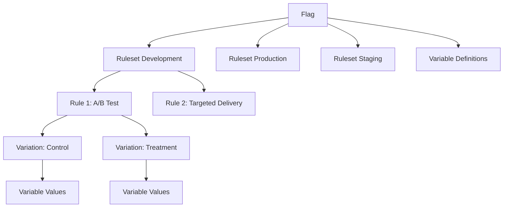

# 🔧 Optimizely Feature Experimentation: Direct API Guide for Ruleset Management

## 📋 Overview: Understanding the Architecture

Feature Experimentation uses a hierarchical structure where **flags** contain **rulesets** (per environment), and rulesets contain **rules** that reference **variations**. This guide explains how to work directly with Optimizely's REST API to manage these entities.

## 🏗️ Entity Relationship Architecture



**Key Relationships:**
- 1 Flag → N Rulesets (1 per environment)
- 1 Ruleset → N Rules (targeting rules, A/B tests, etc.)
- 1 Rule → N Variations (what users actually see)
- 1 Flag → N Variable Definitions (schema)
- 1 Variation → N Variable Values (actual content)

## 🎯 Why PATCH Operations?

Rulesets use **JSON Patch (RFC 6902)** because:

1. **Atomic Updates**: Multiple changes in a single operation
2. **Conflict Resolution**: Precise path-based modifications
3. **Rollback Safety**: Clear operation history
4. **Concurrent Access**: Minimize race conditions

**PATCH Format**: Array of operations with `op`, `path`, and `value`

## 🚀 Complete Workflow: Creating A/B Test from Scratch

### Step 1: Create Flag (POST)

```http
POST /v2/projects/{projectId}/flags
Content-Type: application/json

{
  "key": "checkout_flow_optimization",
  "name": "Checkout Flow Optimization",
  "description": "A/B test for checkout process improvements",
  "variations": [],
  "variable_definitions": [
    {
      "key": "button_color",
      "type": "string",
      "default_value": "blue"
    },
    {
      "key": "checkout_steps",
      "type": "integer", 
      "default_value": 3
    }
  ]
}
```

**Response**: Returns flag with auto-generated `default_variation_key`

### Step 2: Create Variations (POST)

```http
POST /v2/projects/{projectId}/flags/{flagKey}/variations
Content-Type: application/json

{
  "key": "control",
  "name": "Control Variation",
  "description": "Original checkout flow",
  "feature_enabled": true,
  "variable_values": {
    "button_color": "blue",
    "checkout_steps": 3
  }
}
```

```http
POST /v2/projects/{projectId}/flags/{flagKey}/variations
Content-Type: application/json

{
  "key": "treatment", 
  "name": "Optimized Flow",
  "description": "Streamlined checkout with green CTA",
  "feature_enabled": true,
  "variable_values": {
    "button_color": "green",
    "checkout_steps": 2
  }
}
```

### Step 3: Create Audience (if needed)

```http
POST /v2/projects/{projectId}/audiences
Content-Type: application/json

{
  "name": "Premium Users",
  "description": "Users with premium subscriptions", 
  "conditions": [
    "and",
    {
      "type": "custom_attribute",
      "name": "subscription_tier",
      "value": "premium"
    }
  ]
}
```

**Response**: Returns `audience.id` (numeric)

### Step 4: Update Ruleset with A/B Test (PATCH)

This is the **critical operation** that creates the A/B test:

```http
PATCH /v2/projects/{projectId}/flags/{flagKey}/environments/{environmentKey}/ruleset
Content-Type: application/json

[
  {
    "op": "add",
    "path": "/rules/-", 
    "value": {
      "key": "ab_test_rule",
      "type": "a/b_test",
      "enabled": true,
      "audience_conditions": [
        "and", 
        {"audience_id": 12345678}
      ],
      "percentage_included": 10000,
      "variations": [
        {
          "key": "control",
          "weight": 5000
        },
        {
          "key": "treatment", 
          "weight": 5000
        }
      ]
    }
  },
  {
    "op": "add",
    "path": "/rule_priorities/-",
    "value": "ab_test_rule"
  },
  {
    "op": "replace",
    "path": "/enabled",
    "value": true
  }
]
```

## 🔍 Understanding the PATCH Payload

### JSON Patch Operations Explained

| Operation | Path | Purpose | Example |
|-----------|------|---------|---------|
| `add` | `/rules/-` | Append new rule to rules array | Add A/B test rule |
| `add` | `/rule_priorities/-` | Append rule key to priority order | Set execution order |
| `replace` | `/enabled` | Update ruleset enabled state | Enable/disable ruleset |
| `replace` | `/default_variation_key` | Change fallback variation | Update default |
| `remove` | `/rules/rule_key` | Delete specific rule | Remove A/B test |

### Critical Path Structures

```json
{
  "rules": {
    "rule_key_1": { /* rule object */ },
    "rule_key_2": { /* rule object */ }
  },
  "rule_priorities": ["rule_key_1", "rule_key_2"],
  "enabled": true,
  "default_variation_key": "control"
}
```

**Path Examples:**
- `/rules/ab_test_rule` → Specific rule by key
- `/rules/-` → Append to rules object
- `/rule_priorities/0` → First priority position
- `/rule_priorities/-` → Append to priorities array

## 🎲 Variation Configuration Details

### Weight Distribution (Basis Points)

```json
"variations": [
  {
    "key": "control",
    "weight": 5000    // 50% (5000/10000)
  },
  {
    "key": "treatment_a", 
    "weight": 3000    // 30% (3000/10000)
  },
  {
    "key": "treatment_b",
    "weight": 2000    // 20% (2000/10000)
  }
]
```

**Rules:**
- Total weights ≤ `percentage_included`
- `percentage_included` ≤ 10000 (100%)
- Remaining traffic goes to `default_variation_key`

### Audience Conditions Structure

```json
// Simple audience
"audience_conditions": ["and", {"audience_id": 12345}]

// Multiple audiences (AND)
"audience_conditions": [
  "and", 
  {"audience_id": 12345},
  {"audience_id": 67890}
]

// Multiple audiences (OR)
"audience_conditions": [
  "or",
  {"audience_id": 12345}, 
  {"audience_id": 67890}
]

// Complex conditions
"audience_conditions": [
  "and",
  {
    "or": [
      {"audience_id": 12345},
      {"audience_id": 67890}
    ]
  },
  {"audience_id": 11111}
]
```

## 🔧 Common Modification Patterns

### Adding New Variation to Existing A/B Test

```http
PATCH /v2/projects/{projectId}/flags/{flagKey}/environments/{environmentKey}/ruleset
Content-Type: application/json

[
  {
    "op": "add",
    "path": "/rules/ab_test_rule/variations/-",
    "value": {
      "key": "treatment_c",
      "weight": 1000
    }
  },
  {
    "op": "replace", 
    "path": "/rules/ab_test_rule/variations/0/weight",
    "value": 4000
  },
  {
    "op": "replace",
    "path": "/rules/ab_test_rule/variations/1/weight", 
    "value": 4000
  }
]
```

### Changing Traffic Allocation

```http
PATCH /v2/projects/{projectId}/flags/{flagKey}/environments/{environmentKey}/ruleset
Content-Type: application/json

[
  {
    "op": "replace",
    "path": "/rules/ab_test_rule/variations/0/weight",
    "value": 7000
  },
  {
    "op": "replace", 
    "path": "/rules/ab_test_rule/variations/1/weight",
    "value": 3000
  }
]
```

### Updating Audience Targeting

```http
PATCH /v2/projects/{projectId}/flags/{flagKey}/environments/{environmentKey}/ruleset
Content-Type: application/json

[
  {
    "op": "replace",
    "path": "/rules/ab_test_rule/audience_conditions",
    "value": [
      "and",
      {"audience_id": 98765},
      {"audience_id": 43210}
    ]
  }
]
```

### Disabling A/B Test (Pause)

```http
PATCH /v2/projects/{projectId}/flags/{flagKey}/environments/{environmentKey}/ruleset
Content-Type: application/json

[
  {
    "op": "replace",
    "path": "/rules/ab_test_rule/enabled", 
    "value": false
  }
]
```

### Removing A/B Test Completely

```http
PATCH /v2/projects/{projectId}/flags/{flagKey}/environments/{environmentKey}/ruleset
Content-Type: application/json

[
  {
    "op": "remove",
    "path": "/rules/ab_test_rule"
  },
  {
    "op": "remove",
    "path": "/rule_priorities/0"
  }
]
```

## 🚨 Error Prevention & Validation

### Common PATCH Errors

| Error | Cause | Solution |
|-------|-------|----------|
| `Invalid path` | Wrong JSON Patch path | Check ruleset structure first |
| `Variation not found` | Referencing non-existent variation | Create variation first |
| `Audience not found` | Invalid audience_id | Verify audience exists |
| `Weight exceeds limit` | Total weights > percentage_included | Adjust weight distribution |

### Pre-Flight Validation

**Always GET current ruleset first:**

```http
GET /v2/projects/{projectId}/flags/{flagKey}/environments/{environmentKey}/ruleset
```

**Verify variation exists:**

```http
GET /v2/projects/{projectId}/flags/{flagKey}/variations
```

## 📊 Complete Example: Multi-Step A/B Test Creation

```javascript
// Step 1: Create flag
const flagResponse = await fetch(`/v2/projects/${projectId}/flags`, {
  method: 'POST',
  headers: { 'Content-Type': 'application/json' },
  body: JSON.stringify({
    key: 'pricing_test',
    name: 'Pricing Page Test',
    variable_definitions: [
      { key: 'price_display', type: 'string', default_value: 'monthly' }
    ]
  })
});

// Step 2: Create variations
await fetch(`/v2/projects/${projectId}/flags/pricing_test/variations`, {
  method: 'POST', 
  headers: { 'Content-Type': 'application/json' },
  body: JSON.stringify({
    key: 'monthly_display',
    name: 'Monthly Pricing',
    feature_enabled: true,
    variable_values: { price_display: 'monthly' }
  })
});

await fetch(`/v2/projects/${projectId}/flags/pricing_test/variations`, {
  method: 'POST',
  headers: { 'Content-Type': 'application/json' },
  body: JSON.stringify({
    key: 'annual_display',
    name: 'Annual Pricing', 
    feature_enabled: true,
    variable_values: { price_display: 'annual' }
  })
});

// Step 3: Create A/B test ruleset
await fetch(`/v2/projects/${projectId}/flags/pricing_test/environments/production/ruleset`, {
  method: 'PATCH',
  headers: { 'Content-Type': 'application/json' },
  body: JSON.stringify([
    {
      op: 'add',
      path: '/rules/-',
      value: {
        key: 'pricing_ab_test',
        type: 'a/b_test', 
        enabled: true,
        audience_conditions: ['and', {audience_id: audienceId}],
        percentage_included: 5000, // 50% of traffic
        variations: [
          { key: 'monthly_display', weight: 2500 },
          { key: 'annual_display', weight: 2500 }
        ]
      }
    },
    {
      op: 'add',
      path: '/rule_priorities/-',
      value: 'pricing_ab_test'
    },
    {
      op: 'replace',
      path: '/enabled',
      value: true
    }
  ])
});
```

## 🎓 Key Takeaways

1. **Sequence Matters**: Flag → Variations → Audience → Ruleset
2. **PATCH is Atomic**: All operations succeed or fail together
3. **Weights are Basis Points**: 10000 = 100%, 5000 = 50%
4. **Audience IDs are Numeric**: Use the actual ID from audience creation
5. **Path Syntax is Critical**: `/rules/-` appends, `/rules/key` targets specific rule
6. **Always Validate First**: GET current state before PATCH operations

This guide provides the foundation for programmatically managing Feature Experimentation A/B tests through direct API calls, giving you complete control over the flag lifecycle without intermediary abstractions.